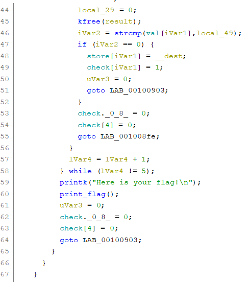
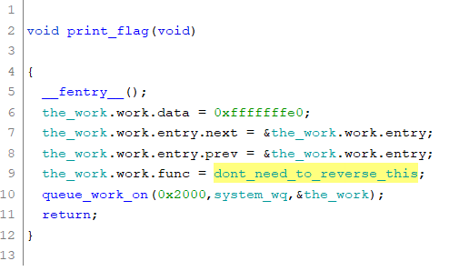
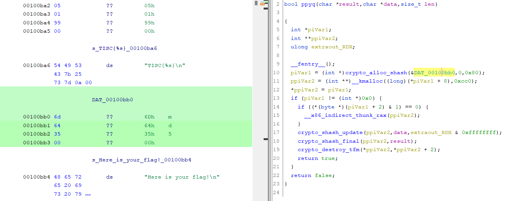

# Level 4A - One Knock Away (RE)
```
One of our clients’ server was recently compromised by PALINDROME.

We recovered one suspicious artifact from the server. Can you figure out what it is?

(The file can only be loaded in a specific VM!)

NOTE: Solving challenge 4A allows you to complete level 4, but unlocks challenge 5A only!

```

# Challenge Solution

## Figuring the type of file
We can see that it is a linux executable, yet it cannot be executed.
```
>> file one
one: ELF 64-bit LSB relocatable, x86-64, version 1 (SYSV), BuildID[sha1]=81502774be4e9e675bb2e7a41e7db3f4c0e8af0f, with debug_info, not stripped

>> ./one
bash: ./one: cannot execute binary file: Exec format error
```
Running `strings` on the file, we can see `printk`, `kfree` in it, suggesting that it is most likely a kernel module.
```
>> strings one
...
printk
kfree
...
```
We can run modinfo to verify. In order to do so, we must name it as a `.ko` file. If not it will not be detected as a kernel module. In the description, there is a hint about `N3tf1lt3r`. The linux version for this kernel module is `5.13.0-40-generic`.
```
>> modinfo one
modinfo: ERROR: Module one not found.

>> cp one one.ko

>> modinfo one.ko
filename:       /home/ubuntu/Downloads/tisc2022/final/one.ko
license:        GPL
author:         CY1603
description:    N3tf1lt3r
srcversion:     68523F31E683B1DBFE032C8
depends:        
retpoline:      Y
name:           one
vermagic:       5.13.0-40-generic SMP mod_unload modversions
```

## Setting up the environment

Trying to `insmod` it on a system with a different linux version will throw an error. A quick search on Google or using the `strings` command will suggest that Ubuntu 20.04 supports this version.
```
>> sudo insmod one.ko
insmod: ERROR: could not insert module one.ko: Invalid module format

>> dmesg 
one: disagrees about version of symbol module_layout
```
```
>> strings one | grep ubuntu
/home/ubuntu/Downloads/tisc2022/final
/home/ubuntu/Downloads/tisc2022/final
/home/ubuntu/Downloads/tisc2022/final/one.c
/home/ubuntu/Downloads/tisc2022/final/one.mod.c
GCC: (Ubuntu 9.4.0-1ubuntu1~20.04.1) 9.4.0
GCC: (Ubuntu 9.4.0-1ubuntu1~20.04.1) 9.4.0
```

After installing an Ubuntu 20.04 VM, we install the following kernel version.
```
>> sudo apt install linux-image-5.13.0-40-generic
```
Then, we reboot the system. Holding the `SHIFT` key during the startup, we will be allowed to select the version `5.13.0-40-generic`.


We can further verify the version with the `uname` command.
```
>> uname -r
5.13.0-40-generic
```
Now, we can try to load the kernel module with `insmod`. To unload the module, we can run `rmmod`.
```
>> sudo dmesg --clear

>> sudo insmod one.ko
>> dmesg
[ 1302.496067] Loading PALINDROME module...

>> sudo rmmod one

>> dmesg
[ 1302.496067] Loading PALINDROME module...
[ 1315.423105] Cleaning up PALINDROME module.
```

The debug messages only shows the kernel loading and unloading. Now that we know the binary is a kernel module and how to run it, we need to decompile to see what it is doing.

## Reversing the binary

Since kernel modules are written in C, the decompiler in `Ghidra` will be useful in helping us to reverse the binary.

From `init_module()`, we can see a `nf_register_net_hook()` being called. A quick Google will let us know that it is a netfilter hook used to capture packets. The `hook_func` is the function that is being called when the below conditions are met. `nfho.pf` is set to 2, which refers to IPV4 packets.


For the other `nfho` conditions, the decompiler doesn't show them nicely. We clicked into it to see the variables it have. There is a hooknum and priority field. The `priority` is 0x80000000 which equates to -2147483648, which is INT_MIN. According to `netfilter_ipv4.h`, this corresponds to NF_IP_PRI_FIRST. This means setting the hook to the highest priority over all other hook functions. The `hooknum` is 0x00000000 and according to `netfilter_ipv4.h`, this corresponds to NF_IP_PRE_ROUTING. This means that the function will be called immediately when a packet is received.


We look into the `hook_func` to see what the hook does. The `hook_func` contains a set of conditions such that when fulfilled, the `print_flag` function will execute.



 In `print_flag`, the function to display the flag function is named as `dont_need_to_reverse_this` to let the participants know that reversing this function is not in the scope of this CTF. Anyways, it contains an abstract algorithm which I believe is harder than the CTF such that it will deter participants from directly reversing it.



We go back to the `hook_func`. Over here, the loop runs for 5 iterations. In each iteration, there is a `strcmp` of `local_49` with `val` that will set `check` to 1.


Clicking into `val`, we can see that there are 5 `md5` hashes. We can easily "unhash" them to `1q`, `2w`, `3e`, `4r`, `5t`.


As for `local_49`, it is translated from hex to a string with `sprintf`. The input is `result`, which we trace back to the `ppyq` function. `ppyq` is a md5 hashing function which takes in the data and data length. The data length is 2, which corresponds to the previous "unhashed" values. Now, we need to know how to set this data(__dest).



If you looked into netfilter hooks, you will realise that `lVar4` is actually `ip_header`. Then on line 26, a check is being done on `ip_header->protocol`. `\0x01` indicates checking of ICMP protocol. 


On line 31, the `strncpy` copied 2 characters from `ip_header + 28` address. If we look at the full ICMP header, we can see that it is 28 bytes to reach the ICMP payload data field. As such, we know that the data can be set by sending them through the ICMP data field.


## Obtaining the flag

In short, by sending `1q`, `2w`, `3e`, `4r`, `5t` in the ICMP data field sequentially, we will be able to obtain the flag.

We can do so by using the `nping` command.

```
>> nping --icmp -c 1 -dest-ip 192.168.29.132 --data-string "1q"
```

After sending the payload in sequence, the flag did not display. We re-read the decompile code and realise that we need to send a random 2 bytes string after the following sequence to get the flag.

We can write a simple script to run against our own server after loading the module.
```sh
#! /bin/bash

payload=("1q" "2w" "3e" "4r" "5t" "aa")
for pl in ${payload[@]}; do
  nping --icmp -c 1 -dest-ip 192.168.29.132 --data-string "$pl"
done
```

