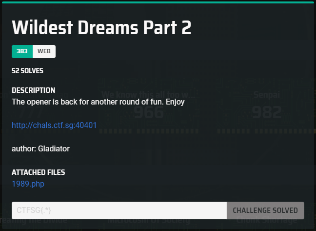
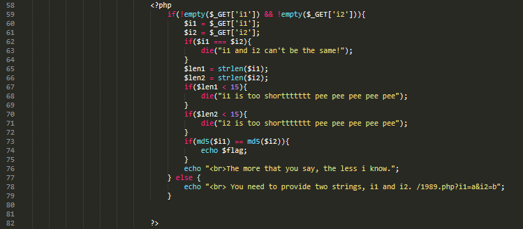
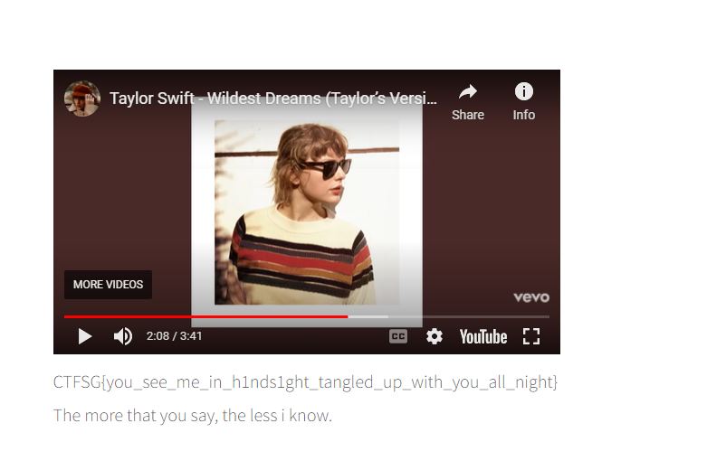
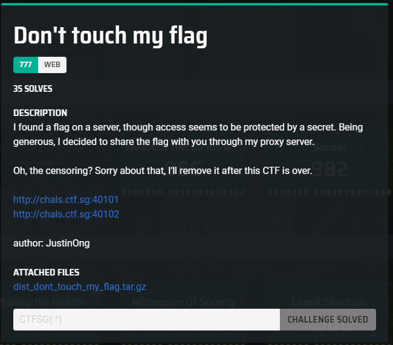
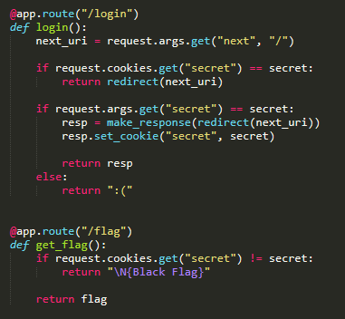
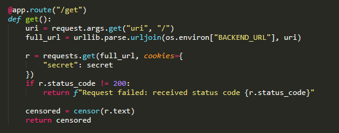
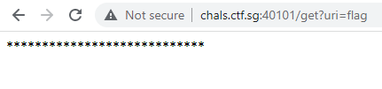
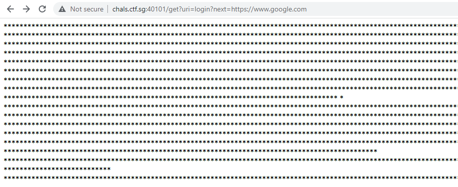
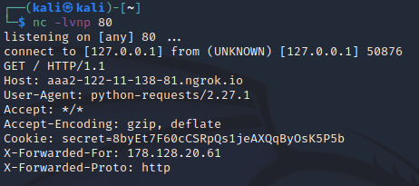
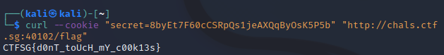

Reading the 1989.php source code, I notice that in order to get the flag, the md5 hash of i1 and i2 have to be the same, yet they cannot be the same.



While searching for possible strings that have md5 hash collision, I came across a [github page](https://github.com/spaze/hashes) on php hash collision. A hashed string that starts with "0E" will be interpreted as "0" by PHP. As such, using "!=" or "==" to compare two hashed strings that starts with "0E" will be considered the same. This [article](https://blog.birost.com/a?ID=01700-1647012b-a964-48a8-b7d5-ed8ff3616103) explains it pretty well. 

Since the length of i1 and i2 cannot be less than 15, we can use the document class strings in the previous article to get our "0E" hashes.

```
i1 = %4d%c9%68%ff%0e%e3%5c%20%95%72%d4%77%7b%72%15%87%d3%6f%a7%b2%1b%dc%56%b7%4a%3d%c0%78%3e%7b%95%18%af%bf%a2%00%a8%28%4b%f3%6e%8e%4b%55%b3%5f%42%75%93%d8%49%67%6d%a0%d1%55%5d%83%60%fb%5f%07%fe%a2


i2 = %4d%c9%68%ff%0e%e3%5c%20%95%72%d4%77%7b%72%15%87%d3%6f%a7%b2%1b%dc%56%b7%4a%3d%c0%78%3e%7b%95%18%af%bf%a2%02%a8%28%4b%f3%6e%8e%4b%55%b3%5f%42%75%93%d8%49%67%6d%a0%d1%d5%5d%83%60%fb%5f%07%fe%a2
```



```
Flag: CTFSG{you_see_me_in_h1nds1ght_tangled_up_with_you_all_night}
```



Proxy is on port 40101 and backend is on port 40102.

From the backend source code, in /flag, we can see that the flag is returned if the "secret" cookie is of a secret value. In /login, there is a check for this secret value for redirection to another url (next_uri).



From the proxy source code, we can see that it takes in a uri and send a request to the backend server with the secret value cookie.



This seems like an SSRF. In order to test if the request proxying from proxy server to backend works, we can curl the following address:

```
http://chals.ctf.sg:40101/get?uri=flag
```



We did a request from the proxy to the backend server. A censored output was returned instead of the "Black Flag" since the r.text is censored. But this already shows that we can send the secret cookie from the proxy server to the backend server. Now, instead of using /flag, we can use /login instead.

```
http://chals.ctf.sg:40101/get?uri=login?next=https://www.google.com
```



We get a censored output of google. Since our payload is working, we can redirect to our ngrok server to steal the secret cookie.

On Kali machine:

```
>> nc -lvnp 80

>> ngrok 80 http
```



We did a curl to the backend server with the secret cookie, we obtained the flag:



```
CTFSG{d0nT_toUcH_mY_c00k13s}
```